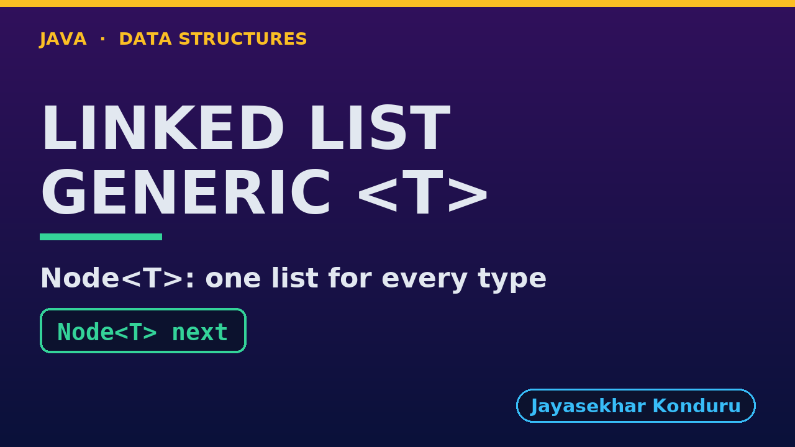

# YouTube — Singly Linked List (Generic)

Everything needed to publish `video/singly-linked-list-generic-explained.mp4`. Copy the fields straight out of this file.

Chapter timings come from the video's `.srt`; they are regenerated whenever the video is rebuilt.

## Title

```
Generic Singly Linked List in Java - Node<T>, equals and References
```

67 characters (YouTube shows about 60 before cutting a title off in search).

## Description

The first two lines are what a viewer sees above the fold, so they carry the hook rather than the boilerplate.

```
Generic Singly Linked List in Java, explained with a treasure hunt held three ways by one class: as String place names, as Integer distances in metres, and as Clue records of our own. We see what Node<T> holds: a reference to the data, not a copy, and a next pointer. We search for a separately made Clue and find it because a record's equals compares its fields, while == says it is a different object. We insert at a position and delete by key with the same pointer changes as the plain list, delete at both ends, and see the garbage collector free nodes nothing refers to. We finish by reversing a list of Integers and a list of Strings with the very same code. The String-only version is the Singly Linked List project.

CHAPTERS
00:00 Introduction
00:43 The Everyday Idea
01:08 The Words
01:29 Act One — One class, any element type
01:53 One class, any element type
02:04 Act Two — Node<T>: data is a reference
02:26 Node<T>: data is a reference
02:36 Act Three — Search and deletion with equals
03:02 Search and deletion with equals
03:15 Act Four — Deleting at both ends
03:39 Deleting at both ends
03:46 Act Five — The same algorithm for every type
04:09 The same algorithm for every type
04:17 Time and Space Complexity
04:41 Compared With Related Structures
05:06 Common Mistakes
05:27 Thanks for Watching

SOURCE CODE, WRITTEN NOTES AND AN INTERACTIVE ANIMATION
https://github.com/jk-boot-up/datastructures/tree/main/gradle-java/arrays-and-lists/singly-linked-list-generic

WHAT YOU NEED FIRST
Java basics: variables, loops, classes and methods. No data-structures knowledge is assumed; START-HERE.md in the repository explains memory, references and counting steps.
```

## Chapters

YouTube shows these as chapters because there are at least three and the first is at `00:00`.

```
00:00 Introduction
00:43 The Everyday Idea
01:08 The Words
01:29 Act One — One class, any element type
01:53 One class, any element type
02:04 Act Two — Node<T>: data is a reference
02:26 Node<T>: data is a reference
02:36 Act Three — Search and deletion with equals
03:02 Search and deletion with equals
03:15 Act Four — Deleting at both ends
03:39 Deleting at both ends
03:46 Act Five — The same algorithm for every type
04:09 The same algorithm for every type
04:17 Time and Space Complexity
04:41 Compared With Related Structures
05:06 Common Mistakes
05:27 Thanks for Watching
```

## Tags

```
generic linked list, java generics, Node<T>, singly linked list, equals vs ==, linked list java, data structures, java data structures, java, java 25, algorithms, computer science, programming tutorial, beginner, big o
```

218 characters, under YouTube's 500 limit.

## Thumbnail



Upload `docs/thumbnail.png` (1280×720) under **Details → Thumbnail → Upload file**. It is made for the small size YouTube shows in search: the name, one line of promise and one piece of code.

## Upload checklist

- [ ] Upload `video/singly-linked-list-generic-explained.mp4` (1080p, H.264, 30 fps, AAC 48 kHz)
- [ ] Set the video language to **English**, then add subtitles: *Upload file → With timing* → `video/singly-linked-list-generic-explained.srt`
- [ ] Upload `docs/thumbnail.png` as the thumbnail
- [ ] Paste the title, description and tags from above
- [ ] Add to the **Data Structures in Java** playlist
- [ ] Wait for 1080p processing before sharing the link

## Runtime

06:12.
