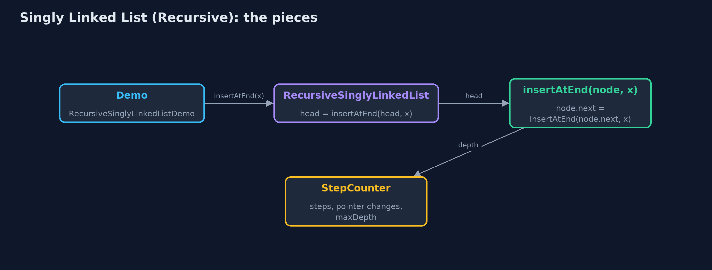

# Singly Linked List (Recursive)

**Seen recursively, a list is either empty or a node followed by a smaller list, so every operation handles one node and calls itself on node.next until the empty list or its target; changing operations return the new first node, as in node.next = deleteByKey(node.next, key); the time is the same as with loops, the extra space is one frame per node visited.**


*count(oak tree) waits for count(old well) ... down to count(null) = 0*

A **singly linked list** is a chain of **nodes**, each holding its **data** and a **next pointer**, reached from a **head** pointer. This project writes every operation **recursively**, from the recursive view of a list: a list is either **empty** (`null`) or a **node followed by a smaller list** (`node.next`). Every operation therefore has a **base case**, the empty list or the node it is looking for, and a **recursive case** that handles one node and calls itself on `node.next`. Operations that change the list follow the textbook pattern: the private method returns the new first node of the list it was given, and the caller stores it, as in `node.next = deleteByKey(node.next, key)`. The time of every operation is the same as in the loop version, `singly-linked-list`; the extra space is one call-stack **frame** per node visited.

> New to data structures? Read [Start here](../../START-HERE.md) first: it explains memory, references and counting steps in ten minutes.

## The everyday idea

Picture the treasure hunt run by a team of finders, one per clue. You ask the first finder how many clues are left. They do not walk the trail; they say "one, plus however many the next finder counts", and wait. The next finder says the same, and waits. The finder after the last clue finds nothing and says "zero": that is the base case. Then the answers come back up the line, each finder adding one. While the question travels down, every finder asked is standing there waiting: that is the call stack.

## The worked example: A treasure hunt of clues, every operation written recursively

The treasure hunt from `singly-linked-list`: six clues from the oak tree to the chest. The demo traces a recursive count, displays the hunt forwards and backwards, searches, gets, inserts at the end and at a position, deletes by key and at the end, reverses the list, and finally counts a million nodes recursively.

## Why it exists

Linked lists are defined recursively in most textbooks, and many list algorithms are simplest written that way: counting, printing in reverse, deleting by key without a separate `prev` pointer, and reversing. Recursion on lists is also the step between recursion on arrays and recursion on trees, where a node has two smaller structures instead of one. The cost, one frame per node, is exactly what makes long lists dangerous to recurse over.

## New words

| Word | What it means here |
| --- | --- |
| **recursive view of a list** | A list is either empty (`null`) or a node followed by a smaller list, `node.next`. |
| **base case** | The input answered without another call: the empty list, or the node being looked for. |
| **recursive case** | Handle this node, and call the method again on `node.next`. |
| **returning the new first node** | A changing operation returns the first node of the list it was given, after the change; the caller stores it: `node.next = insertAtEnd(node.next, data)`. |
| **call stack and frame** | One frame per call not yet returned. A recursion over n nodes needs n frames. |
| **recursion depth** | The most frames at once: the extra space of the operation. |

## What you will see, act by act

Run the demo and it tells the story in 5 acts, printing the real numbers that the tests check:

```bash
./gradlew run
```

| Act | What it shows |
| --- | --- |
| 1. A list is a node followed by a smaller list | count(the oak tree) = 1 + count(rest), down to count(null) = 0: count() = 6, with 6 calls waiting at once. |
| 2. Forwards and backwards | display prints before the recursive call, displayReverse after it: the same six calls, depth 6, in opposite orders. |
| 3. Search and insertion, recursively | search finds the fountain with 5 comparisons at depth 5; get(3) is 3 deep; insertAtEnd goes 6 deep and the empty list at the end becomes the new node; insertAtPosition(1) is 1 deep. |
| 4. Deletion and reversal, recursively | deleteByKey finds the red gate at depth 4 and returns node.next in its place; deleteAtEnd is 6 deep; reverse is 5 deep on 6 nodes. |
| 5. The limit of recursion | A million nodes built with insertAtBeginning (no recursion); a recursive count() throws StackOverflowError. |

Each act is drawn step by step in [the explained walkthrough](docs/singly-linked-list-recursive-explained.md) and in [the animation](docs/animation.html).

## The operations, and what they cost

Time is given for the best, average and worst case in Big-O notation (START-HERE.md explains it by counting steps); the last column is what the demo actually counted, so every formula can be checked against a real number.

| Operation | What it does | Time: best / average / worst | Extra space (call stack) | Same operation as a loop | Steps counted in the demo |
| --- | --- | --- | --- | --- | --- |
| Display / display in reverse | This node, then the rest (or the rest, then this node) | O(n) / O(n) / O(n) | O(n) | O(1); in reverse, O(n) for a stack | depth 6 for 6 clues |
| Count | 0 for null, otherwise 1 + count(node.next) | O(n) / O(n) / O(n) | O(n) | O(1) | 6, depth 6 |
| Insert at beginning / delete at beginning | Change head: no recursion needed | O(1) / O(1) / O(1) | O(1) | O(1) | 2 and 1 pointer changes |
| Insert at end | null becomes the new node; otherwise node.next = insertAtEnd(node.next) | O(n) / O(n) / O(n) | O(n) | O(1) | depth 6 |
| Insert at position | pos 0: new node in front; otherwise insert at pos - 1 of the rest | O(1) at 0 / O(n) / O(n) | O(pos) | O(1) | depth 1 for position 1 |
| Delete at end | The last node is replaced by null | O(n) / O(n) / O(n) | O(n) | O(1) | depth 6 on 7 nodes |
| Delete by key | If this node matches, return node.next; otherwise delete from the rest | O(1) / O(n) / O(n) | O(n) | O(1) | 4 comparisons, depth 4 |
| Search / get | Match here, or search the rest with pos + 1 | O(1) / O(n) / O(n) | O(n) | O(1) | 5 comparisons, depth 5; get(3) depth 3 |
| Reverse | Reverse the rest, then node.next.next = node; node.next = null | O(n) / O(n) / O(n) | O(n) | O(1) | depth 5 on 6 nodes |

Extra space is the memory an operation needs besides the structure itself. A loop needs a fixed amount, O(1); a recursive operation needs one call-stack frame for every call still waiting, so its extra space is the depth of the recursion.

## The operations in code

### Count

```java
/** Count: 0 for the empty list, otherwise 1 + the count of the rest. O(n) time and stack. */
public int count() {
    return count(head);
}

private int count(Node node) {
    if (node == null) {
        return 0;                  // base case: the empty list has no nodes
    }
    steps.enter();
    steps.step();
    int c = 1 + count(node.next);
    steps.exit();
    return c;
}
```

The recursive definition, word for word: the empty list has 0 nodes; any other list has 1 plus the count of the rest. The addition waits for the call, so every node's frame is on the stack at the deepest point.

### Display in reverse

```java
/**
 * Display in reverse: the rest of the list first, then this node. Printing after the recursive
 * call is all it takes; a loop would need a stack of its own. O(n) time and stack.
 */
public String displayReverse() {
    StringBuilder s = new StringBuilder();
    displayReverse(head, s);
    return s.append("(head)").toString();
}

private void displayReverse(Node node, StringBuilder s) {
    if (node == null) {
        return;
    }
    steps.enter();
    steps.step();
    displayReverse(node.next, s);  // the rest first ...
    s.append(node.data).append(" <- ");  // ... then this node, on the way back
    steps.exit();
}
```

The only change from `display` is the order of two lines: the recursive call comes first, and the node's data is appended afterwards, on the way back. A loop would need its own stack to do this; the call stack is that stack.

### Insertion at the end

```java
/** Insertion at the end: the end of the empty list is a new node; otherwise insert into the rest. O(n). */
public void insertAtEnd(String data) {
    head = insertAtEnd(head, data);
}

private Node insertAtEnd(Node node, String data) {
    if (node == null) {            // base case: reached the end
        steps.pointer();
        return new Node(data, null);
    }
    steps.enter();
    steps.step();
    node.next = insertAtEnd(node.next, data);
    steps.exit();
    return node;
}
```

The textbook pattern for a changing operation: the method returns the first node of the list it was given. At the end, the empty list is replaced by the new node (the base case); every other call stores the result in `node.next` and returns `node` unchanged.

### Deletion by key

```java
/**
 * Deletion by key: if this node holds the key, the list becomes the rest; otherwise delete from
 * the rest. O(n) time and stack.
 *
 * @return true if a node was deleted
 */
public boolean deleteByKey(String key) {
    boolean[] found = new boolean[1];
    head = deleteByKey(head, key, found);
    return found[0];
}

private Node deleteByKey(Node node, String key, boolean[] found) {
    if (node == null) {            // base case: not found
        return null;
    }
    steps.enter();
    steps.compare();
    Node result;
    if (node.data.equals(key)) {   // base case: skip this node
        found[0] = true;
        steps.pointer();
        result = node.next;
    } else {
        node.next = deleteByKey(node.next, key, found);
        result = node;
    }
    steps.exit();
    return result;
}
```

No `prev` pointer is needed. The call that finds the key returns `node.next` instead of `node`, and its caller stores that in its own `next`: the node is skipped. The earlier calls just return themselves.

### Reversal

```java
/**
 * Reverses the list: reverse the rest, then hang this node on the end of the reversed rest.
 * The last node is the base case and becomes the new head. O(n) time and stack.
 */
public void reverse() {
    head = reverse(head);
    steps.pointer();
}

private Node reverse(Node node) {
    if (node == null || node.next == null) {
        return node;               // base case: an empty or one-node list is its own reverse
    }
    steps.enter();
    Node newHead = reverse(node.next);
    node.next.next = node;         // the node after this one now points back to it
    node.next = null;              // and this node is, for now, the last
    steps.pointer();
    steps.exit();
    return newHead;
}
```

Reverse the rest first; its last node is `node.next`, still reachable from `node`. Then `node.next.next = node` hangs this node after it, and `node.next = null` makes it the end. The old last node, the base case, is returned all the way up as the new head.

## Compared with related structures

The recursive singly linked list against the loop version and its neighbours (n nodes):

| Operation | Recursive singly list | Singly list (loops) | Recursive static array |
| --- | --- | --- | --- |
| Insert / delete at the beginning | O(1), no recursion | O(1) | O(n) shifts, O(n) stack |
| Insert / delete at the end | O(n) time and stack | O(n) time, O(1) space | O(1) at the end |
| Search, count, display | O(n) time and stack | O(n) time, O(1) space | O(n) time and stack |
| Display in reverse | O(n) time and stack, natural | O(n) and an explicit stack | O(n) time and stack |
| Delete by key | no prev pointer needed | needs prev | shifts |
| A million elements | StackOverflowError | fine | StackOverflowError |

## The code

```
src/main/java/com/jk/explore/singlylinkedlistrecursive/
├── Lines.java                          The demo's printed lines, kept in one {@code StringBuilder} so the tests can check them
├── Node.java                           A node of a singly linked list: the data it holds and a pointer to the next node
├── RecursiveSinglyLinkedList.java      A singly linked list whose operations are written recursively
├── RecursiveSinglyLinkedListDemo.java  Tells the story of the recursive singly linked list in five acts, printing the real counts and the real depth of every recursion
└── StepCounter.java                    Counts what a linked-list operation costs: traversal steps (following one next pointer), comparisons (checking one node's data against a key), and pointer changes (setting one pointer)
```

## Test

```bash
./gradlew test
```

18 tests in `DemoRunsTest`, `RecursiveSinglyLinkedListTest`. Every number the demo prints is asserted, and nothing depends on the clock, so every run gives the same result.

## Common mistakes

| The mistake | What goes wrong | The fix |
| --- | --- | --- |
| Forgetting to store the returned node | Writing `insertAtEnd(node.next, data);` without `node.next =` drops the new node: it is never linked in. | Always `node.next = insertAtEnd(node.next, data);` and `head = insertAtEnd(head, data);`. |
| No base case for the empty list | `node.next` on `null` throws NullPointerException. | Check `node == null` first in every recursive method. |
| In reverse, forgetting `node.next = null` | The old first node still points to the second, which now points back to it: a two-node cycle. | After `node.next.next = node`, set `node.next = null`. |
| Recursing over long lists | One frame per node: a million nodes overflow the call stack. | Use loops for long lists; recursion where the depth is small. |

## Try it yourself

1. **Easy.** Write a recursive `int countOccurrences(Node node, String key)`. What is its base case, and its extra space?
2. **Medium.** Write a recursive `String getLast(Node node)` that returns the data of the last node. How deep does it go on the six clues?
3. **Harder.** Write a recursive `Node insertSorted(Node node, String data)` that inserts into a list kept in alphabetical order, returning the new first node. Use it to build the six clues in alphabetical order.

The answers are in [docs/exercises.md](docs/exercises.md), below the questions, so they are not given away.

## When to use it

- Printing a list in reverse, or any operation whose work happens on the way back.
- Short lists, where the depth is small.
- Learning: the same patterns are used on trees, where the depth is only the height.

## When not to

- Long lists: a million nodes overflow Java's call stack. Use the loops of `singly-linked-list`.
- When O(1) extra space matters.

## Where you have already met this

- Lisp and Haskell lists: `(cons head rest)` and `x : xs`, defined exactly this way.
- The recursive reverse, a classic interview question.
- Tree traversals, which recurse on two children instead of one next pointer.

## Technologies and versions

| Technology | Version | Used for |
| --- | --- | --- |
| Java | 25 | the code (toolchain set in `build.gradle`; Gradle fetches JDK 25 if it is missing) |
| Gradle | 9.8.0 (wrapper) | build and run, nothing to install |
| JUnit | 6.1.3 | the tests |
| videokit | course tool | the narrated video and animation: Piper `en_US-amy-medium`, speed 0.8, longer pauses (the `amy-slow` voice) |

## Learning material

| Document | What it is for |
| --- | --- |
| [Start here](../../START-HERE.md) | the ideas every project relies on |
| [Problem statement](docs/problem-statement.md) | the situation and what the project must show |
| [Prerequisites](docs/prerequisites.md) | what you need to know first |
| [Singly Linked List (Recursive), explained](docs/singly-linked-list-recursive-explained.md) | every act, picture by picture |
| [Animated walkthrough](docs/animation.html) | the structure changing step by step, narrated |
| [Cheat sheet](docs/cheat-sheet.md) | the whole structure on one page |
| [Exercises and answers](docs/exercises.md) | practice, easy to harder |
| [Session guide](docs/session.md) | a one-hour lesson |
| [Specification](docs/spec.md) | what this project must be true of |

### How the pieces fit

Each public operation passes head to a private recursive method, which returns the new first node.



### The classes

Public operations take data; the private recursive versions take a node.


### How the data moves

Return the rest in place of the match; otherwise store the result in node.next.


### Who calls whom, in order

Each call waits for the count of the rest; the base case answers 0.


### Video

`video/singly-linked-list-recursive-explained.mp4` (with `.m4a` audio and `.srt` subtitles) is built by `video/build_video.sh`. Rendered media is not committed.

## Where this sits

Part of the [data structures course](../../index.md), in *arrays-and-lists*.
