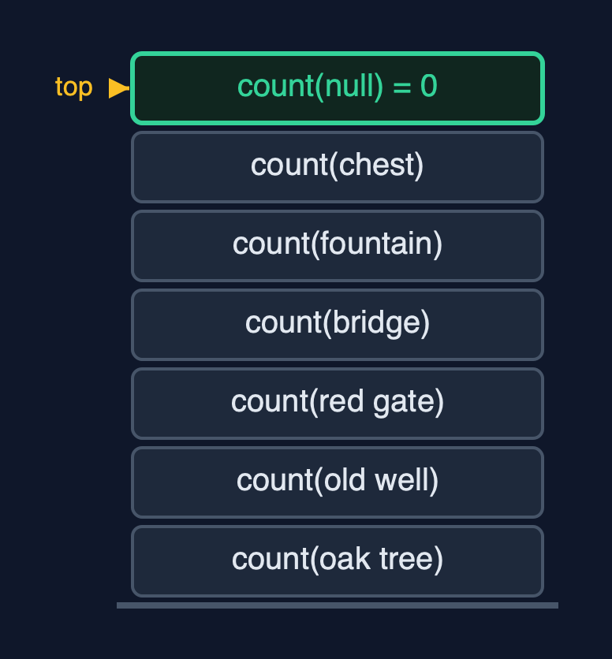
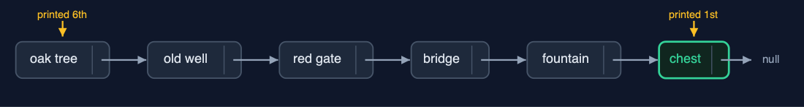
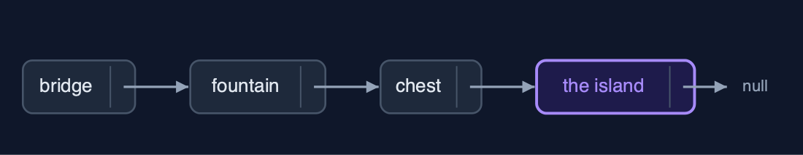
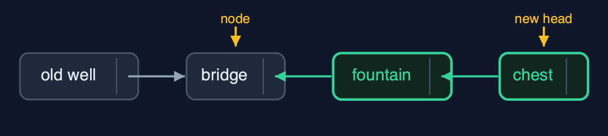
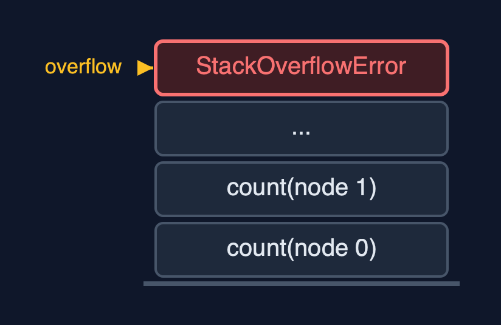

# Singly Linked List (Recursive), Explained

## In one sentence

A recursive singly linked list treats a list as empty or a node followed by a smaller list, so each operation handles one node and calls itself on node.next, returning the new first node when it changes the list; the time is unchanged and the stack grows by one frame per node.

## The picture


*count(oak tree) waits for count(old well) ... down to count(null) = 0*

## The everyday idea

Picture the treasure hunt run by a team of finders, one per clue. You ask the first finder how many clues are left. They do not walk the trail; they say "one, plus however many the next finder counts", and wait. The next finder says the same, and waits. The finder after the last clue finds nothing and says "zero": that is the base case. Then the answers come back up the line, each finder adding one. While the question travels down, every finder asked is standing there waiting: that is the call stack.

## The 5 acts

### Act 1: A list is a node followed by a smaller list

The recursive view of a list: either it is empty, `null`, or it is a node followed by a smaller list, `node.next`. Counting follows directly: the empty list has 0 nodes, and any other list has 1 plus the count of the rest. The demo traces it: `count(the oak tree) = 1 + count(rest)`, `count(the old well) = 1 + count(rest)`, and so on to `count(null) = 0`, the base case. Then the additions happen on the way back up, and the answer is 6. At the deepest point six calls were waiting on the call stack.



**Six count calls waiting on the stack, and the base case count(null) on top** Here is the call stack. One frame per clue, each waiting for the count of the rest. On top, the empty list answers zero, and the answers flow back down.

What the demo printed:

```
count(the oak tree) = 1 + count(rest)
  count(the old well) = 1 + count(rest) ... count(the chest)
    count(null) = 0   <- base case: the empty list
count() = 6, with 6 calls waiting at once
```

### Act 2: Forwards and backwards

`display` appends this node's data and then displays the rest, so the clues come out from the oak tree to the chest. `displayReverse` does the same two things in the other order: it displays the rest first, and appends this node's data when that call returns, so the chest is printed first and the oak tree last. Both go six calls deep. With a loop, printing a singly linked list backwards needs a stack of your own; here the call stack does it.



**displayReverse: the deepest call, the chest, prints first; each call prints as it returns** Here is the order of printing. The calls go down from the oak tree to the chest. The printing happens on the way back, so the chest is first.

What the demo printed:

```
display():        head -> the oak tree -> ... -> the chest -> null   depth 6
displayReverse(): the chest <- the fountain <- the bridge <- the red gate <- the old well <- the oak tree <- (head)   depth 6
printing after the recursive call instead of before it reverses the order
```

### Act 3: Search and insertion, recursively

`search` compares this node with the key and, if it does not match, searches the rest with position + 1: the fountain is found at position 4 after 5 comparisons, 5 calls deep. `get(3)` calls itself three times. `insertAtEnd` uses the textbook pattern for changing a list: each call stores the result of the recursive call in `node.next` and returns itself, and the base case, the empty list after the chest, returns the new node, "the island". `insertAtPosition(1, "the mill")` recurses once, and at position 0 of the rest returns a new node pointing to the old well: 2 pointer changes.



**insertAtEnd: the empty list after the chest is replaced by the new node** Here is the insertion at the end. The recursion reached the empty list after the chest. The base case returned the new node, the island, and the chest stored it as its next.

What the demo printed:

```
search("the fountain") = position 4: 5 comparisons, depth 5
get(3) = "the bridge": depth 3
insertAtEnd("the island"): depth 6; the base case, the empty list at the end, becomes the new node
insertAtPosition(1, "the mill"): depth 1, 2 pointers changed
head -> the oak tree -> the mill -> the old well -> ... -> the chest -> the island -> null
```

### Act 4: Deletion and reversal, recursively

`deleteByKey` needs no `prev` pointer. Each call compares its node with the key; the call holding "the red gate" returns `node.next`, the bridge, instead of itself, and the call before it, the old well, stores that as its next: the red gate is skipped. 4 comparisons, depth 4. `deleteAtEnd` recurses to the last node, "the island", whose call returns `null`, so the chest's next becomes null: depth 6. `reverse` reverses the rest first, then hangs this node on its end with `node.next.next = node; node.next = null`; on 6 nodes it goes 5 deep, and the old last node, the chest, comes back as the new head.



**reverse: the rest is already reversed; now bridge.next.next = bridge and bridge.next = null** Here is one step of reverse. The rest of the list, from the fountain on, is already reversed. The fountain is pointed back at the bridge, and the bridge's next becomes null.

What the demo printed:

```
deleteByKey("the red gate"): 4 comparisons, depth 4; that call returns node.next instead of itself
deleteAtEnd() removed "the island": depth 6
reverse(): depth 5; reverse the rest, then hang this node on its end
head -> the chest -> the fountain -> the bridge -> the old well -> the mill -> the oak tree -> null
```

### Act 5: The limit of recursion

Building a million-node list with `insertAtBeginning` is fine: each insertion is two pointer changes with no recursion. Counting it recursively is not: one frame per node, and the call stack runs out long before a million, so Java throws `StackOverflowError`. The loop in `singly-linked-list` counts the same list with O(1) extra space. On lists, recursion depth equals the length; on balanced trees, later in the course, it is only the height, which is why recursion is the natural tool there.



**One frame per node: a million-node recursion overflows the stack** One count call per node, all waiting. A million is far too many.

What the demo printed:

```
1,000,000 nodes, built with insertAtBeginning: no recursion, O(1) each
count(): StackOverflowError, one frame per node
the loop in the singly-linked-list project counts them in O(1) extra space
```

## The operations in code

### Count

```java
/** Count: 0 for the empty list, otherwise 1 + the count of the rest. O(n) time and stack. */
public int count() {
    return count(head);
}

private int count(Node node) {
    if (node == null) {
        return 0;                  // base case: the empty list has no nodes
    }
    steps.enter();
    steps.step();
    int c = 1 + count(node.next);
    steps.exit();
    return c;
}
```

The recursive definition, word for word: the empty list has 0 nodes; any other list has 1 plus the count of the rest. The addition waits for the call, so every node's frame is on the stack at the deepest point.

### Display in reverse

```java
/**
 * Display in reverse: the rest of the list first, then this node. Printing after the recursive
 * call is all it takes; a loop would need a stack of its own. O(n) time and stack.
 */
public String displayReverse() {
    StringBuilder s = new StringBuilder();
    displayReverse(head, s);
    return s.append("(head)").toString();
}

private void displayReverse(Node node, StringBuilder s) {
    if (node == null) {
        return;
    }
    steps.enter();
    steps.step();
    displayReverse(node.next, s);  // the rest first ...
    s.append(node.data).append(" <- ");  // ... then this node, on the way back
    steps.exit();
}
```

The only change from `display` is the order of two lines: the recursive call comes first, and the node's data is appended afterwards, on the way back. A loop would need its own stack to do this; the call stack is that stack.

### Insertion at the end

```java
/** Insertion at the end: the end of the empty list is a new node; otherwise insert into the rest. O(n). */
public void insertAtEnd(String data) {
    head = insertAtEnd(head, data);
}

private Node insertAtEnd(Node node, String data) {
    if (node == null) {            // base case: reached the end
        steps.pointer();
        return new Node(data, null);
    }
    steps.enter();
    steps.step();
    node.next = insertAtEnd(node.next, data);
    steps.exit();
    return node;
}
```

The textbook pattern for a changing operation: the method returns the first node of the list it was given. At the end, the empty list is replaced by the new node (the base case); every other call stores the result in `node.next` and returns `node` unchanged.

### Deletion by key

```java
/**
 * Deletion by key: if this node holds the key, the list becomes the rest; otherwise delete from
 * the rest. O(n) time and stack.
 *
 * @return true if a node was deleted
 */
public boolean deleteByKey(String key) {
    boolean[] found = new boolean[1];
    head = deleteByKey(head, key, found);
    return found[0];
}

private Node deleteByKey(Node node, String key, boolean[] found) {
    if (node == null) {            // base case: not found
        return null;
    }
    steps.enter();
    steps.compare();
    Node result;
    if (node.data.equals(key)) {   // base case: skip this node
        found[0] = true;
        steps.pointer();
        result = node.next;
    } else {
        node.next = deleteByKey(node.next, key, found);
        result = node;
    }
    steps.exit();
    return result;
}
```

No `prev` pointer is needed. The call that finds the key returns `node.next` instead of `node`, and its caller stores that in its own `next`: the node is skipped. The earlier calls just return themselves.

### Reversal

```java
/**
 * Reverses the list: reverse the rest, then hang this node on the end of the reversed rest.
 * The last node is the base case and becomes the new head. O(n) time and stack.
 */
public void reverse() {
    head = reverse(head);
    steps.pointer();
}

private Node reverse(Node node) {
    if (node == null || node.next == null) {
        return node;               // base case: an empty or one-node list is its own reverse
    }
    steps.enter();
    Node newHead = reverse(node.next);
    node.next.next = node;         // the node after this one now points back to it
    node.next = null;              // and this node is, for now, the last
    steps.pointer();
    steps.exit();
    return newHead;
}
```

Reverse the rest first; its last node is `node.next`, still reachable from `node`. Then `node.next.next = node` hangs this node after it, and `node.next = null` makes it the end. The old last node, the base case, is returned all the way up as the new head.

## The operations, and what they cost

| Operation | What it does | Time: best / average / worst | Extra space (call stack) | Same operation as a loop | Steps counted in the demo |
| --- | --- | --- | --- | --- | --- |
| Display / display in reverse | This node, then the rest (or the rest, then this node) | O(n) / O(n) / O(n) | O(n) | O(1); in reverse, O(n) for a stack | depth 6 for 6 clues |
| Count | 0 for null, otherwise 1 + count(node.next) | O(n) / O(n) / O(n) | O(n) | O(1) | 6, depth 6 |
| Insert at beginning / delete at beginning | Change head: no recursion needed | O(1) / O(1) / O(1) | O(1) | O(1) | 2 and 1 pointer changes |
| Insert at end | null becomes the new node; otherwise node.next = insertAtEnd(node.next) | O(n) / O(n) / O(n) | O(n) | O(1) | depth 6 |
| Insert at position | pos 0: new node in front; otherwise insert at pos - 1 of the rest | O(1) at 0 / O(n) / O(n) | O(pos) | O(1) | depth 1 for position 1 |
| Delete at end | The last node is replaced by null | O(n) / O(n) / O(n) | O(n) | O(1) | depth 6 on 7 nodes |
| Delete by key | If this node matches, return node.next; otherwise delete from the rest | O(1) / O(n) / O(n) | O(n) | O(1) | 4 comparisons, depth 4 |
| Search / get | Match here, or search the rest with pos + 1 | O(1) / O(n) / O(n) | O(n) | O(1) | 5 comparisons, depth 5; get(3) depth 3 |
| Reverse | Reverse the rest, then node.next.next = node; node.next = null | O(n) / O(n) / O(n) | O(n) | O(1) | depth 5 on 6 nodes |

## Compared with related structures

The recursive singly linked list against the loop version and its neighbours (n nodes):

| Operation | Recursive singly list | Singly list (loops) | Recursive static array |
| --- | --- | --- | --- |
| Insert / delete at the beginning | O(1), no recursion | O(1) | O(n) shifts, O(n) stack |
| Insert / delete at the end | O(n) time and stack | O(n) time, O(1) space | O(1) at the end |
| Search, count, display | O(n) time and stack | O(n) time, O(1) space | O(n) time and stack |
| Display in reverse | O(n) time and stack, natural | O(n) and an explicit stack | O(n) time and stack |
| Delete by key | no prev pointer needed | needs prev | shifts |
| A million elements | StackOverflowError | fine | StackOverflowError |

## The verdict

Learn list recursion here, especially display in reverse and reverse, because the same patterns run trees. For long lists in real code, use loops.

## How to recognise it in code you did not write

- `if (node == null) return ...;` at the top of a method taking a `Node`.
- `node.next = operation(node.next, ...); return node;`.
- `node.next.next = node; node.next = null;` in a reverse.

## Where you have already met this

- Lisp and Haskell lists: `(cons head rest)` and `x : xs`, defined exactly this way.
- The recursive reverse, a classic interview question.
- Tree traversals, which recurse on two children instead of one next pointer.
