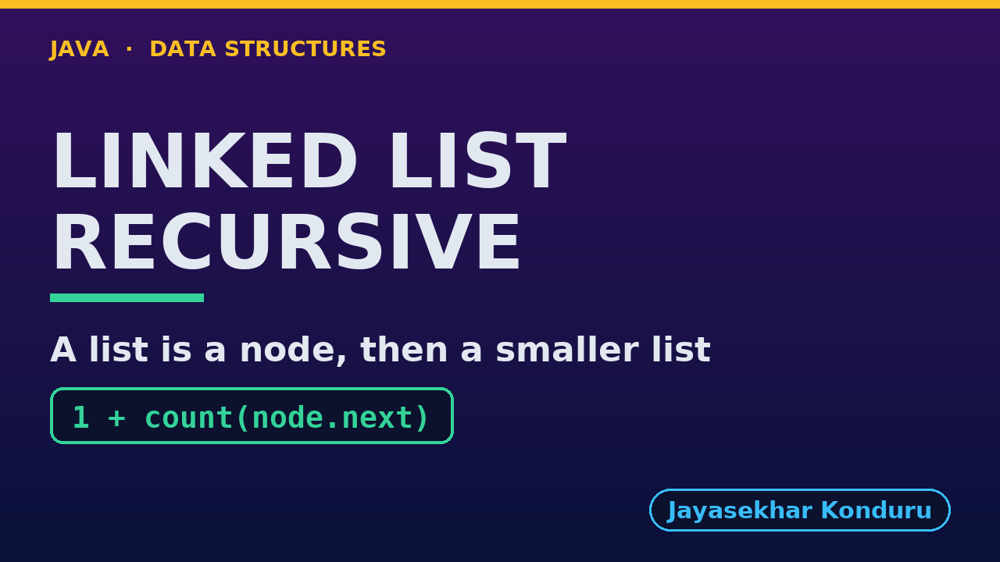

# YouTube — Singly Linked List (Recursive)

Everything needed to publish `video/singly-linked-list-recursive-explained.mp4`. Copy the fields straight out of this file.

Chapter timings come from the video's `.srt`; they are regenerated whenever the video is rebuilt.

## Title

```
Singly Linked List in Java, Recursively - Count, Reverse, Delete by Key
```

71 characters (YouTube shows about 60 before cutting a title off in search).

## Description

The first two lines are what a viewer sees above the fold, so they carry the hook rather than the boilerplate.

```
Singly Linked List in Java, written recursively, explained with a treasure hunt of clues. We start from the recursive definition, a list is empty or a node followed by a smaller list, and trace count(the oak tree) = 1 + count(rest) down to count(null) = 0, six calls deep. We display the hunt forwards and, by printing after the recursive call instead of before it, backwards. We search, get, insert at the end and at a position recursively, delete by key by returning node.next in place of the matching node, delete at the end, and reverse the list by reversing the rest and hanging each node on its end. We finish at the limit: counting a million nodes recursively throws a real StackOverflowError, where the loop version needs O(1) extra space.

CHAPTERS
00:00 Introduction
00:45 The Everyday Idea
01:19 The Words
01:47 Act One — A list is a node followed by a smaller list
02:20 A list is a node followed by a smaller list
02:34 Act Two — Forwards and backwards
02:59 Forwards and backwards
03:12 Act Three — Search and insertion, recursively
03:41 Search and insertion, recursively
03:55 Act Four — Deletion and reversal, recursively
04:25 Deletion and reversal, recursively
04:39 Act Five — The limit of recursion
05:03 The limit of recursion
05:10 Time and Space Complexity
05:35 Recursive or Loop?
05:59 Common Mistakes
06:20 Thanks for Watching

SOURCE CODE, WRITTEN NOTES AND AN INTERACTIVE ANIMATION
https://github.com/jk-boot-up/datastructures/tree/main/gradle-java/arrays-and-lists/singly-linked-list-recursive

WHAT YOU NEED FIRST
Java basics: variables, loops, classes and methods. No data-structures knowledge is assumed; START-HERE.md in the repository explains memory, references and counting steps.
```

## Chapters

YouTube shows these as chapters because there are at least three and the first is at `00:00`.

```
00:00 Introduction
00:45 The Everyday Idea
01:19 The Words
01:47 Act One — A list is a node followed by a smaller list
02:20 A list is a node followed by a smaller list
02:34 Act Two — Forwards and backwards
02:59 Forwards and backwards
03:12 Act Three — Search and insertion, recursively
03:41 Search and insertion, recursively
03:55 Act Four — Deletion and reversal, recursively
04:25 Deletion and reversal, recursively
04:39 Act Five — The limit of recursion
05:03 The limit of recursion
05:10 Time and Space Complexity
05:35 Recursive or Loop?
05:59 Common Mistakes
06:20 Thanks for Watching
```

## Tags

```
recursive linked list, linked list recursion, reverse linked list recursively, singly linked list, call stack, stack overflow, data structures, java data structures, java, java 25, algorithms, computer science, programming tutorial, beginner, big o
```

248 characters, under YouTube's 500 limit.

## Thumbnail



Upload `docs/thumbnail.png` (1280×720) under **Details → Thumbnail → Upload file**. It is made for the small size YouTube shows in search: the name, one line of promise and one piece of code.

## Upload checklist

- [ ] Upload `video/singly-linked-list-recursive-explained.mp4` (1080p, H.264, 30 fps, AAC 48 kHz)
- [ ] Set the video language to **English**, then add subtitles: *Upload file → With timing* → `video/singly-linked-list-recursive-explained.srt`
- [ ] Upload `docs/thumbnail.png` as the thumbnail
- [ ] Paste the title, description and tags from above
- [ ] Add to the **Data Structures in Java** playlist
- [ ] Wait for 1080p processing before sharing the link

## Runtime

07:06.
