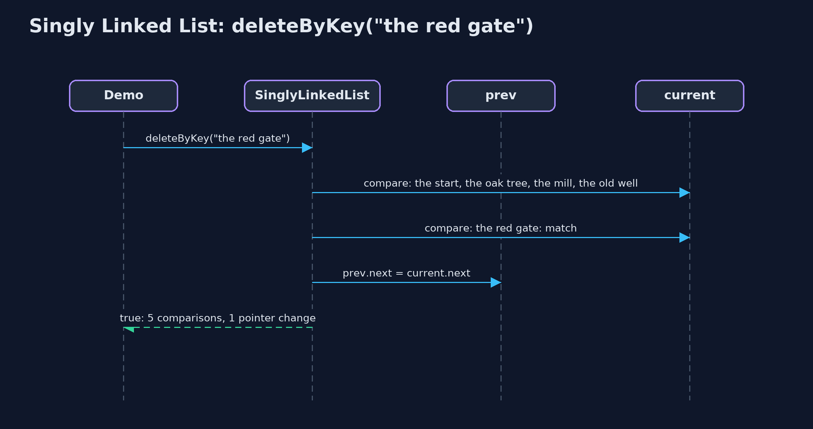

# Singly Linked List

**A singly linked list is a chain of nodes, each holding a value and a pointer to the next node; inserting or removing changes a pointer or two and moves nothing, but reaching node number n means following n pointers.**


*each node holds its data and a next pointer; head points to the first node; the last next is null*

A **singly linked list** keeps its values in separate **nodes** that can sit anywhere in memory. Each node holds its **data** and a **next pointer** (in Java, a reference) to the next node. The last node's pointer is `null`: it points nowhere. The list itself remembers only the first node, the **head**. Because nothing is side by side, inserting or deleting means changing a pointer or two, and no data moves. This project builds one by hand, the way a C textbook does with `struct node { data; struct node *next; }`, with the textbook operations: insertAtBeginning, insertAtEnd, insertAtPosition, deleteAtBeginning, deleteAtEnd, deleteAtPosition, deleteByKey, search, display, count and reverse.

> New to data structures? Read [Start here](../../START-HERE.md) first: it explains memory, references and counting steps in ten minutes.

## The everyday idea

Think of a treasure hunt. The first clue is handed to you. It says: the next clue is under the oak tree. Under the oak tree, a clue says: the next one is in the old well. Nobody gives you a map of every clue; each one only knows where the next is. To add a clue, you rewrite just one clue to point at the new spot, and the new clue points on to where that one used to lead. To reach the sixth clue, though, you have to walk the whole trail from the start.

## The worked example: A treasure hunt: each clue says where the next one is

A treasure hunt has six clues, in order: the oak tree, the old well, the red gate, the bridge, the fountain and the chest. The organisers keep adding and removing clues as they plan the route. The demo stores the hunt first in an array and then as a linked list, searches it, inserts a clue at a position and at the front, deletes by key, at the beginning and at the end, sets two pointers in the wrong order to see what is lost, and reverses the list.

## Why it exists

In an array, a new clue near the front means every later clue shifts one place to make room: five shifts for a hunt of six, a million for a list of a million. A linked list never moves data. Once you have reached the right node, inserting is two pointer changes and deleting is one, however long the list is.

## New words

| Word | What it means here |
| --- | --- |
| **node** | One element of the list: its `data` and a `next` pointer to the following node. Here it is the class `Node`. |
| **next pointer** | The field `next` in every node: a reference (in C, a pointer) to the following node. |
| **head** | The first node. The list only remembers this one; every other node is found by following pointers. |
| **null** | A pointer that points nowhere. The last node's `next` is `null`, which marks the end. |
| **traverse** | To visit the nodes one by one by following next pointers. Each move to the next node is one step, and the demo counts them. |
| **pointer change** | Setting one pointer (head or a next) to a different node. Inserting takes two; deleting takes one. |
| **prev and current** | The two pointers used to walk a list: `current` is the node being looked at, `prev` the one before it, needed to delete `current` or insert before it. |

## What you will see, act by act

Run the demo and it tells the story in 5 acts, printing the real numbers that the tests check:

```bash
./gradlew run
```

| Act | What it shows |
| --- | --- |
| 1. The hunt in an array | Six clues at indexes 0 to 5; a new clue at index 1 shifts 5 clues one place right. |
| 2. Nodes and next pointers | The hunt as six nodes: built with insertAtEnd in 10 steps, displayed from head to null, and counted by a 6-step traversal. |
| 3. Search, insertion and deletion | search finds the fountain in 5 comparisons; get(3) takes 3 steps; insertAtPosition and insertAtBeginning change 2 pointers each; deleteByKey, deleteAtBeginning and deleteAtEnd change 1. |
| 4. Two pointers in the wrong order | prev.next = newNode first: the mill points at itself and 4 of 7 clues become unreachable; deleting from an empty list is an underflow. |
| 5. Reversal, and the bill | reverse turns 6 next pointers around and moves head: 7 pointer changes, no data moved; get(999) takes 999 steps and insertAtEnd on 1,000 nodes takes 999. |

Each act is drawn step by step in [the explained walkthrough](docs/singly-linked-list-explained.md) and in [the animation](docs/animation.html).

## The operations, and what they cost

Time is given for the best, average and worst case in Big-O notation (START-HERE.md explains it by counting steps); the last column is what the demo actually counted, so every formula can be checked against a real number.

| Operation | What it does | Time: best / average / worst | Extra space | Steps counted in the demo |
| --- | --- | --- | --- | --- |
| Display (traverse) | Follow next pointers from head to null | O(n) / O(n) / O(n) | O(1) | 6 steps for 6 clues |
| Count | Traverse and count the nodes (only head is stored) | O(n) / O(n) / O(n) | O(1) | 6 steps |
| Insert at beginning | newNode.next = head; head = newNode | O(1) / O(1) / O(1) | O(1) | 2 pointer changes, whatever the length |
| Insert at end | Walk to the last node, link the new node after it | O(n) / O(n) / O(n) | O(1) | 999 steps on 1,000 nodes; O(1) with a tail pointer |
| Insert at position | Walk to prev, then newNode.next = prev.next; prev.next = newNode | O(1) at 0 / O(n) / O(n) | O(1) | 2 pointer changes, 0 data moved |
| Delete at beginning | head = head.next | O(1) / O(1) / O(1) | O(1) | 1 pointer change |
| Delete at end | Walk to the second-to-last node, set its next to null | O(n) / O(n) / O(n) | O(1) | 4 steps on 6 nodes |
| Delete at position / by key | Walk with prev and current, then prev.next = current.next | O(1) at the head / O(n) / O(n) | O(1) | 5 comparisons, 1 pointer change |
| Search | Compare each node's data with the key | O(1) / O(n) / O(n) | O(1) | 5 comparisons to find position 4 |
| Get at position | Follow pos next pointers from head | O(1) / O(n) / O(n) | O(1) | 3 steps for position 3; 999 for 999 |
| Reverse | prev, current, next: turn each next pointer around | O(n) / O(n) / O(n) | O(1) | 6 next pointers and head: 7 changes |

Extra space is the memory an operation needs besides the structure itself. A loop needs a fixed amount, O(1); a recursive operation needs one call-stack frame for every call still waiting, so its extra space is the depth of the recursion.

## The operations in code

### Insertion at the beginning

```java
/** Insertion at the beginning: the new node points to the old head, then becomes the head. O(1). */
public void insertAtBeginning(String data) {
    Node newNode = new Node(data, null);
    newNode.next = head;
    steps.pointer();
    head = newNode;
    steps.pointer();
}
```

Two pointer changes: the new node points to the old head, then the head points to the new node. No traversal, so O(1) however long the list is. On an empty list `head` is `null`, and the same two lines still work.

### Insertion at the end

```java
/** Insertion at the end: traverse to the last node, then link the new node after it. O(n). */
public void insertAtEnd(String data) {
    Node newNode = new Node(data, null);
    if (head == null) {
        head = newNode;
        steps.pointer();
        return;
    }
    Node current = head;
    while (current.next != null) {
        current = current.next;
        steps.step();
    }
    current.next = newNode;
    steps.pointer();
}
```

With only a head pointer, the last node must be found by walking: `while (current.next != null) current = current.next;`. That is O(n). Keeping a `tail` pointer makes it O(1); exercise two adds one.

### Insertion at a position

```java
/**
 * Insertion at position {@code pos} (0 = before the head): traverse to the node before the
 * position, {@code prev}, then change two pointers in this order: the new node points to the
 * rest of the list, then {@code prev} points to the new node. O(pos).
 *
 * @throws IndexOutOfBoundsException when pos is negative or past the end of the list
 */
public void insertAtPosition(int pos, String data) {
    if (pos == 0) {
        insertAtBeginning(data);
        return;
    }
    Node prev = nodeBefore(pos);
    Node newNode = new Node(data, null);
    newNode.next = prev.next;   // 1: the new node points to the rest of the list
    steps.pointer();
    prev.next = newNode;        // 2: only now does the list point to the new node
    steps.pointer();
}
```

Walk to `prev`, the node before the position. Then the order of the two pointer changes matters: first the new node points to the rest (`newNode.next = prev.next`), and only then does `prev` point to the new node. The other order loses the rest of the list, as act four shows.

### Deletion by key

```java
/**
 * Deletion by key: the first node holding {@code key}. Keeps a {@code prev} pointer one node
 * behind {@code current}, because the node before the deleted one must be changed. O(n).
 *
 * @return true if a node was deleted
 */
public boolean deleteByKey(String key) {
    Node prev = null;
    Node current = head;
    while (current != null) {
        steps.compare();
        if (current.data.equals(key)) {
            if (prev == null) {
                head = current.next;      // deleting the head
            } else {
                prev.next = current.next; // point past the deleted node
            }
            steps.pointer();
            return true;
        }
        prev = current;
        current = current.next;
        steps.step();
    }
    return false;
}
```

`prev` follows one node behind `current`. When `current` holds the key, `prev.next = current.next` points past it, and the node is no longer reachable. Deleting the head is the special case: `head = current.next`.

### Reversal

```java
/**
 * Reverses the list in place with three pointers, prev, current and next: each node's next is
 * turned to point backwards. One pointer change per node, O(n) time, O(1) extra space.
 */
public void reverse() {
    Node prev = null;
    Node current = head;
    while (current != null) {
        Node next = current.next;   // save the rest before changing the pointer
        current.next = prev;
        steps.pointer();
        prev = current;
        current = next;
    }
    head = prev;
    steps.pointer();
}
```

The classic three-pointer loop. `next` saves the rest of the list before `current.next` is turned to point backwards at `prev`; then all three move one node on. At the end, `prev` is the old last node, which becomes the head.

## Compared with related structures

How a singly linked list compares with the structures it is usually weighed against (n nodes):

| Operation | Singly linked list | Doubly linked list | Dynamic array |
| --- | --- | --- | --- |
| Access position i | O(n) | O(n) | O(1) |
| Insert / delete at the beginning | O(1) | O(1) | O(n) shifts |
| Insert at the end | O(n), or O(1) with a tail pointer | O(1) with a tail pointer | O(1) amortised |
| Delete at the end | O(n): needs the second-to-last node | O(1): tail.prev | O(1) |
| Insert / delete in the middle, once reached | O(1) | O(1) | O(n) shifts |
| Search | O(n) | O(n) | O(n); O(log n) if sorted |
| Walk backwards | not possible | yes | yes |
| Extra memory per element | one next pointer and an object header | two pointers and a header | spare capacity |

## The code

```
src/main/java/com/jk/explore/singlylinkedlist/
├── Lines.java                 The demo's printed lines, kept in one {@code StringBuilder} so the tests can check them
├── Node.java                  A node of a singly linked list: the data it holds and a pointer to the next node
├── SinglyLinkedList.java      A singly linked list: nodes joined by next pointers, and a pointer to the first node, the head
├── SinglyLinkedListDemo.java  Tells the story of the singly linked list in five acts, printing the real step counts
└── StepCounter.java           Counts what a linked-list operation costs: traversal steps (following one next pointer), comparisons (checking one node's data against a key), and pointer changes (setting one pointer)
```

## Test

```bash
./gradlew test
```

21 tests in `DemoRunsTest`, `SinglyLinkedListTest`. Every number the demo prints is asserted, and nothing depends on the clock, so every run gives the same result.

## Common mistakes

| The mistake | What goes wrong | The fix |
| --- | --- | --- |
| Setting the two pointers of an insertion in the wrong order | `prev.next = newNode` first makes the rest of the list unreachable, and `newNode.next = prev.next` then points the new node at itself. | First `newNode.next = prev.next`, then `prev.next = newNode`. |
| Losing the head | Walking with `head = head.next` instead of a separate `current` pointer throws away the start of the list. | Walk with `Node current = head;` and leave `head` alone. |
| Forgetting the empty list and the one-node list | `head.next` on an empty list throws `NullPointerException`; deleting the only node must set `head` to `null`. | Check `head == null` first (underflow), and handle `head.next == null` in deleteAtEnd. |
| Deleting a node without the node before it | With only `current`, there is no way to change the previous node's `next`. | Walk with `prev` one node behind `current`, or stop at the node before. |

## Try it yourself

1. **Easy.** Write `int countOccurrences(String key)` that counts the nodes holding `key`. What are its time and space complexity?
2. **Medium.** Add a `tail` pointer that always refers to the last node, so `insertAtEnd` takes no steps. Which other operations must now keep `tail` up to date?
3. **Harder.** Write `String middle()` that returns the data of the middle node in one pass, without counting first.

The answers are in [docs/exercises.md](docs/exercises.md), below the questions, so they are not given away.

## When to use it

- You insert and delete a lot, especially at the beginning, and rarely jump to a position.
- You do not know the size in advance and do not want spare places.
- You build other structures: stacks and queues are often a linked list inside.

## When not to

- You read by position: node n is n steps away, where an array takes one step.
- Memory matters: each node carries a pointer and an object header as well as its value.
- You need to walk backwards: a singly linked list only points forwards (see the doubly linked list).

## Where you have already met this

- A treasure hunt, a chain of emails replying to each other, a train of carriages.
- `java.util.LinkedList` is a linked list that links both ways.
- Every Java object reference is a pointer of this kind; a linked list is just objects pointing at objects.

## Technologies and versions

| Technology | Version | Used for |
| --- | --- | --- |
| Java | 25 | the code (toolchain set in `build.gradle`; Gradle fetches JDK 25 if it is missing) |
| Gradle | 9.8.0 (wrapper) | build and run, nothing to install |
| JUnit | 6.1.3 | the tests |
| videokit | course tool | the narrated video and animation: Piper `en_US-amy-medium`, speed 0.8, longer pauses (the `amy-slow` voice) |

## Learning material

| Document | What it is for |
| --- | --- |
| [Start here](../../START-HERE.md) | the ideas every project relies on |
| [Problem statement](docs/problem-statement.md) | the situation and what the project must show |
| [Prerequisites](docs/prerequisites.md) | what you need to know first |
| [Singly Linked List, explained](docs/singly-linked-list-explained.md) | every act, picture by picture |
| [Animated walkthrough](docs/animation.html) | the structure changing step by step, narrated |
| [Cheat sheet](docs/cheat-sheet.md) | the whole structure on one page |
| [Exercises and answers](docs/exercises.md) | practice, easy to harder |
| [Session guide](docs/session.md) | a one-hour lesson |
| [Specification](docs/spec.md) | what this project must be true of |

### How the pieces fit

The demo calls the textbook operations; the list holds only `head`; every other node is reached by following next pointers.


### The classes

`SinglyLinkedList` holds `head`; each `Node` holds `data` and `next`.


### How the data moves

Walk to prev, then the two pointer changes, in this order.


### Who calls whom, in order

prev and current walk together until current holds the key.



### Video

`video/singly-linked-list-explained.mp4` (with `.m4a` audio and `.srt` subtitles) is built by `video/build_video.sh`. Rendered media is not committed.

## Where this sits

Part of the [data structures course](../../index.md), in *arrays-and-lists*.
