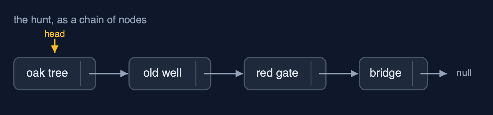

# Singly Linked List — Cheat Sheet

**A singly linked list is a chain of nodes, each holding a value and a pointer to the next node; inserting or removing changes a pointer or two and moves nothing, but reaching node number n means following n pointers.**

| | |
| --- | --- |
| **What it is** | A singly linked list is a chain of nodes, each holding data and a next pointer, reached from a head pointer: insertion and deletion change one or two pointers and move no data, but reaching position i takes i steps. |
| **Everyday picture** | A treasure hunt: each clue tells you where the next one is |
| **Use it when** | You insert and delete a lot, especially at the beginning, and rarely jump to a position; You do not know the size in advance and do not want spare places; You build other structures: stacks and queues are often a linked list inside |
| **Avoid it when** | You read by position: node n is n steps away, where an array takes one step; Memory matters: each node carries a pointer and an object header as well as its value; You need to walk backwards: a singly linked list only points forwards (see the doubly linked list) |
| **Already in Java** | `java.util.LinkedList` (which links both ways: see the doubly linked list) |

## Costs

| Operation | What it does | Time: best / average / worst | Extra space | Steps counted in the demo |
| --- | --- | --- | --- | --- |
| Display (traverse) | Follow next pointers from head to null | O(n) / O(n) / O(n) | O(1) | 6 steps for 6 clues |
| Count | Traverse and count the nodes (only head is stored) | O(n) / O(n) / O(n) | O(1) | 6 steps |
| Insert at beginning | newNode.next = head; head = newNode | O(1) / O(1) / O(1) | O(1) | 2 pointer changes, whatever the length |
| Insert at end | Walk to the last node, link the new node after it | O(n) / O(n) / O(n) | O(1) | 999 steps on 1,000 nodes; O(1) with a tail pointer |
| Insert at position | Walk to prev, then newNode.next = prev.next; prev.next = newNode | O(1) at 0 / O(n) / O(n) | O(1) | 2 pointer changes, 0 data moved |
| Delete at beginning | head = head.next | O(1) / O(1) / O(1) | O(1) | 1 pointer change |
| Delete at end | Walk to the second-to-last node, set its next to null | O(n) / O(n) / O(n) | O(1) | 4 steps on 6 nodes |
| Delete at position / by key | Walk with prev and current, then prev.next = current.next | O(1) at the head / O(n) / O(n) | O(1) | 5 comparisons, 1 pointer change |
| Search | Compare each node's data with the key | O(1) / O(n) / O(n) | O(1) | 5 comparisons to find position 4 |
| Get at position | Follow pos next pointers from head | O(1) / O(n) / O(n) | O(1) | 3 steps for position 3; 999 for 999 |
| Reverse | prev, current, next: turn each next pointer around | O(n) / O(n) / O(n) | O(1) | 6 next pointers and head: 7 changes |

## Compared with related structures

How a singly linked list compares with the structures it is usually weighed against (n nodes):

| Operation | Singly linked list | Doubly linked list | Dynamic array |
| --- | --- | --- | --- |
| Access position i | O(n) | O(n) | O(1) |
| Insert / delete at the beginning | O(1) | O(1) | O(n) shifts |
| Insert at the end | O(n), or O(1) with a tail pointer | O(1) with a tail pointer | O(1) amortised |
| Delete at the end | O(n): needs the second-to-last node | O(1): tail.prev | O(1) |
| Insert / delete in the middle, once reached | O(1) | O(1) | O(n) shifts |
| Search | O(n) | O(n) | O(n); O(log n) if sorted |
| Walk backwards | not possible | yes | yes |
| Extra memory per element | one next pointer and an object header | two pointers and a header | spare capacity |

## Watch out for

- **Setting the two pointers of an insertion in the wrong order**: First `newNode.next = prev.next`, then `prev.next = newNode`.
- **Losing the head**: Walk with `Node current = head;` and leave `head` alone.
- **Forgetting the empty list and the one-node list**: Check `head == null` first (underflow), and handle `head.next == null` in deleteAtEnd.
- **Deleting a node without the node before it**: Walk with `prev` one node behind `current`, or stop at the node before.
