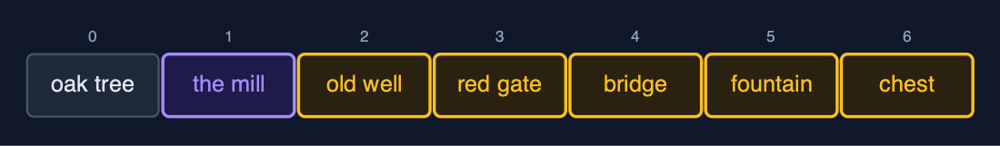
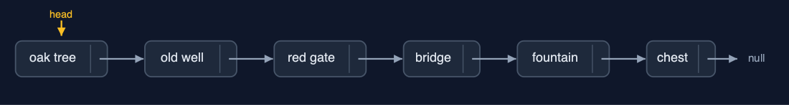
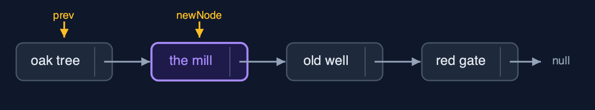
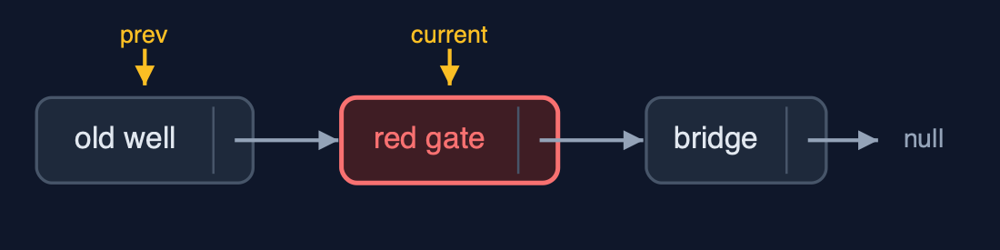
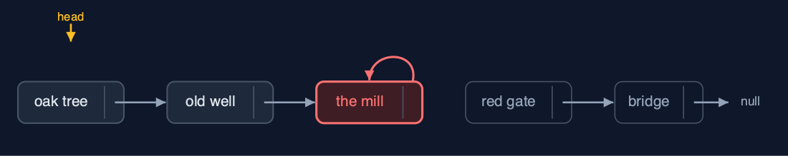
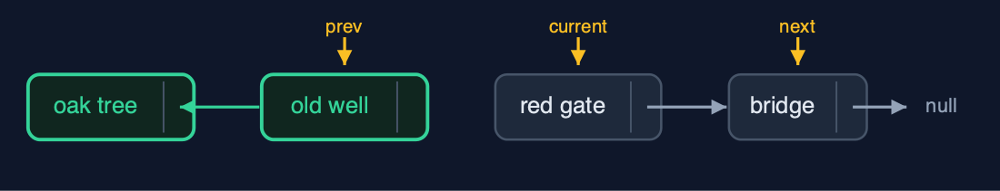

# Singly Linked List, Explained

## In one sentence

A singly linked list is a chain of nodes, each holding data and a next pointer, reached from a head pointer: insertion and deletion change one or two pointers and move no data, but reaching position i takes i steps.

## The picture


*each node holds its data and a next pointer; head points to the first node; the last next is null*

## The everyday idea

Think of a treasure hunt. The first clue is handed to you. It says: the next clue is under the oak tree. Under the oak tree, a clue says: the next one is in the old well. Nobody gives you a map of every clue; each one only knows where the next is. To add a clue, you rewrite just one clue to point at the new spot, and the new clue points on to where that one used to lead. To reach the sixth clue, though, you have to walk the whole trail from the start.

## The 5 acts

### Act 1: The hunt in an array

Stored in an array, the six clues sit at indexes 0 to 5. The organisers want a new clue, the mill, at index 1. An array cannot open a gap, so every clue from index 1 onwards shifts one place right, starting from the end: five shifts. Every insertion near the front of an array shifts nearly everything, and the cost grows with the length of the hunt.



**To fit the mill at index 1, the clues at indexes 1 to 5 each shifted one place right** Here is the array after the insertion. The mill is at index one, in purple. The five clues after it, in amber, each shifted one place to the right. Five shifts for one new clue.

What the demo printed:

```
6 clues at indexes 0 to 5
a new clue at index 1: 5 clues shifted one place right
every insertion near the front shifts nearly everything
```

### Act 2: Nodes and next pointers

Each clue becomes a `Node`: its `data` and a `next` pointer to the following node; the last node's `next` is `null`. The list stores only `head`, a pointer to the first node. Building the hunt with `insertAtEnd` walks to the last node every time: 0, 0, 1, 2, 3 and 4 steps, 10 in all. `display` follows the pointers from `head` to `null`. And because only `head` is stored, `count` must traverse every node: 6 steps to learn there are 6 clues.



**Six nodes: data and a next pointer each; head points to the first, the last next is null** Here is the list. Head points to the oak tree. Each node points to the next. The chest's next pointer is null: the end. The nodes can be anywhere in memory; the pointers put them in order.

What the demo printed:

```
built with insertAtEnd: 10 steps in all, each walking to the last node
head -> the oak tree -> the old well -> the red gate -> the bridge -> the fountain -> the chest -> null
count() = 6: 6 steps, because only head is stored
```

### Act 3: Search, insertion and deletion

There is no jumping: `search("the fountain")` compares node after node and finds it at position 4 after 5 comparisons, and `get(3)` follows 3 next pointers. Insertion changes pointers only: `insertAtPosition(1, "the mill")` walks to the oak tree, points the mill at the old well, then points the oak tree at the mill: 2 pointer changes, nothing shifted. `insertAtBeginning("the start")` points the new node at the old head and moves `head`: 2 changes. Deletion changes one pointer: `deleteByKey("the red gate")` walks with `prev` and `current` and sets the old well's next past the red gate; `deleteAtBeginning` moves `head` on one node; `deleteAtEnd` walks 4 steps to the second-to-last node, the fountain, and sets its next to null.



**insertAtPosition(1): the mill points to the old well (1), then the oak tree points to the mill (2)** Here is the insertion. First, the new node, the mill, points to the old well. Then the oak tree points to the mill. Two pointers changed, and no clue moved.



**deleteByKey("the red gate"): the old well's next now skips to the bridge** And the deletion. We walk with two pointers, prev and current. When current reaches the red gate, prev, the old well, is pointed past it, to the bridge. One pointer changed. The red gate can no longer be reached.

What the demo printed:

```
search("the fountain") = position 4: 5 comparisons
get(3) = "the bridge": 3 steps from the head
insertAtPosition(1, "the mill"): 2 pointers changed, 0 clues shifted
insertAtBeginning("the start"): 2 pointers changed
deleteByKey("the red gate"): 5 comparisons, 1 pointer changed
deleteAtBeginning() removed "the start": 1 pointer changed
deleteAtEnd() removed "the chest": 4 steps to reach the second-to-last node
head -> the oak tree -> the mill -> the old well -> the bridge -> the fountain -> null
```

### Act 4: Two pointers in the wrong order

Insertion's two pointer changes must happen in the right order. Done the other way round, `prev.next = newNode` comes first: the old well now points at the mill, and nothing points at the red gate any more. Then `newNode.next = prev.next` copies that same pointer into the mill, so the mill points at itself. Walking from the head now reaches the oak tree, the old well and the mill, and then goes round in a circle: only 3 of 7 clues are reachable, and the red gate, the bridge, the fountain and the chest are lost. Deleting from an empty list is refused as an underflow.



**The mill points at itself; the red gate, bridge, fountain and chest are unreachable** Here is the broken list. The oak tree, the old well, and the mill, which points back at itself. The four clues after it, in red, still exist, but no pointer leads to them.

What the demo printed:

```
prev.next = newNode first, then newNode.next = prev.next
"the mill" now points at itself
3 of 7 clues reachable; the other 4 are lost
an empty list, deleteAtBeginning(): underflow: the list is empty
```

### Act 5: Reversal, and the bill

Reversal is the classic three-pointer loop: `next` saves the rest of the list, `current.next` is turned to point back at `prev`, and all three move on one node. Six next pointers are turned around, then `head` moves to the old last node: 7 pointer changes, and no clue is moved. The costs show at scale. Reaching position 999 of 1,000 follows 999 pointers, where an array takes one step, and `insertAtEnd` walks 999 steps when only `head` is kept. Each node also holds a next pointer and an object header, about 24 bytes, where an `int` in an array takes 4. Java's `java.util.LinkedList` is a linked list that links both ways.



**Reversal half way: the old well already points back to the oak tree; current, the red gate, is next to turn** Here is reversal half way. The nodes behind current already point backwards. Next holds on to the rest of the list, so nothing is lost when current's pointer is turned.

What the demo printed:

```
reverse(): 7 pointer changes (6 next pointers turned around, then head), no data moved
head -> the chest -> the fountain -> the bridge -> the red gate -> the old well -> the oak tree -> null
get(999) of 1,000: 999 steps (an array: 1 step)
insertAtEnd on 1,000 with only a head: 999 steps
each node also holds a next pointer and an object header: about 24 bytes, against 4 per int in an array
```

## The operations in code

### Insertion at the beginning

```java
/** Insertion at the beginning: the new node points to the old head, then becomes the head. O(1). */
public void insertAtBeginning(String data) {
    Node newNode = new Node(data, null);
    newNode.next = head;
    steps.pointer();
    head = newNode;
    steps.pointer();
}
```

Two pointer changes: the new node points to the old head, then the head points to the new node. No traversal, so O(1) however long the list is. On an empty list `head` is `null`, and the same two lines still work.

### Insertion at the end

```java
/** Insertion at the end: traverse to the last node, then link the new node after it. O(n). */
public void insertAtEnd(String data) {
    Node newNode = new Node(data, null);
    if (head == null) {
        head = newNode;
        steps.pointer();
        return;
    }
    Node current = head;
    while (current.next != null) {
        current = current.next;
        steps.step();
    }
    current.next = newNode;
    steps.pointer();
}
```

With only a head pointer, the last node must be found by walking: `while (current.next != null) current = current.next;`. That is O(n). Keeping a `tail` pointer makes it O(1); exercise two adds one.

### Insertion at a position

```java
/**
 * Insertion at position {@code pos} (0 = before the head): traverse to the node before the
 * position, {@code prev}, then change two pointers in this order: the new node points to the
 * rest of the list, then {@code prev} points to the new node. O(pos).
 *
 * @throws IndexOutOfBoundsException when pos is negative or past the end of the list
 */
public void insertAtPosition(int pos, String data) {
    if (pos == 0) {
        insertAtBeginning(data);
        return;
    }
    Node prev = nodeBefore(pos);
    Node newNode = new Node(data, null);
    newNode.next = prev.next;   // 1: the new node points to the rest of the list
    steps.pointer();
    prev.next = newNode;        // 2: only now does the list point to the new node
    steps.pointer();
}
```

Walk to `prev`, the node before the position. Then the order of the two pointer changes matters: first the new node points to the rest (`newNode.next = prev.next`), and only then does `prev` point to the new node. The other order loses the rest of the list, as act four shows.

### Deletion by key

```java
/**
 * Deletion by key: the first node holding {@code key}. Keeps a {@code prev} pointer one node
 * behind {@code current}, because the node before the deleted one must be changed. O(n).
 *
 * @return true if a node was deleted
 */
public boolean deleteByKey(String key) {
    Node prev = null;
    Node current = head;
    while (current != null) {
        steps.compare();
        if (current.data.equals(key)) {
            if (prev == null) {
                head = current.next;      // deleting the head
            } else {
                prev.next = current.next; // point past the deleted node
            }
            steps.pointer();
            return true;
        }
        prev = current;
        current = current.next;
        steps.step();
    }
    return false;
}
```

`prev` follows one node behind `current`. When `current` holds the key, `prev.next = current.next` points past it, and the node is no longer reachable. Deleting the head is the special case: `head = current.next`.

### Reversal

```java
/**
 * Reverses the list in place with three pointers, prev, current and next: each node's next is
 * turned to point backwards. One pointer change per node, O(n) time, O(1) extra space.
 */
public void reverse() {
    Node prev = null;
    Node current = head;
    while (current != null) {
        Node next = current.next;   // save the rest before changing the pointer
        current.next = prev;
        steps.pointer();
        prev = current;
        current = next;
    }
    head = prev;
    steps.pointer();
}
```

The classic three-pointer loop. `next` saves the rest of the list before `current.next` is turned to point backwards at `prev`; then all three move one node on. At the end, `prev` is the old last node, which becomes the head.

## The operations, and what they cost

| Operation | What it does | Time: best / average / worst | Extra space | Steps counted in the demo |
| --- | --- | --- | --- | --- |
| Display (traverse) | Follow next pointers from head to null | O(n) / O(n) / O(n) | O(1) | 6 steps for 6 clues |
| Count | Traverse and count the nodes (only head is stored) | O(n) / O(n) / O(n) | O(1) | 6 steps |
| Insert at beginning | newNode.next = head; head = newNode | O(1) / O(1) / O(1) | O(1) | 2 pointer changes, whatever the length |
| Insert at end | Walk to the last node, link the new node after it | O(n) / O(n) / O(n) | O(1) | 999 steps on 1,000 nodes; O(1) with a tail pointer |
| Insert at position | Walk to prev, then newNode.next = prev.next; prev.next = newNode | O(1) at 0 / O(n) / O(n) | O(1) | 2 pointer changes, 0 data moved |
| Delete at beginning | head = head.next | O(1) / O(1) / O(1) | O(1) | 1 pointer change |
| Delete at end | Walk to the second-to-last node, set its next to null | O(n) / O(n) / O(n) | O(1) | 4 steps on 6 nodes |
| Delete at position / by key | Walk with prev and current, then prev.next = current.next | O(1) at the head / O(n) / O(n) | O(1) | 5 comparisons, 1 pointer change |
| Search | Compare each node's data with the key | O(1) / O(n) / O(n) | O(1) | 5 comparisons to find position 4 |
| Get at position | Follow pos next pointers from head | O(1) / O(n) / O(n) | O(1) | 3 steps for position 3; 999 for 999 |
| Reverse | prev, current, next: turn each next pointer around | O(n) / O(n) / O(n) | O(1) | 6 next pointers and head: 7 changes |

## Compared with related structures

How a singly linked list compares with the structures it is usually weighed against (n nodes):

| Operation | Singly linked list | Doubly linked list | Dynamic array |
| --- | --- | --- | --- |
| Access position i | O(n) | O(n) | O(1) |
| Insert / delete at the beginning | O(1) | O(1) | O(n) shifts |
| Insert at the end | O(n), or O(1) with a tail pointer | O(1) with a tail pointer | O(1) amortised |
| Delete at the end | O(n): needs the second-to-last node | O(1): tail.prev | O(1) |
| Insert / delete in the middle, once reached | O(1) | O(1) | O(n) shifts |
| Search | O(n) | O(n) | O(n); O(log n) if sorted |
| Walk backwards | not possible | yes | yes |
| Extra memory per element | one next pointer and an object header | two pointers and a header | spare capacity |

## The verdict

Use a singly linked list when you insert and delete mostly at the beginning, as in a stack, or once you are already at the right node. For reading by position, use an array; for deleting at the end or walking backwards, a doubly linked list.

## How to recognise it in code you did not write

- A `Node` class with `data` and `next`, and a list class holding only `head`.
- `while (current != null) { ...; current = current.next; }`.
- `newNode.next = prev.next; prev.next = newNode;` and `prev.next = current.next;`.

## Where you have already met this

- A treasure hunt, a chain of emails replying to each other, a train of carriages.
- `java.util.LinkedList` is a linked list that links both ways.
- Every Java object reference is a pointer of this kind; a linked list is just objects pointing at objects.
