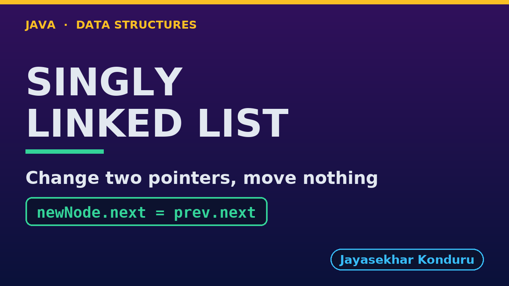

# YouTube — Singly Linked List

Everything needed to publish `video/singly-linked-list-explained.mp4`. Copy the fields straight out of this file.

Chapter timings come from the video's `.srt`; they are regenerated whenever the video is rebuilt.

## Title

```
Singly Linked List in Java - Insertion, Deletion, Search and Reverse
```

68 characters (YouTube shows about 60 before cutting a title off in search).

## Description

The first two lines are what a viewer sees above the fold, so they carry the hook rather than the boilerplate.

```
Singly Linked List in Java, explained with a treasure hunt where each clue says where the next one is hidden. We start with the hunt in an array, where one new clue near the front shifts five others. Then we build the list by hand, the way a C textbook does: a Node with data and a next pointer, and a head. We run every textbook operation and count the real cost: insertAtEnd walking to the last node, count by traversal, search in 5 comparisons, insertAtPosition and insertAtBeginning changing 2 pointers and shifting nothing, deleteByKey, deleteAtBeginning and deleteAtEnd. Then we set the two pointers of an insertion in the wrong order and watch a clue point at itself and four clues vanish. We finish by reversing the list with three pointers, prev, current and next, and with the bill: 999 steps to reach position 999, where an array takes one.

CHAPTERS
00:00 Introduction
00:52 The Everyday Idea
01:27 The Words
01:51 Act One — The hunt in an array
02:16 The hunt in an array
02:33 Act Two — Nodes and next pointers
03:02 Nodes and next pointers
03:20 Act Three — Search, insertion and deletion
03:57 Search, insertion and deletion
04:31 Act Four — Two pointers in the wrong order
04:58 Two pointers in the wrong order
05:14 Act Five — Reversal, and the bill
05:41 Reversal, and the bill
05:56 Time and Space Complexity
06:28 Compared With Related Structures
06:57 Common Mistakes
07:21 Thanks for Watching

SOURCE CODE, WRITTEN NOTES AND AN INTERACTIVE ANIMATION
https://github.com/jk-boot-up/datastructures/tree/main/gradle-java/arrays-and-lists/singly-linked-list

WHAT YOU NEED FIRST
Java basics: variables, loops, classes and methods. No data-structures knowledge is assumed; START-HERE.md in the repository explains memory, references and counting steps.
```

## Chapters

YouTube shows these as chapters because there are at least three and the first is at `00:00`.

```
00:00 Introduction
00:52 The Everyday Idea
01:27 The Words
01:51 Act One — The hunt in an array
02:16 The hunt in an array
02:33 Act Two — Nodes and next pointers
03:02 Nodes and next pointers
03:20 Act Three — Search, insertion and deletion
03:57 Search, insertion and deletion
04:31 Act Four — Two pointers in the wrong order
04:58 Two pointers in the wrong order
05:14 Act Five — Reversal, and the bill
05:41 Reversal, and the bill
05:56 Time and Space Complexity
06:28 Compared With Related Structures
06:57 Common Mistakes
07:21 Thanks for Watching
```

## Tags

```
singly linked list, linked list java, node next pointer, linked list insert, linked list vs array, data structures, java data structures, java, java 25, algorithms, computer science, programming tutorial, beginner, big o
```

220 characters, under YouTube's 500 limit.

## Thumbnail



Upload `docs/thumbnail.png` (1280×720) under **Details → Thumbnail → Upload file**. It is made for the small size YouTube shows in search: the name, one line of promise and one piece of code.

## Upload checklist

- [ ] Upload `video/singly-linked-list-explained.mp4` (1080p, H.264, 30 fps, AAC 48 kHz)
- [ ] Set the video language to **English**, then add subtitles: *Upload file → With timing* → `video/singly-linked-list-explained.srt`
- [ ] Upload `docs/thumbnail.png` as the thumbnail
- [ ] Paste the title, description and tags from above
- [ ] Add to the **Data Structures in Java** playlist
- [ ] Wait for 1080p processing before sharing the link

## Runtime

08:05.
