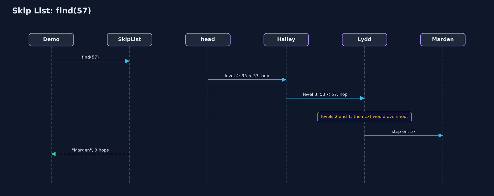

# Skip List

**A skip list adds express levels on top of a sorted linked list, chosen by tossing coins, so a search rides the express as far as it can and then changes down: about log2(n) hops instead of n, on average.**


*level 1 calls at every station; each level above skips more of them*

A **skip list** is a sorted linked list with express lanes. Every value sits on the bottom level, in order, exactly as in a sorted linked list. Some values also stand on level 2, which skips over the ones in between; fewer stand on level 3, and so on. A search starts on the highest level, goes as far as it can without passing the value it wants, then drops down a level and carries on. Which values get the higher levels is decided by tossing a coin, so on average each level has half the values of the one below, and a search takes about log2(n) hops instead of n. It is built by hand here, as in C: each node is a key, a value, and an array of forward arrows, one per level.

> New to data structures? Read [Start here](../../START-HERE.md) first: it explains memory, references and counting steps in ten minutes.

## The everyday idea

Think of a railway line with two kinds of train. The stopping train calls at every station; the express calls only at a few big ones. To get to a small station near the end of the line, you ride the express as far as it goes without overshooting, then change to the stopping train for the last few stops. A skip list has several express services, each skipping more stations than the one below, and a search changes down, level by level, until it arrives.

## The worked example: A train line with stopping and express services

A railway line has sixteen stations, from Ashford at kilometre 3 to Pinner at kilometre 71, kept in order of distance. Passengers ask for stations by kilometre marker. The demo first runs a stopping service only, then adds express levels, finds Marden at kilometre 57, adds a new station, Quarry, and removes Hailey, then shows what an unlucky coin does, and measures a line of a thousand stations.

## Why it exists

A sorted array can be searched quickly by halving, but inserting into it moves everything after the new value. A sorted linked list inserts cheaply, but cannot be halved: there is no middle to jump to, so finding a value means walking from the start, thirteen hops to reach the thirteenth station and five hundred on average in a list of a thousand. A skip list keeps the linked list's cheap inserts and adds express arrows that make searching about as fast as halving: under ten hops on average for a thousand.

## New words

| Word | What it means here |
| --- | --- |
| **level** | One lane of arrows. Level 1 links every station; each higher level links only some, skipping the rest. |
| **height** | How many levels a station stands on: how many forward arrows its node has. |
| **head** | A dummy station at the start that stands on every level, so every search has somewhere to begin. |
| **coin toss** | How a new station's height is chosen: one level, plus one more for every head in a row. |
| **hop** | Following one arrow, on any level. The demo counts them. |
| **expected (on average)** | What happens averaged over the coin tosses. A skip list is fast on average, not in every case. |

## What you will see, act by act

Run the demo and it tells the story in 5 acts, printing the real numbers that the tests check:

```bash
./gradlew run
```

| Act | What it shows |
| --- | --- |
| 1. A stopping service only | Sixteen stations in order, every train calls at every one: finding Marden takes 13 hops, one station at a time. |
| 2. Express lanes | Every 2nd station on level 2, every 4th on level 3, every 8th on level 4: 30 arrows for 16 stations. |
| 3. Ride the express, then change | Marden in 3 hops; km 60 is not there after 4; Quarry is added with height 1 and 2 arrows; Hailey is removed from all 4 levels. |
| 4. An unlucky coin | With a coin that always lands tails, every station stays on level 1: finding Marden takes 13 hops again. |
| 5. The bill, at a thousand stations | 1,000 stations with a fair coin: 11 levels, 9.7 hops per search on average (the stopping service: 500.5), for 2,031 arrows. |

Each act is drawn step by step in [the explained walkthrough](docs/skip-list-explained.md) and in [the animation](docs/animation.html).

## The operations, and what they cost

A step here means one look at, or one change to, one element. Counting steps is how we say fast or slow without a stopwatch; the last column gives the usual short name for that cost.

| Operation | What it does | Steps it takes | Name for that cost |
| --- | --- | --- | --- |
| Search | Ride each level as far as possible without passing, then drop a level | 3 hops for Marden (13 on the stopping line); 9.7 on average at 1,000 stations | O(log n) expected |
| Insert | Search for the spot, toss coins for the height, link in on each level | The search, plus 2 arrows per level | O(log n) expected |
| Remove | Search for it, then unlink it from every level it stands on | The search, plus 1 arrow per level: 4 for Hailey | O(log n) expected |
| Walk in order | Follow the level 1 arrows from the head | One hop per station | O(n), linear |
| Worst case (unlucky coins) | Every station stays on level 1: a plain sorted list | 13 hops for Marden again | O(n) |

## The code

```
src/main/java/com/jk/explore/skiplist/
├── Coin.java          A coin to toss when deciding how tall a new station is: heads, go up a level; tails, stop
├── Lines.java         The demo's printed lines, kept in one {@code StringBuilder} so the tests can check them
├── SkipList.java      A sorted linked list with express lanes: extra levels of arrows that skip over many stations at once
├── SkipListDemo.java  Tells the story of the skip list in five acts, printing the real step counts
└── StepCounter.java   Counts the steps a skip list takes: hops (following one arrow, on any level) and link changes (pointing one arrow somewhere new)
```

## Test

```bash
./gradlew test
```

21 tests in `DemoRunsTest`, `SkipListTest`. Every number the demo prints is asserted, and nothing depends on the clock, so every run gives the same result.

## Common mistakes

| The mistake | What goes wrong | The fix |
| --- | --- | --- |
| Forgetting to record the last station before the target on every level | Insert links the new station in on level 1 but not on the express levels, or links it in the wrong place. | Keep a `before` array: while searching, store the last station visited on each level, then link in on each. |
| Linking the arrows in the wrong order | As in any linked list, pointing the station before at the new one first loses the rest of that level. | On each level, first `box.next[l] = before[l].next[l]`, then `before[l].next[l] = box`. |
| Using the same random generator without a seed in tests | The heights change every run, so step counts change and tests fail at random. | Seed the coin in tests and demos, as `Coin.seeded(2026)` does. |
| Letting the height grow without limit | A long run of heads makes a very tall station and a head with thousands of levels. | Cap the height (`MAX_LEVEL`), about log2 of the largest size you expect. |

## Try it yourself

1. **Easy.** With the regular line of act two, which stations does a search for Kelby (km 48) visit, and how many hops does it take?
2. **Medium.** Add `String firstAtOrAfter(int km)`, which returns the name of the first station at or beyond `km` (or null). Why does it need hardly any new code?
3. **Harder.** Each station is on level 2 with probability 1/2, level 3 with 1/4, and so on. Show that the expected total number of arrows is about 2n, and explain why a search visits about 2 stations per level.

The answers are in [docs/exercises.md](docs/exercises.md), below the questions, so they are not given away.

## When to use it

- You need values kept in order, with fast search, insert and delete, and simple code.
- You want ordered data that many threads can change at once (the JDK's concurrent skip lists).
- You want the speed of a balanced tree without writing rotations.

## When not to

- You need a guaranteed worst case: a skip list is fast on average, and bad luck makes it slow.
- Memory is tight: the express arrows cost about one extra arrow per value.
- The data never changes: a sorted array searched by halving is smaller and just as fast.

## Where you have already met this

- Stopping and express trains; lifts that serve only some floors; skimming a book by chapter, then page, then line.
- `java.util.concurrent.ConcurrentSkipListMap` and `ConcurrentSkipListSet`.
- Redis sorted sets use a skip list inside.

## Technologies and versions

| Technology | Version | Used for |
| --- | --- | --- |
| Java | 25 | the code (toolchain set in `build.gradle`; Gradle fetches JDK 25 if it is missing) |
| Gradle | 9.8.0 (wrapper) | build and run, nothing to install |
| JUnit | 6.1.3 | the tests |
| videokit | course tool | the narrated video and animation: Piper `en_US-amy-medium`, speed 0.8, longer pauses (the `amy-slow` voice) |

## Learning material

| Document | What it is for |
| --- | --- |
| [Start here](../../START-HERE.md) | the ideas every project relies on |
| [Problem statement](docs/problem-statement.md) | the situation and what the project must show |
| [Prerequisites](docs/prerequisites.md) | what you need to know first |
| [Skip List, explained](docs/skip-list-explained.md) | every act, picture by picture |
| [Animated walkthrough](docs/animation.html) | the structure changing step by step, narrated |
| [Cheat sheet](docs/cheat-sheet.md) | the whole structure on one page |
| [Exercises and answers](docs/exercises.md) | practice, easy to harder |
| [Session guide](docs/session.md) | a one-hour lesson |
| [Specification](docs/spec.md) | what this project must be true of |

### How the pieces fit

The skip list keeps a head on every level; each station node has one forward arrow per level it stands on; a coin decides heights.


### The classes

`SkipList` and its nested `Node`; `Coin` for heights; `StepCounter` for hops and arrows; `Lines` for the demo's output.


### How the data moves

Ride the current level while the next station is before the target; when it would overshoot, drop a level.


### Who calls whom, in order

Three hops on the regular line: level 4, level 3, then level 1.



### Video

`video/skip-list-explained.mp4` (with `.m4a` audio and `.srt` subtitles) is built by `video/build_video.sh`. Rendered media is not committed.

## Where this sits

Part of the [data structures course](../../index.md), in *arrays-and-lists*.
