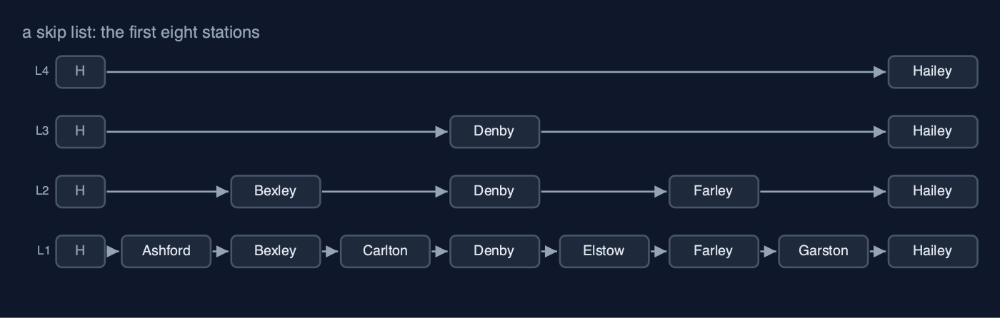
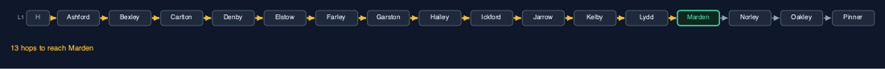
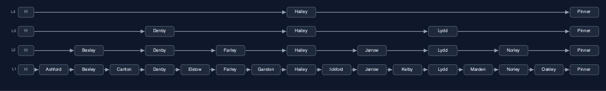
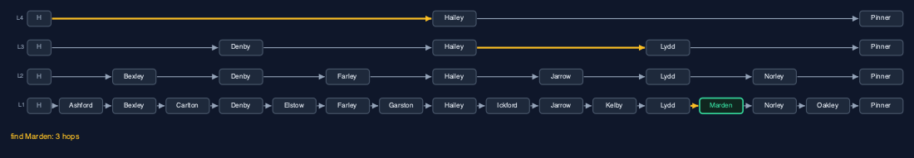
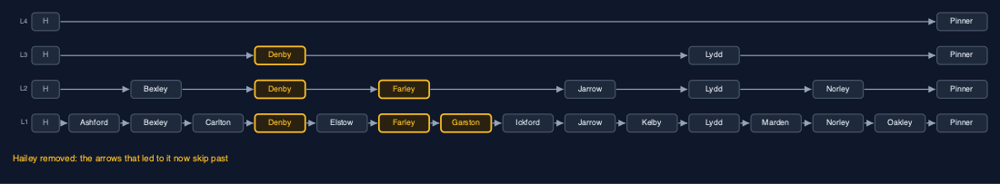
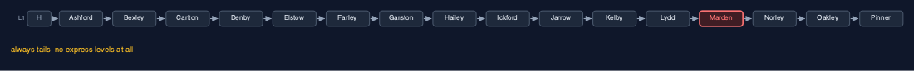
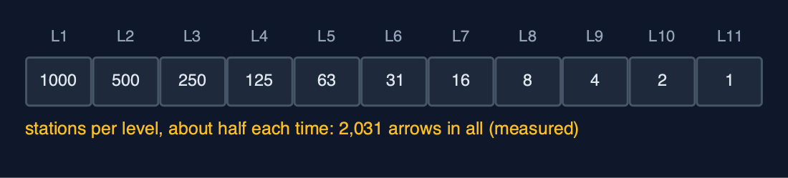

# Skip List, Explained

## In one sentence

A skip list is a sorted linked list with extra express levels, chosen by coin tosses, so a search rides the highest level as far as it can, then drops down, taking about log2(n) hops on average.

## The picture



*level 1 calls at every station; each level above skips more of them*

## The everyday idea

Think of a railway line with two kinds of train. The stopping train calls at every station; the express calls only at a few big ones. To get to a small station near the end of the line, you ride the express as far as it goes without overshooting, then change to the stopping train for the last few stops. A skip list has several express services, each skipping more stations than the one below, and a search changes down, level by level, until it arrives.

## The 5 acts

### Act 1: A stopping service only

First the line has a stopping service only: the sixteen stations form an ordinary sorted linked list, Ashford to Pinner. To find Marden, at kilometre 57, the search starts at the head and follows one arrow at a time, checking each station: twelve stations before Marden and one hop onto it, thirteen hops. A sorted array could be halved, looking in the middle and throwing half away, but a linked list has no middle to jump to; the only way to reach a station is through every station before it.



**The stopping service: 12 stations passed, then Marden, 13 hops** Here is the stopping line. One level, every station. The amber arrows are the search for Marden. It passes every station before it, one hop at a time. Thirteen hops.

What the demo printed:

```
16 stations in order, every train calls at every one
find Marden (km 57): 13 hops, one station at a time
a sorted linked list cannot jump to the middle: there are no positions to jump to
```

### Act 2: Express lanes

Now some stations get express stops. In this perfectly regular line, every second station also stands on level 2, every fourth on level 3, and every eighth on level 4. Each station's node holds one forward arrow per level it stands on: Ashford has one, Bexley two, Denby three, and Hailey and Pinner four. A head node at the start stands on every level, so every search can begin at the top. Level 4 links only Hailey and Pinner; level 1 still links every station in order. The whole line uses 30 arrows for 16 stations.



**Four levels: level 4 calls only at Hailey and Pinner; level 1 calls everywhere** Here are the four levels. The bottom row is the stopping service, every station. Each row above skips more. The top row, level four, calls only at Hailey and Pinner. The column of H boxes on the left is the head, standing on every level.

What the demo printed:

```
level 4: Hailey Pinner
level 3: Denby Hailey Lydd Pinner
level 2: Bexley Denby Farley Hailey Jarrow Lydd Norley Pinner
level 1: Ashford Bexley Carlton Denby Elstow Farley Garston Hailey Ickford Jarrow Kelby Lydd Marden Norley Oakley Pinner
30 arrows for 16 stations
```

### Act 3: Ride the express, then change

To find Marden, the search starts at the head on level 4 and rides to Hailey (kilometre 35), because Hailey is still before 57. The next stop on level 4 is Pinner at 71, which would overshoot, so it drops to level 3 and rides to Lydd (53); the next, Pinner again, overshoots. It drops to level 2, where the next stop, Norley (62), overshoots; drops to level 1, where the next station is Marden: step on. Three hops, against thirteen. Looking for kilometre 60 follows the same kind of path and finds no station there, after four hops. Adding Quarry at kilometre 50 tosses the coin, which gives height 1, so Quarry is linked in on level 1 only: two arrows. Removing Hailey unlinks it on each of its four levels: four arrows changed.



**Level 4 to Hailey, level 3 to Lydd, level 1 onto Marden: 3 hops** Here is the search, in amber. Level four, from the head to Hailey. Level three, from Hailey to Lydd. Then down to level one, and one step onto Marden. Three hops. Ride the express as far as it goes, then change down.



**Remove Hailey: on each of its 4 levels, the station before it now points past it** Now remove Hailey. Hailey stood on four levels, so it is unlinked four times. On each level, the station before Hailey now points straight past it. Four arrows changed, and the express lanes are still in order.

What the demo printed:

```
find Marden (km 57): 3 hops: express to Hailey, then Lydd, then step on
find km 60: no station, 4 hops to be sure
add Quarry (km 50): the coin gives height 1, 2 arrows set
remove Hailey (height 4): 4 arrows changed, one per level
```

### Act 4: An unlucky coin

The express levels only exist because the coin sometimes lands heads. Build the same sixteen stations with a coin that always lands tails and every station gets height 1: there is one level, no express at all, and the line is an ordinary sorted linked list again. Finding Marden takes thirteen hops, exactly as in act one. A real coin is never that unlucky for long, but it shows the truth about skip lists: their speed is an average over the coin tosses, not a guarantee. Balanced trees, later in the course, pay for a guarantee with more complicated code.



**Always tails: one level, no express, and Marden is 13 hops away again** Here is the unlucky line. Only the bottom row exists. Every search walks, one station at a time, just like the stopping service. The express lanes are a gift of the coin, not a promise.

What the demo printed:

```
every toss is tails: 1 level, no express at all
find Marden: 13 hops, the same as the stopping service
a skip list is only fast on average: bad luck makes it a plain list
```

### Act 5: The bill, at a thousand stations

With a fair coin and a thousand stations, the line grows eleven levels. Finding every station once and averaging, a search takes 9.7 hops, where the stopping service would average 500.5. The express lanes cost memory: 2,031 arrows for 1,000 stations, about two per station instead of one, because half the stations have a second arrow, a quarter a third, and so on. And the speed is an average, as act four showed. In Java, `java.util.concurrent.ConcurrentSkipListMap` is a skip list, chosen over a tree because many threads can change it at once without locking the whole structure.



**Each level has about half the stations of the one below: about 2 arrows per station** Here is where the arrows go. Every station has one. About half have a second. A quarter have a third. Add them up and you get about two arrows per station. That is the price of searching in ten hops instead of five hundred.

What the demo printed:

```
1,000 stations: 11 levels, finding a station takes 9.7 hops on average (the stopping service: 500.5)
2,031 arrows: about 2 per station instead of 1
already in Java: java.util.concurrent.ConcurrentSkipListMap
```

## The operations, and what they cost

| Operation | What it does | Steps it takes | Name for that cost |
| --- | --- | --- | --- |
| Search | Ride each level as far as possible without passing, then drop a level | 3 hops for Marden (13 on the stopping line); 9.7 on average at 1,000 stations | O(log n) expected |
| Insert | Search for the spot, toss coins for the height, link in on each level | The search, plus 2 arrows per level | O(log n) expected |
| Remove | Search for it, then unlink it from every level it stands on | The search, plus 1 arrow per level: 4 for Hailey | O(log n) expected |
| Walk in order | Follow the level 1 arrows from the head | One hop per station | O(n), linear |
| Worst case (unlucky coins) | Every station stays on level 1: a plain sorted list | 13 hops for Marden again | O(n) |

## The verdict

Use a skip list when you need ordered data with fast search, insert and delete and would rather not write a balanced tree, or when many threads must change it at once, which is where the JDK uses it. When you need a guaranteed worst case, use a balanced tree; when the data never changes, a sorted array searched by halving is smaller and just as fast.

## How to recognise it in code you did not write

- A node with an array of next pointers, often `Node[] next` or `forward`.
- A `randomLevel()` method that loops while a random bit is set.
- A search loop over levels counting down, with an inner `while` riding each level.

## Where you have already met this

- Stopping and express trains; lifts that serve only some floors; skimming a book by chapter, then page, then line.
- `java.util.concurrent.ConcurrentSkipListMap` and `ConcurrentSkipListSet`.
- Redis sorted sets use a skip list inside.
