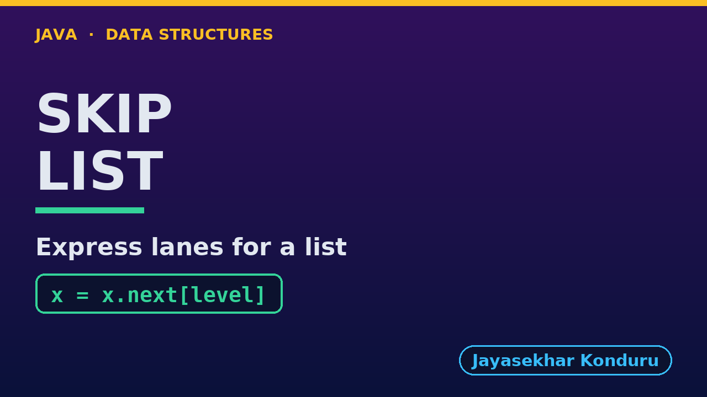

# YouTube — Skip List

Everything needed to publish `video/skip-list-explained.mp4`. Copy the fields straight out of this file.

Chapter timings come from the video's `.srt`; they are regenerated whenever the video is rebuilt.

## Title

```
Skip List in Java - Express Lanes for a Linked List
```

51 characters (YouTube shows about 60 before cutting a title off in search).

## Description

The first two lines are what a viewer sees above the fold, so they carry the hook rather than the boilerplate.

```
Skip List in Java, explained with a train line that has a stopping service and express services. We start with sixteen stations on a stopping line and count thirteen hops to reach Marden, because a sorted linked list has no middle to jump to. Then we build express levels by hand, as in C: every station keeps one forward arrow per level it stands on, and a coin toss decides how tall each station is. We ride the express and change down, finding Marden in three hops, add and remove stations level by level, and meet an unlucky coin that turns the whole line back into a stopping service. We finish with the bill at a thousand stations: 9.7 hops on average instead of 500.5, for about two arrows per station.

CHAPTERS
00:00 Introduction
00:52 The Everyday Idea
01:20 Words First
01:45 Act One — A stopping service only
02:10 A stopping service only
02:26 Act Two — Express lanes
02:54 Express lanes
03:16 Act Three — Ride the express, then change
03:41 Ride the express, then change
04:20 Act Four — An unlucky coin
04:45 An unlucky coin
05:02 Act Five — The bill, at a thousand stations
05:28 The bill, at a thousand stations
05:48 What Each Operation Costs
06:23 Common Mistakes
06:50 When To Use It
07:14 Thanks for Watching

SOURCE CODE, WRITTEN NOTES AND AN INTERACTIVE ANIMATION
https://github.com/jk-boot-up/datastructures/tree/main/gradle-java/arrays-and-lists/skip-list

WHAT YOU NEED FIRST
Java basics: variables, loops, classes and methods. No data-structures knowledge is assumed; START-HERE.md in the repository explains memory, references and counting steps.
```

## Chapters

YouTube shows these as chapters because there are at least three and the first is at `00:00`.

```
00:00 Introduction
00:52 The Everyday Idea
01:20 Words First
01:45 Act One — A stopping service only
02:10 A stopping service only
02:26 Act Two — Express lanes
02:54 Express lanes
03:16 Act Three — Ride the express, then change
03:41 Ride the express, then change
04:20 Act Four — An unlucky coin
04:45 An unlucky coin
05:02 Act Five — The bill, at a thousand stations
05:28 The bill, at a thousand stations
05:48 What Each Operation Costs
06:23 Common Mistakes
06:50 When To Use It
07:14 Thanks for Watching
```

## Tags

```
skip list, skip list java, probabilistic data structure, sorted list search, ConcurrentSkipListMap, data structures, java data structures, java, java 25, algorithms, computer science, programming tutorial, beginner, big o
```

221 characters, under YouTube's 500 limit.

## Thumbnail



Upload `docs/thumbnail.png` (1280×720) under **Details → Thumbnail → Upload file**. It is made for the small size YouTube shows in search: the name, one line of promise and one piece of code.

## Upload checklist

- [ ] Upload `video/skip-list-explained.mp4` (1080p, H.264, 30 fps, AAC 48 kHz)
- [ ] Set the video language to **English**, then add subtitles: *Upload file → With timing* → `video/skip-list-explained.srt`
- [ ] Upload `docs/thumbnail.png` as the thumbnail
- [ ] Paste the title, description and tags from above
- [ ] Add to the **Data Structures in Java** playlist
- [ ] Wait for 1080p processing before sharing the link

## Runtime

07:58.
