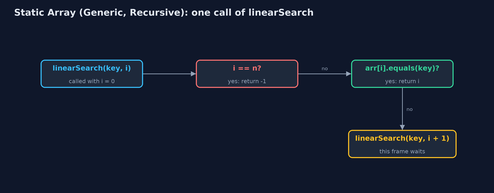

# Static Array (Generic, Recursive)

**The generic recursive static array holds any comparable type T, compares elements with equals and compareTo, and writes every operation as a method that handles one element or one half and calls itself for the rest; its time is the same as the loop version, and its extra space is the recursion depth.**


*linearSearch("Thu") goes one call deeper per element, asking equals, until the match*

This project combines the two variations of the **static array**. Like `static-array-generic`, the element type is a **type parameter** `T extends Comparable<T>`, so the same class holds day names, temperatures or readings, stores **references**, and compares elements with **`equals`** and **`compareTo`**. Like `static-array-recursive`, every operation that can be recursive is: it handles one element or one half, **calls itself** for the rest, and stops at a **base case**, so each call still waiting keeps a **frame** on the **call stack**. The time of every operation is unchanged from the plain static array; the extra space of each recursive operation is its **recursion depth**: O(n) for traversal, linear search, maximum and shifting, O(log n) for binary search.

> New to data structures? Read [Start here](../../START-HERE.md) first: it explains memory, references and counting steps in ten minutes.

## The everyday idea

Picture a queue of seven people, each holding a card. You want to know who holds a card that matches yours. You ask the first person to compare their card with yours. If it does not match, they ask the person behind them the same question and wait. The cards may be anything, numbers, names, photographs: each person just knows how to compare two cards of that kind. When someone finds a match, or the queue runs out, the answer travels back up the queue to you. While the question travels down, everyone asked is standing there waiting: that is the call stack.

## The worked example: One week held as day names, temperatures and readings, every operation recursive

The weather station's week is stored three ways by the same class: day names as `String`, temperatures as `Integer`, and `Reading(day, celsius)` records ordered by temperature. The demo traces a recursive search for "Thu", traverses all three arrays, binary searches the sorted day names, finds the hottest reading and the last day name with one recursive `findMax`, inserts, deletes and reverses recursively, and finally runs out of call stack on a million elements.

## Why it exists

The generic version answers "how do I write the structure once for every type?"; the recursive version answers "how do the textbook's recursive definitions run?". Real code needs both at once: every recursive algorithm later in the course, on trees, heaps and graphs, is written generically, comparing elements with `compareTo`. Seeing the two together on the simplest structure makes those later projects easier to read.

## New words

| Word | What it means here |
| --- | --- |
| **type parameter T** | The element type, filled in at each use: `GenericRecursiveStaticArray<String>`. |
| **equals / compareTo** | How generic code asks two objects whether they are equal, and which is larger; `==` and `<` are not used on elements. |
| **base case** | The input answered without another call: no elements left, a match found, or an empty range. |
| **recursive case** | One element's work, then a call on the rest: `linearSearch(key, i + 1)`. |
| **call stack and frame** | Java keeps one frame, holding a call's parameters and local variables, for every call that has not returned. |
| **recursion depth** | The most frames on the stack at once: the extra space of a recursive operation. |

## What you will see, act by act

Run the demo and it tells the story in 5 acts, printing the real numbers that the tests check:

```bash
./gradlew run
```

| Act | What it shows |
| --- | --- |
| 1. Recursion, for any element type | Recursive linear search for "Thu": each call asks equals and, if not, calls itself on the rest, until the match at index 3, depth 4. |
| 2. The same recursion, three types | Traversal of Integer, String and Reading arrays is the same recursive method, depth 7 each; a separately made "Fri" is found with equals at depth 5. |
| 3. compareTo, recursively | Recursive binary search finds "Thu" in the sorted names with 3 compareTo calls at depth 3; recursive findMax gives Thu 25 C for readings and Wed for names. |
| 4. Insertion, deletion and reversal, recursively | insertAt(2, Wed* 18 C) shifts 5 at depth 5; deleteAt(0) shifts 7 at depth 7 and clears the freed place; reverse swaps 3 at depth 3. |
| 5. The limit of recursion | On 1,000,000 Integers, recursive binary search is 20 compareTo calls deep; recursive linear search throws StackOverflowError. |

Each act is drawn step by step in [the explained walkthrough](docs/static-array-generic-recursive-explained.md) and in [the animation](docs/animation.html).

## The operations, and what they cost

Time is given for the best, average and worst case in Big-O notation (START-HERE.md explains it by counting steps); the last column is what the demo actually counted, so every formula can be checked against a real number.

| Operation | What it does | Time: best / average / worst | Extra space (call stack) | Same operation as a loop | Steps counted in the demo |
| --- | --- | --- | --- | --- | --- |
| Traverse | Visit arr[i], then traverse from i + 1 | O(n) / O(n) / O(n) | O(n) | O(1) | 7 reads, depth 7, for each type |
| Access `get(i)` / update | One address calculation (not recursive) | O(1) / O(1) / O(1) | O(1) | O(1) | 1 step |
| Insert `insertAt(pos, x)` | shiftRight from the last element down to pos | O(1) at the end / O(n) / O(n) at the front | O(n - pos) | O(1) | 5 shifts at depth 5 |
| Delete `deleteAt(pos)` | shiftLeft from pos, then set the freed place to null | O(1) at the end / O(n) / O(n) at the front | O(n - pos) | O(1) | 7 shifts at depth 7 |
| Linear search | arr[i].equals(key)? If not, search from i + 1 | O(1) / O(n) / O(n) | O(n) | O(1) | 4 equals calls at depth 4 to find "Thu" |
| Binary search (sorted) | compareTo with the middle, search one half | O(1) / O(log n) / O(log n) | O(log n) | O(1) | 3 calls for "Thu"; 20 on 1,000,000 |
| Find maximum | compareTo arr[i] with the maximum of the rest | O(n) / O(n) / O(n) | O(n) | O(1) | 6 compareTo calls at depth 6 |
| Reverse | Swap the ends, reverse the middle | O(n) / O(n) / O(n) | O(n / 2) | O(1) | 3 swaps at depth 3 |

Extra space is the memory an operation needs besides the structure itself. A loop needs a fixed amount, O(1); a recursive operation needs one call-stack frame for every call still waiting, so its extra space is the depth of the recursion.

## The operations in code

### Linear search with equals

```java
/** Linear search with {@code equals}: is the key at i? If not, search from i + 1. O(n) time, O(n) stack. */
public int linearSearch(T key) {
    return linearSearch(key, 0);
}

private int linearSearch(T key, int i) {
    if (i == n) {
        return -1;                 // base case: searched everything
    }
    steps.enter();
    steps.compare();
    int result = arr[i].equals(key) ? i : linearSearch(key, i + 1);
    steps.exit();
    return result;
}
```

Two base cases: no elements left (-1), and a match, found with `equals`, which compares contents. Otherwise the call passes the rest of the array, `i + 1`, to the next call. One frame per element examined.

### Binary search with compareTo

```java
/** Binary search with {@code compareTo} on a sorted array: search only the half that can hold the key. O(log n) time and stack. */
public int binarySearch(T key) {
    return binarySearch(key, 0, n - 1);
}

private int binarySearch(T key, int low, int high) {
    if (low > high) {
        return -1;                 // base case: the range is empty
    }
    steps.enter();
    int mid = low + (high - low) / 2;
    steps.compare();
    int c = arr[mid].compareTo(key);   // negative: arr[mid] < key; zero: equal; positive: >
    int result;
    if (c == 0) {
        result = mid;
    } else if (c < 0) {
        result = binarySearch(key, mid + 1, high);
    } else {
        result = binarySearch(key, low, mid - 1);
    }
    steps.exit();
    return result;
}
```

`compareTo` returns negative, zero or positive, which decides the half. The base case is an empty range. Each call halves the range, so the depth is about log2(n): 3 for 7 names, 20 for a million.

### Find maximum

```java
/** The index of the largest element by {@code compareTo}: the larger of arr[i] and the largest of the rest. O(n) time and stack. */
public int findMax() {
    return n == 0 ? -1 : findMax(0);
}

private int findMax(int i) {
    if (i == n - 1) {
        return i;                  // base case: one element is its own maximum
    }
    steps.enter();
    int restMax = findMax(i + 1);
    steps.compare();
    int result = arr[i].compareTo(arr[restMax]) >= 0 ? i : restMax;
    steps.exit();
    return result;
}
```

The base case is the last element. Every other call first finds the maximum of the rest, then compares it with its own element using `compareTo`, on the way back up. The element's own `compareTo` decides the order: temperature for readings, alphabetical for names.

### Deletion

```java
/**
 * Deletion at {@code pos}: shift arr[pos+1..n-1] left recursively, then clear the freed place.
 * O(n - pos) time and stack.
 *
 * @return the deleted element
 * @throws IllegalStateException "underflow" when the array is empty
 */
public T deleteAt(int pos) {
    if (isEmpty()) {
        throw new IllegalStateException("underflow: the array is empty");
    }
    checkIndex(pos);
    T deleted = arr[pos];
    shiftLeft(pos);
    arr[n - 1] = null;             // no reference left behind, so the object can be freed
    n--;
    return deleted;
}

private void shiftLeft(int i) {
    if (i >= n - 1) {              // base case: reached the last element
        return;
    }
    steps.enter();
    arr[i] = arr[i + 1];
    steps.shift();
    shiftLeft(i + 1);
    steps.exit();
}
```

`shiftLeft` moves `arr[i + 1]` into `arr[i]` and recurses on `i + 1`, stopping at the last element. Afterwards the freed place is set to `null`, so the deleted object is not kept alive by the array.

## Compared with related structures

The four static-array projects side by side (n elements):

| Property | Generic, recursive (this) | Generic, loops | int, recursive | int, loops |
| --- | --- | --- | --- | --- |
| Element types | any Comparable T | any Comparable T | int | int |
| Compares with | equals, compareTo | equals, compareTo | ==, < | ==, < |
| Traverse, linear search | O(n) time, O(n) stack | O(n) time, O(1) space | O(n) time, O(n) stack | O(n) time, O(1) space |
| Binary search | O(log n) time and stack | O(log n) time, O(1) space | O(log n) time and stack | O(log n) time, O(1) space |
| Insert / delete at front | O(n), O(n) stack | O(n), O(1) space | O(n), O(n) stack | O(n), O(1) space |
| A million elements | linear recursion overflows | fine | linear recursion overflows | fine |

## The code

```
src/main/java/com/jk/explore/staticarraygenericrecursive/
├── GenericRecursiveStaticArray.java      A static (fixed-capacity) array of any element type {@code T}, whose operations are written recursively
├── GenericRecursiveStaticArrayDemo.java  Tells the story of the generic, recursive static array in five acts, printing the real counts and the real depth of every recursion
├── Lines.java                            The demo's printed lines, kept in one {@code StringBuilder} so the tests can check them
├── Reading.java                          One day's temperature reading: a type of our own, to show that the generic array holds any type that can be put in order
└── StepCounter.java                      Counts what an array operation costs, so the demo prints real numbers instead of claims: element reads and writes, comparisons, shifts (moving an element to the next position), swaps, copies into a new array, and the deepest recursion reached (the most call-stack frames alive at once, which is the extra space a recursive version uses)
```

## Test

```bash
./gradlew test
```

21 tests in `DemoRunsTest`, `GenericRecursiveStaticArrayTest`. Every number the demo prints is asserted, and nothing depends on the clock, so every run gives the same result.

## Common mistakes

| The mistake | What goes wrong | The fix |
| --- | --- | --- |
| Comparing elements with `==` or `<` | `==` only matches the very same object, and `<` does not compile on objects. | Use `equals` for equality and `compareTo` for order. |
| No base case, or no progress towards it | The method calls itself for ever and throws `StackOverflowError`. | Write the base case first; make every call work on `i + 1` or a smaller half. |
| Leaving the deleted reference in the array | The object stays reachable and is never freed. | Set the freed place to `null` after shifting. |
| Linear recursion on large data | One frame per element: a million elements overflow the call stack. | Recurse where the depth is logarithmic; loop over long linear passes. |

## Try it yourself

1. **Easy.** Write a recursive `int count(T key, int i)` returning how many elements from index i on are equal to `key`. Name its base case and its extra space.
2. **Medium.** Write a recursive `boolean isSorted(int i)` using `compareTo`. How deep does it go on the day names in week order, [Mon, Tue, Wed, Thu, Fri, Sat, Sun]?
3. **Harder.** Write a generic recursive `int findMin(int i)` that returns the index of the smallest element. Then change `Reading.compareTo` to order by day name and say what `findMin` returns on the readings, without changing the array class.

The answers are in [docs/exercises.md](docs/exercises.md), below the questions, so they are not given away.

## When to use it

- The structure must hold several element types, and the algorithm is naturally recursive.
- The recursion depth is logarithmic, as in binary search.
- Learning: this is how the tree and divide-and-conquer code later in the course is written.

## When not to

- Linear recursion over large arrays: a million elements overflow Java's call stack; use the loops of `static-array-generic`.
- Millions of plain numbers: `int[]` avoids a reference and an object per element.

## Where you have already met this

- Recursive generic methods in textbooks, such as `<T extends Comparable<T>> int binarySearch(T[] a, T key, int low, int high)`.
- `Comparable<T>` on `String`, `Integer` and `LocalDate`.
- Any `StackOverflowError` from a method that called itself too deeply.

## Technologies and versions

| Technology | Version | Used for |
| --- | --- | --- |
| Java | 25 | the code (toolchain set in `build.gradle`; Gradle fetches JDK 25 if it is missing) |
| Gradle | 9.8.0 (wrapper) | build and run, nothing to install |
| JUnit | 6.1.3 | the tests |
| videokit | course tool | the narrated video and animation: Piper `en_US-amy-medium`, speed 0.8, longer pauses (the `amy-slow` voice) |

## Learning material

| Document | What it is for |
| --- | --- |
| [Start here](../../START-HERE.md) | the ideas every project relies on |
| [Problem statement](docs/problem-statement.md) | the situation and what the project must show |
| [Prerequisites](docs/prerequisites.md) | what you need to know first |
| [Static Array (Generic, Recursive), explained](docs/static-array-generic-recursive-explained.md) | every act, picture by picture |
| [Animated walkthrough](docs/animation.html) | the structure changing step by step, narrated |
| [Cheat sheet](docs/cheat-sheet.md) | the whole structure on one page |
| [Exercises and answers](docs/exercises.md) | practice, easy to harder |
| [Session guide](docs/session.md) | a one-hour lesson |
| [Specification](docs/spec.md) | what this project must be true of |

### How the pieces fit

The demo uses one generic class with three element types; each public operation starts a private recursive method.


### The classes

`T extends Comparable<T>`; `Reading` is one such type; `StepCounter` measures steps and depth.


### How the data moves

Two base cases, then a call on the rest.



### Who calls whom, in order

Three calls, each on half the range; the index returns through every frame.


### Video

`video/static-array-generic-recursive-explained.mp4` (with `.m4a` audio and `.srt` subtitles) is built by `video/build_video.sh`. Rendered media is not committed.

## Where this sits

Part of the [data structures course](../../index.md), in *arrays-and-lists*.
