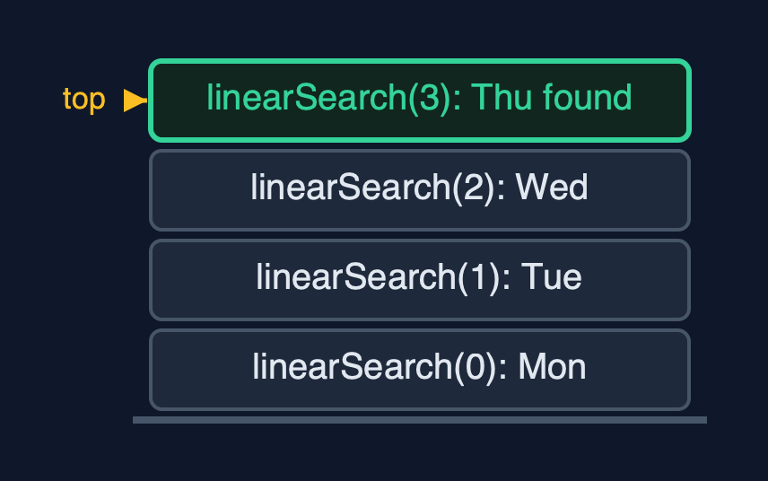

# Static Array (Generic, Recursive) — Cheat Sheet

**The generic recursive static array holds any comparable type T, compares elements with equals and compareTo, and writes every operation as a method that handles one element or one half and calls itself for the rest; its time is the same as the loop version, and its extra space is the recursion depth.**

| | |
| --- | --- |
| **What it is** | The generic recursive static array holds any comparable type, compares with equals and compareTo, and writes each operation as one element's work plus a call on the rest; the time is unchanged and the extra space is the recursion depth. |
| **Everyday picture** | A queue of people passing a question back, whatever the question is about |
| **Use it when** | The structure must hold several element types, and the algorithm is naturally recursive; The recursion depth is logarithmic, as in binary search; Learning: this is how the tree and divide-and-conquer code later in the course is written |
| **Avoid it when** | Linear recursion over large arrays: a million elements overflow Java's call stack; use the loops of `static-array-generic`; Millions of plain numbers: `int[]` avoids a reference and an object per element |
| **Already in Java** | Nothing: Java's generic collections and `java.util.Arrays` are iterative |

## Costs

| Operation | What it does | Time: best / average / worst | Extra space (call stack) | Same operation as a loop | Steps counted in the demo |
| --- | --- | --- | --- | --- | --- |
| Traverse | Visit arr[i], then traverse from i + 1 | O(n) / O(n) / O(n) | O(n) | O(1) | 7 reads, depth 7, for each type |
| Access `get(i)` / update | One address calculation (not recursive) | O(1) / O(1) / O(1) | O(1) | O(1) | 1 step |
| Insert `insertAt(pos, x)` | shiftRight from the last element down to pos | O(1) at the end / O(n) / O(n) at the front | O(n - pos) | O(1) | 5 shifts at depth 5 |
| Delete `deleteAt(pos)` | shiftLeft from pos, then set the freed place to null | O(1) at the end / O(n) / O(n) at the front | O(n - pos) | O(1) | 7 shifts at depth 7 |
| Linear search | arr[i].equals(key)? If not, search from i + 1 | O(1) / O(n) / O(n) | O(n) | O(1) | 4 equals calls at depth 4 to find "Thu" |
| Binary search (sorted) | compareTo with the middle, search one half | O(1) / O(log n) / O(log n) | O(log n) | O(1) | 3 calls for "Thu"; 20 on 1,000,000 |
| Find maximum | compareTo arr[i] with the maximum of the rest | O(n) / O(n) / O(n) | O(n) | O(1) | 6 compareTo calls at depth 6 |
| Reverse | Swap the ends, reverse the middle | O(n) / O(n) / O(n) | O(n / 2) | O(1) | 3 swaps at depth 3 |

## Compared with related structures

The four static-array projects side by side (n elements):

| Property | Generic, recursive (this) | Generic, loops | int, recursive | int, loops |
| --- | --- | --- | --- | --- |
| Element types | any Comparable T | any Comparable T | int | int |
| Compares with | equals, compareTo | equals, compareTo | ==, < | ==, < |
| Traverse, linear search | O(n) time, O(n) stack | O(n) time, O(1) space | O(n) time, O(n) stack | O(n) time, O(1) space |
| Binary search | O(log n) time and stack | O(log n) time, O(1) space | O(log n) time and stack | O(log n) time, O(1) space |
| Insert / delete at front | O(n), O(n) stack | O(n), O(1) space | O(n), O(n) stack | O(n), O(1) space |
| A million elements | linear recursion overflows | fine | linear recursion overflows | fine |

## Watch out for

- **Comparing elements with `==` or `<`**: Use `equals` for equality and `compareTo` for order.
- **No base case, or no progress towards it**: Write the base case first; make every call work on `i + 1` or a smaller half.
- **Leaving the deleted reference in the array**: Set the freed place to `null` after shifting.
- **Linear recursion on large data**: Recurse where the depth is logarithmic; loop over long linear passes.
