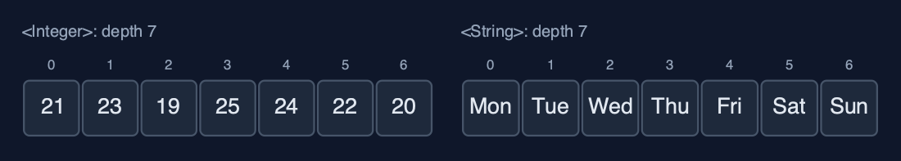
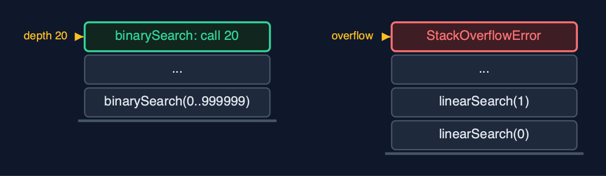

# Static Array (Generic, Recursive), Explained

## In one sentence

The generic recursive static array holds any comparable type, compares with equals and compareTo, and writes each operation as one element's work plus a call on the rest; the time is unchanged and the extra space is the recursion depth.

## The picture


*linearSearch("Thu") goes one call deeper per element, asking equals, until the match*

## The everyday idea

Picture a queue of seven people, each holding a card. You want to know who holds a card that matches yours. You ask the first person to compare their card with yours. If it does not match, they ask the person behind them the same question and wait. The cards may be anything, numbers, names, photographs: each person just knows how to compare two cards of that kind. When someone finds a match, or the queue runs out, the answer travels back up the queue to you. While the question travels down, everyone asked is standing there waiting: that is the call stack.

## The 5 acts

### Act 1: Recursion, for any element type

The recursive linear search is defined in one sentence: either the element at i equals the key, or the key is in the rest of the array. The demo traces it on the day names. `linearSearch(0)` asks whether "Mon" equals "Thu": no, so it calls `linearSearch(1)`, and waits. "Tue", no; "Wed", no; "Thu", yes: that call returns index 3 without calling again, a base case. The other base case is running out of elements. The search used 4 `equals` calls and 4 frames on the call stack at once.


**Four calls waiting on the call stack; the top one found "Thu"** Here is the call stack at the moment of the match. The first call is at the bottom. Each call pushed a new frame on top. The top call found Thursday, and its answer now travels back down through every frame.

What the demo printed:

```
linearSearch(0): Mon.equals(Thu)? no -> linearSearch(1)
  ... Tue, no; Wed, no
    linearSearch(3): Thu.equals(Thu) -> found, index 3   <- base case
linearSearch("Thu") = index 3: 4 equals calls, depth 4
```

### Act 2: The same recursion, three types

The same recursive traverse runs on `GenericRecursiveStaticArray<Integer>`, `<String>` and `<Reading>`: each visits one element and calls itself for the rest, 7 frames deep for 7 elements, whatever the type. Searching for `new String("Fri")`, a separate object with the same text, succeeds at index 4, depth 5, because the search asks `equals`; `==` would compare references and never match.



**One class, three element types, the same depth** Here are two of the arrays. Numbers and names. The recursive method does not care which: it goes one call per element, seven deep, in both.

What the demo printed:

```
<Integer> traverse: [21, 23, 19, 25, 24, 22, 20], depth 7
<String>  traverse: [Mon, Tue, Wed, Thu, Fri, Sat, Sun], depth 7
<Reading> traverse: [Mon 21 C, ... Sun 20 C], depth 7
linearSearch(new String("Fri")) = index 4 at depth 5: equals compares the text, == would not match
```

### Act 3: compareTo, recursively

Recursive binary search compares the key with the middle element using `compareTo` and calls itself on one half. On the sorted names [Fri, Mon, Sat, Sun, Thu, Tue, Wed] it compares with "Sun" (go right), "Tue" (go left), then "Thu": 3 calls, depth 3. Recursive `findMax` goes all the way to the last element, its base case, and then compares on the way back up: 6 `compareTo` calls at depth 6. For readings the order is temperature, so the answer is "Thu 25 C"; for names the same method returns "Wed".


**Recursive binary search: call 1 at Sun, call 2 at Tue, call 3 finds Thu** Here are the three calls. Each call looks at the middle of its range, and calls itself on one half. The third call finds Thursday.

What the demo printed:

```
sorted [Fri, Mon, Sat, Sun, Thu, Tue, Wed]: binarySearch("Thu") = index 4, 3 compareTo calls, depth 3
findMax on readings = Thu 25 C: 6 compareTo calls on the way back up, depth 6
findMax on day names = Wed: the same method, alphabetical order
```

### Act 4: Insertion, deletion and reversal, recursively

`insertAt(2, Wed* 18 C)` calls `shiftRight` from the last reading down to index 2: 5 shifts, 5 frames, and the new reading is stored. `deleteAt(0)` calls `shiftLeft` from index 0: 7 shifts, 7 frames; then the place that fell out of use is set to `null`, so the array holds no reference to the deleted reading. `reverse` swaps the two ends and calls itself on the middle: 3 swaps, depth 3.


**After deleteAt(0): seven references shifted by seven calls, and the freed place is null** Here is the array after the deletion. Seven readings shifted left, one call each. The place after them is null, so the deleted reading can be freed.

What the demo printed:

```
insertAt(2, Wed* 18 C): 5 shifts, depth 5
deleteAt(0) removed Mon 21 C: 7 shifts, depth 7; the freed place is set to null
reverse: 3 swaps, depth 3; [Sun 20 C, Sat 22 C, Fri 24 C, Thu 25 C, Wed 19 C, Wed* 18 C, Tue 23 C]
```

### Act 5: The limit of recursion

Generics do not change the depth. Binary search on a million sorted Integers makes 20 `compareTo` calls, 20 frames deep, and is always safe. Linear search on the same array needs one frame per element, and the call stack runs out long before a million: Java throws `StackOverflowError`. The loop version in `static-array-generic` searches the million with O(1) extra space. Generics change what is compared; recursion changes how much stack is used; neither changes the time.



**Depth 20 fits on the call stack; depth 1,000,000 does not** Here are the two depths. Twenty frames for binary search. A million frames for linear search, far beyond what the call stack can hold.

What the demo printed:

```
binarySearch on 1,000,000 Integers: 20 compareTo calls, depth 20
linearSearch on 1,000,000: StackOverflowError, one frame per element
generics change what is compared, recursion changes how much stack is used; neither changes the time
```

## The operations in code

### Linear search with equals

```java
/** Linear search with {@code equals}: is the key at i? If not, search from i + 1. O(n) time, O(n) stack. */
public int linearSearch(T key) {
    return linearSearch(key, 0);
}

private int linearSearch(T key, int i) {
    if (i == n) {
        return -1;                 // base case: searched everything
    }
    steps.enter();
    steps.compare();
    int result = arr[i].equals(key) ? i : linearSearch(key, i + 1);
    steps.exit();
    return result;
}
```

Two base cases: no elements left (-1), and a match, found with `equals`, which compares contents. Otherwise the call passes the rest of the array, `i + 1`, to the next call. One frame per element examined.

### Binary search with compareTo

```java
/** Binary search with {@code compareTo} on a sorted array: search only the half that can hold the key. O(log n) time and stack. */
public int binarySearch(T key) {
    return binarySearch(key, 0, n - 1);
}

private int binarySearch(T key, int low, int high) {
    if (low > high) {
        return -1;                 // base case: the range is empty
    }
    steps.enter();
    int mid = low + (high - low) / 2;
    steps.compare();
    int c = arr[mid].compareTo(key);   // negative: arr[mid] < key; zero: equal; positive: >
    int result;
    if (c == 0) {
        result = mid;
    } else if (c < 0) {
        result = binarySearch(key, mid + 1, high);
    } else {
        result = binarySearch(key, low, mid - 1);
    }
    steps.exit();
    return result;
}
```

`compareTo` returns negative, zero or positive, which decides the half. The base case is an empty range. Each call halves the range, so the depth is about log2(n): 3 for 7 names, 20 for a million.

### Find maximum

```java
/** The index of the largest element by {@code compareTo}: the larger of arr[i] and the largest of the rest. O(n) time and stack. */
public int findMax() {
    return n == 0 ? -1 : findMax(0);
}

private int findMax(int i) {
    if (i == n - 1) {
        return i;                  // base case: one element is its own maximum
    }
    steps.enter();
    int restMax = findMax(i + 1);
    steps.compare();
    int result = arr[i].compareTo(arr[restMax]) >= 0 ? i : restMax;
    steps.exit();
    return result;
}
```

The base case is the last element. Every other call first finds the maximum of the rest, then compares it with its own element using `compareTo`, on the way back up. The element's own `compareTo` decides the order: temperature for readings, alphabetical for names.

### Deletion

```java
/**
 * Deletion at {@code pos}: shift arr[pos+1..n-1] left recursively, then clear the freed place.
 * O(n - pos) time and stack.
 *
 * @return the deleted element
 * @throws IllegalStateException "underflow" when the array is empty
 */
public T deleteAt(int pos) {
    if (isEmpty()) {
        throw new IllegalStateException("underflow: the array is empty");
    }
    checkIndex(pos);
    T deleted = arr[pos];
    shiftLeft(pos);
    arr[n - 1] = null;             // no reference left behind, so the object can be freed
    n--;
    return deleted;
}

private void shiftLeft(int i) {
    if (i >= n - 1) {              // base case: reached the last element
        return;
    }
    steps.enter();
    arr[i] = arr[i + 1];
    steps.shift();
    shiftLeft(i + 1);
    steps.exit();
}
```

`shiftLeft` moves `arr[i + 1]` into `arr[i]` and recurses on `i + 1`, stopping at the last element. Afterwards the freed place is set to `null`, so the deleted object is not kept alive by the array.

## The operations, and what they cost

| Operation | What it does | Time: best / average / worst | Extra space (call stack) | Same operation as a loop | Steps counted in the demo |
| --- | --- | --- | --- | --- | --- |
| Traverse | Visit arr[i], then traverse from i + 1 | O(n) / O(n) / O(n) | O(n) | O(1) | 7 reads, depth 7, for each type |
| Access `get(i)` / update | One address calculation (not recursive) | O(1) / O(1) / O(1) | O(1) | O(1) | 1 step |
| Insert `insertAt(pos, x)` | shiftRight from the last element down to pos | O(1) at the end / O(n) / O(n) at the front | O(n - pos) | O(1) | 5 shifts at depth 5 |
| Delete `deleteAt(pos)` | shiftLeft from pos, then set the freed place to null | O(1) at the end / O(n) / O(n) at the front | O(n - pos) | O(1) | 7 shifts at depth 7 |
| Linear search | arr[i].equals(key)? If not, search from i + 1 | O(1) / O(n) / O(n) | O(n) | O(1) | 4 equals calls at depth 4 to find "Thu" |
| Binary search (sorted) | compareTo with the middle, search one half | O(1) / O(log n) / O(log n) | O(log n) | O(1) | 3 calls for "Thu"; 20 on 1,000,000 |
| Find maximum | compareTo arr[i] with the maximum of the rest | O(n) / O(n) / O(n) | O(n) | O(1) | 6 compareTo calls at depth 6 |
| Reverse | Swap the ends, reverse the middle | O(n) / O(n) / O(n) | O(n / 2) | O(1) | 3 swaps at depth 3 |

## Compared with related structures

The four static-array projects side by side (n elements):

| Property | Generic, recursive (this) | Generic, loops | int, recursive | int, loops |
| --- | --- | --- | --- | --- |
| Element types | any Comparable T | any Comparable T | int | int |
| Compares with | equals, compareTo | equals, compareTo | ==, < | ==, < |
| Traverse, linear search | O(n) time, O(n) stack | O(n) time, O(1) space | O(n) time, O(n) stack | O(n) time, O(1) space |
| Binary search | O(log n) time and stack | O(log n) time, O(1) space | O(log n) time and stack | O(log n) time, O(1) space |
| Insert / delete at front | O(n), O(n) stack | O(n), O(1) space | O(n), O(n) stack | O(n), O(1) space |
| A million elements | linear recursion overflows | fine | linear recursion overflows | fine |

## The verdict

This is the shape of most textbook code for trees and heaps: generic, recursive, and comparing with compareTo. On arrays, keep recursion for logarithmic depth such as binary search, and use loops for linear passes over large data.

## How to recognise it in code you did not write

- `class X<T extends Comparable<T>>` with private methods that call themselves.
- `arr[i].equals(key)` and `arr[mid].compareTo(key)` inside a recursive method.
- A base case such as `if (i == n) return -1;` at the top.

## Where you have already met this

- Recursive generic methods in textbooks, such as `<T extends Comparable<T>> int binarySearch(T[] a, T key, int low, int high)`.
- `Comparable<T>` on `String`, `Integer` and `LocalDate`.
- Any `StackOverflowError` from a method that called itself too deeply.
