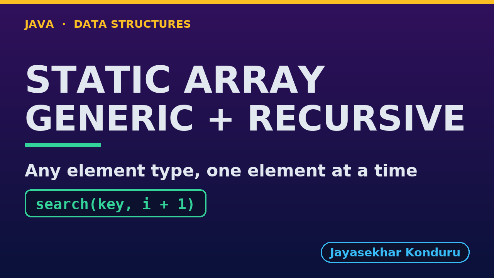

# YouTube — Static Array (Generic, Recursive)

Everything needed to publish `video/static-array-generic-recursive-explained.mp4`. Copy the fields straight out of this file.

Chapter timings come from the video's `.srt`; they are regenerated whenever the video is rebuilt.

## Title

```
Generic Recursive Static Array in Java - equals, compareTo and the Call Stack
```

77 characters (YouTube shows about 60 before cutting a title off in search).

## Description

The first two lines are what a viewer sees above the fold, so they carry the hook rather than the boilerplate.

```
Generic Recursive Static Array in Java, explained with one week held as String day names, Integer temperatures and Reading records by the same class. We trace a recursive linear search for "Thu" call by call, each call asking equals and passing the rest of the array to the next call, until the match at depth 4. We traverse all three element types at depth 7, find a separately made "Fri" that == would miss, binary search the sorted day names with compareTo in 3 calls, and find the hottest reading with compareTo on the way back up the call stack. We insert, delete and reverse recursively, clearing the freed place for the garbage collector, and finish at the limit: binary search on a million Integers goes only 20 calls deep, while linear search throws a real StackOverflowError.

CHAPTERS
00:00 Introduction
00:48 The Everyday Idea
01:26 The Words
01:59 Act One — Recursion, for any element type
02:31 Recursion, for any element type
02:48 Act Two — The same recursion, three types
03:14 The same recursion, three types
03:27 Act Three — compareTo, recursively
03:58 compareTo, recursively
04:10 Act Four — Insertion, deletion and reversal, recursively
04:36 Insertion, deletion and reversal, recursively
04:49 Act Five — The limit of recursion
05:16 The limit of recursion
05:28 Time and Space Complexity
05:58 The Four Static Arrays
06:27 Common Mistakes
06:51 Thanks for Watching

SOURCE CODE, WRITTEN NOTES AND AN INTERACTIVE ANIMATION
https://github.com/jk-boot-up/datastructures/tree/main/gradle-java/arrays-and-lists/static-array-generic-recursive

WHAT YOU NEED FIRST
Java basics: variables, loops, classes and methods. No data-structures knowledge is assumed; START-HERE.md in the repository explains memory, references and counting steps.
```

## Chapters

YouTube shows these as chapters because there are at least three and the first is at `00:00`.

```
00:00 Introduction
00:48 The Everyday Idea
01:26 The Words
01:59 Act One — Recursion, for any element type
02:31 Recursion, for any element type
02:48 Act Two — The same recursion, three types
03:14 The same recursion, three types
03:27 Act Three — compareTo, recursively
03:58 compareTo, recursively
04:10 Act Four — Insertion, deletion and reversal, recursively
04:36 Insertion, deletion and reversal, recursively
04:49 Act Five — The limit of recursion
05:16 The limit of recursion
05:28 Time and Space Complexity
05:58 The Four Static Arrays
06:27 Common Mistakes
06:51 Thanks for Watching
```

## Tags

```
java generics, recursion, recursive binary search, comparable, call stack, static array, data structures, java data structures, java, java 25, algorithms, computer science, programming tutorial, beginner, big o
```

210 characters, under YouTube's 500 limit.

## Thumbnail



Upload `docs/thumbnail.png` (1280×720) under **Details → Thumbnail → Upload file**. It is made for the small size YouTube shows in search: the name, one line of promise and one piece of code.

## Upload checklist

- [ ] Upload `video/static-array-generic-recursive-explained.mp4` (1080p, H.264, 30 fps, AAC 48 kHz)
- [ ] Set the video language to **English**, then add subtitles: *Upload file → With timing* → `video/static-array-generic-recursive-explained.srt`
- [ ] Upload `docs/thumbnail.png` as the thumbnail
- [ ] Paste the title, description and tags from above
- [ ] Add to the **Data Structures in Java** playlist
- [ ] Wait for 1080p processing before sharing the link

## Runtime

07:39.
