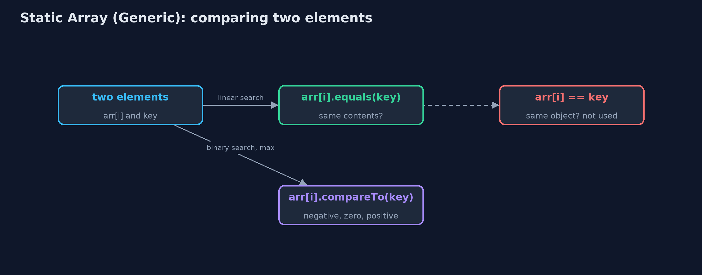

# Static Array (Generic)

**A generic static array is written once with a type parameter T and used for any element type: it stores references to objects, compares them with equals and compareTo instead of == and <, and keeps every cost of the static array: O(1) access, O(n) shifting, a fixed capacity.**


*GenericStaticArray<Reading> with n = 7: each place holds a reference to a Reading object*

A **generic static array** is the static array written once for **any element type**. Instead of `int`, the class has a **type parameter** `T`: `GenericStaticArray<Integer>` holds integers, `GenericStaticArray<String>` holds strings, `GenericStaticArray<Reading>` holds objects of our own, and the compiler refuses anything else. The structure and every cost are the same as the `static-array` project: consecutive places, O(1) access by index, O(n) shifting on insertion and deletion, a fixed capacity and overflow. Three things change, and they are what this project teaches. The array stores **references** to objects, not the values themselves. Equality is tested with **`equals`**, which compares contents, not `==`, which compares references. And order is tested with **`compareTo`**, so `T` must be a type whose elements can be put in order: `T extends Comparable<T>`.

> New to data structures? Read [Start here](../../START-HERE.md) first: it explains memory, references and counting steps in ten minutes.

## The everyday idea

Picture the same row of numbered lockers, but now every locker holds a **label with an address** on it rather than the thing itself: the thing is kept somewhere else, and the label tells you where. The lockers do not care what the things are, parcels, books, bicycles, so the same row works for anything. When the manager says "this row is for books only", nobody may put a bicycle's label in it. To ask "is this the same book?" you compare the books, not the labels: two labels can point at two copies of the same book.

## The worked example: One week of temperatures held as numbers, as day names, and as readings

The weather station from the `static-array` project stores its week three ways with the same class: the temperatures as `Integer`, the day names as `String`, and each day as a `Reading(day, celsius)` record that orders readings by temperature. The demo searches each, inserts and deletes readings, and runs the same `findMax` on readings and on day names to show that each type brings its own order.

## Why it exists

Without generics, the course would need a separate array class for every element type: one for `int`, one for `String`, one for readings, all with identical code. The old alternative, an array of `Object`, accepts anything, so a string can end up in an array of temperatures and the mistake is only found when the program crashes. A type parameter gives one class for every type, and the compiler checks each use: putting `"hot"` into a `GenericStaticArray<Integer>` does not even compile.

## New words

| Word | What it means here |
| --- | --- |
| **type parameter T** | A placeholder for the element type, written in angle brackets: `GenericStaticArray<T>`. Each use fills it in: `GenericStaticArray<Integer>`. |
| **reference** | What an array of objects stores in each place: the address of an object that lives elsewhere in memory. |
| **equals** | The method that compares two objects' contents. `==` on objects only asks whether two references point at the same object. |
| **compareTo** | The method of `Comparable<T>` that orders two objects: negative if smaller, zero if equal, positive if larger. |
| **bounded type** | `T extends Comparable<T>`: T may be any type, as long as its elements can be compared. |
| **type erasure** | Java removes type parameters when it compiles, so at run time `T` is unknown and `new T[10]` is not allowed. |
| **overflow and underflow** | Inserting into a full array (overflow) or deleting from an empty one (underflow), as in any static array. |

## What you will see, act by act

Run the demo and it tells the story in 5 acts, printing the real numbers that the tests check:

```bash
./gradlew run
```

| Act | What it shows |
| --- | --- |
| 1. One class, any element type | The same GenericStaticArray holds Integer temperatures, String day names and Reading records; storing a String in the Integer array does not compile. |
| 2. Inside: an array of references | new T[10] is not allowed, so the array is created as (T[]) new Comparable[10]; copying it copies 7 references, and both arrays share the same objects. |
| 3. Searching with equals and compareTo | Linear search finds 24 with 5 equals comparisons and finds a separately made "Fri" that == would miss; binary search finds 24 and "Thu" with 3 compareTo comparisons each. |
| 4. Insertion, deletion, overflow | Inserting a reading at index 2 shifts 5; deleting index 0 shifts 7 and sets the freed place to null; at 10 of 10 the next insert is an overflow. |
| 5. One algorithm, many orders | The same findMax returns Thu 25 C for readings (by temperature) and Wed for day names (alphabetically); reverse swaps 3 pairs; there is no sum, because T need not be a number. |

Each act is drawn step by step in [the explained walkthrough](docs/static-array-generic-explained.md) and in [the animation](docs/animation.html).

## The operations, and what they cost

Time is given for the best, average and worst case in Big-O notation (START-HERE.md explains it by counting steps); the last column is what the demo actually counted, so every formula can be checked against a real number.

| Operation | What it does | Time: best / average / worst | Extra space | Steps counted in the demo |
| --- | --- | --- | --- | --- |
| Traverse | Visit arr[0] to arr[n-1] once | O(n) / O(n) / O(n) | O(1) | 7 reads for the week |
| Access `get(i)` | Return the reference in arr[i] | O(1) / O(1) / O(1) | O(1) | 1 step |
| Update `update(i, x)` | Store a new reference in arr[i] | O(1) / O(1) / O(1) | O(1) | 1 step |
| Insert `insertAt(pos, x)` | Shift arr[pos..n-1] right, store x | O(1) at the end / O(n) / O(n) at the front | O(1) | 5 shifts to insert a reading at index 2 of 7 |
| Delete `deleteAt(pos)` | Shift arr[pos+1..n-1] left, set the freed place to null | O(1) at the end / O(n) / O(n) at the front | O(1) | 7 shifts to delete index 0 of 8 |
| Linear search | Compare with each element using equals | O(1) / O(n) / O(n) | O(1) | 5 comparisons to find 24 |
| Binary search (sorted) | compareTo with the middle, discard half, repeat | O(1) / O(log n) / O(log n) | O(1) | 3 comparisons for 24, and 3 for "Thu" |
| Find maximum | compareTo each element with the largest so far | O(n) / O(n) / O(n) | O(1) | 6 comparisons for 7 readings |
| Reverse | Swap the references in arr[i] and arr[n-1-i] moving inward | O(n) / O(n) / O(n) | O(1) | 3 swaps for 7 elements |
| Grow `copyWithCapacity(m)` | A new array; the references copied, not the objects | O(n) / O(n) / O(n) | O(n) | 7 references copied |

Extra space is the memory an operation needs besides the structure itself. A loop needs a fixed amount, O(1); a recursive operation needs one call-stack frame for every call still waiting, so its extra space is the depth of the recursion.

## The operations in code

### Creating the array

```java
/**
 * An empty array of the given capacity.
 *
 * @throws IllegalArgumentException if {@code capacity} is negative
 */
@SuppressWarnings("unchecked")
public GenericStaticArray(int capacity) {
    if (capacity < 0) {
        throw new IllegalArgumentException("capacity must not be negative: " + capacity);
    }
    // Java cannot create "new T[capacity]": T is erased when the program runs. Every T is a
    // Comparable, so an array of Comparable can hold them, and the cast is safe because only
    // T is ever stored.
    this.arr = (T[]) new Comparable[capacity];
}
```

`new T[capacity]` does not compile, because Java erases `T` when it compiles. Every `T` is a `Comparable`, so an array of `Comparable` can hold them, and the cast to `T[]` is safe because the class only ever stores `T`. This is the standard textbook way to build a generic array in Java.

### Linear search with equals

```java
/**
 * Linear search: the index of the first element equal to {@code key}, or -1. Uses
 * {@code equals}, which compares contents; {@code ==} would compare references. O(n), O(1) space.
 */
public int linearSearch(T key) {
    for (int i = 0; i < n; i++) {
        steps.compare();
        if (arr[i].equals(key)) {
            return i;
        }
    }
    return -1;
}
```

`arr[i].equals(key)` compares the contents of two objects. `arr[i] == key` would only be true for the very same object, so a search for `new String("Fri")` would fail although "Fri" is in the array.

### Binary search with compareTo

```java
/**
 * Binary search, for an array sorted in ascending order by {@code compareTo}: compare with the
 * middle element and discard the half that cannot hold {@code key}. O(log n), O(1) space.
 *
 * @return an index holding {@code key}, or -1
 */
public int binarySearch(T key) {
    int low = 0;
    int high = n - 1;
    while (low <= high) {
        int mid = low + (high - low) / 2;    // not (low + high) / 2, which can overflow
        steps.compare();
        int c = arr[mid].compareTo(key);     // negative: arr[mid] < key; zero: equal; positive: >
        if (c == 0) {
            return mid;
        } else if (c < 0) {
            low = mid + 1;
        } else {
            high = mid - 1;
        }
    }
    return -1;
}
```

`<` and `>` only work on numbers, so the generic version asks the element: `arr[mid].compareTo(key)` is negative, zero or positive. The halving, and the 20 comparisons for a million elements, are unchanged.

### Deletion

```java
/**
 * Deletion at position {@code pos} (0 &lt;= pos &lt; n): shifts {@code arr[pos+1..n-1]} one place
 * left, then clears the freed place. O(n - pos - 1) shifts.
 *
 * @return the deleted element
 * @throws IllegalStateException "underflow" when the array is empty
 */
public T deleteAt(int pos) {
    if (isEmpty()) {
        throw new IllegalStateException("underflow: the array is empty");
    }
    checkIndex(pos);
    T deleted = arr[pos];
    for (int i = pos; i < n - 1; i++) {
        arr[i] = arr[i + 1];
        steps.shift();
    }
    arr[n - 1] = null;    // no reference left behind, so the object can be garbage-collected
    n--;
    return deleted;
}
```

The same shifts as the int version, plus one line: the place that falls out of use is set to `null`. Otherwise the array would keep a reference to the deleted object and Java could never free it.

## Compared with related structures

The generic static array against the int-only static array and the generic dynamic array (n elements):

| Property | Generic static array | Static array of int | Generic dynamic array |
| --- | --- | --- | --- |
| Element types | any T that is Comparable | int only | any T |
| What each place stores | a reference to an object | the value itself | a reference to an object |
| Access element i | O(1), then follow the reference | O(1) | O(1) |
| Insert or delete at the front | O(n) shifts | O(n) shifts | O(n) shifts |
| Equality and order | equals, compareTo | ==, < | equals, compareTo |
| Size | fixed at creation | fixed at creation | grows by copying |
| Memory per element | a reference plus the object | 4 bytes | a reference plus the object, plus spare places |

## The code

```
src/main/java/com/jk/explore/staticarraygeneric/
├── GenericStaticArray.java      A static (fixed-capacity) array that holds elements of any type {@code T}, with the operations of a data-structures textbook, written with loops
├── GenericStaticArrayDemo.java  Tells the story of the generic static array in five acts, printing the real step counts
├── Lines.java                   The demo's printed lines, kept in one {@code StringBuilder} so the tests can check them
├── Reading.java                 One day's temperature reading: a type of our own, to show that the generic array holds any type that can be put in order
└── StepCounter.java             Counts what an array operation costs, so the demo prints real numbers instead of claims: element reads and writes, comparisons, shifts (moving an element to the next position), swaps, and copies into a new array
```

## Test

```bash
./gradlew test
```

24 tests in `DemoRunsTest`, `GenericStaticArrayTest`. Every number the demo prints is asserted, and nothing depends on the clock, so every run gives the same result.

## Common mistakes

| The mistake | What goes wrong | The fix |
| --- | --- | --- |
| Comparing objects with `==` | `==` asks whether two references point at the same object, so an equal string made elsewhere is not found. | Use `equals` for equality and `compareTo` for order. |
| Writing `new T[capacity]` | It does not compile: Java does not know `T` when the program runs. | `(T[]) new Comparable[capacity]` (or `new Object[capacity]` when no bound is needed), with the cast kept inside the class. |
| Leaving a reference in a freed place | The deleted object stays reachable from the array, so the garbage collector cannot free it. | Set the place to `null` when it falls out of use. |
| Using a raw type: `GenericStaticArray a` | The compiler stops checking the element type, and the wrong type is only caught at run time, if at all. | Always give the type argument: `GenericStaticArray<Integer>`. |

## Try it yourself

1. **Easy.** Write `int count(T key)`, which returns how many elements are equal to `key`. Why must it use `equals` and not `==`?
2. **Medium.** Make `Reading` order by day name instead of temperature. What does `findMax` then return on the week, and did you change `GenericStaticArray`?
3. **Harder.** Write `boolean isSorted()`, true when the elements are in ascending order by `compareTo`. Then explain why `binarySearch` may give a wrong answer if `isSorted()` is false.

The answers are in [docs/exercises.md](docs/exercises.md), below the questions, so they are not given away.

## When to use it

- The same structure is needed for more than one element type.
- You want the compiler to check the element type, instead of casting from `Object`.
- The elements are objects already, such as strings or records.

## When not to

- Millions of plain numbers: `int[]` stores 4 bytes per element; an array of `Integer` stores a reference per element and a separate object for each value.
- The number of elements changes: use a dynamic array (`dynamic-array-generic`).

## Where you have already met this

- `ArrayList<String>`, `HashMap<String, Integer>` and every other Java collection.
- `Comparable<T>`, implemented by `String`, `Integer`, `LocalDate` and many more.
- Templates in C++ and generics in C# and TypeScript.

## Technologies and versions

| Technology | Version | Used for |
| --- | --- | --- |
| Java | 25 | the code (toolchain set in `build.gradle`; Gradle fetches JDK 25 if it is missing) |
| Gradle | 9.8.0 (wrapper) | build and run, nothing to install |
| JUnit | 6.1.3 | the tests |
| videokit | course tool | the narrated video and animation: Piper `en_US-amy-medium`, speed 0.8, longer pauses (the `amy-slow` voice) |

## Learning material

| Document | What it is for |
| --- | --- |
| [Start here](../../START-HERE.md) | the ideas every project relies on |
| [Problem statement](docs/problem-statement.md) | the situation and what the project must show |
| [Prerequisites](docs/prerequisites.md) | what you need to know first |
| [Static Array (Generic), explained](docs/static-array-generic-explained.md) | every act, picture by picture |
| [Animated walkthrough](docs/animation.html) | the structure changing step by step, narrated |
| [Cheat sheet](docs/cheat-sheet.md) | the whole structure on one page |
| [Exercises and answers](docs/exercises.md) | practice, easy to harder |
| [Session guide](docs/session.md) | a one-hour lesson |
| [Specification](docs/spec.md) | what this project must be true of |

### How the pieces fit

The demo uses one class, `GenericStaticArray<T>`, with three element types; the array holds references to objects elsewhere in memory.


### The classes

`GenericStaticArray<T>` requires `T extends Comparable<T>`; `Reading` is one such type, ordered by temperature.


### How the data moves

Equality asks equals; order asks compareTo; == is never used on elements.



### Who calls whom, in order

Three compareTo calls on the sorted day names.


### Video

`video/static-array-generic-explained.mp4` (with `.m4a` audio and `.srt` subtitles) is built by `video/build_video.sh`. Rendered media is not committed.

## Where this sits

Part of the [data structures course](../../index.md), in *arrays-and-lists*.
