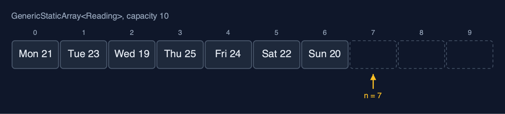

# Static Array (Generic) — Cheat Sheet

**A generic static array is written once with a type parameter T and used for any element type: it stores references to objects, compares them with equals and compareTo instead of == and <, and keeps every cost of the static array: O(1) access, O(n) shifting, a fixed capacity.**

| | |
| --- | --- |
| **What it is** | A generic static array is the static array written once with a type parameter T, storing references and comparing them with equals and compareTo, so one class holds any comparable type with the same O(1) access and O(n) shifting. |
| **Everyday picture** | A row of lockers that can hold whatever you are told to store |
| **Use it when** | The same structure is needed for more than one element type; You want the compiler to check the element type, instead of casting from `Object`; The elements are objects already, such as strings or records |
| **Avoid it when** | Millions of plain numbers: `int[]` stores 4 bytes per element; an array of `Integer` stores a reference per element and a separate object for each value; The number of elements changes: use a dynamic array (`dynamic-array-generic`) |
| **Already in Java** | `java.util.ArrayList<E>` and the generic methods of `java.util.Arrays`, such as `binarySearch(T[], key)` |

## Costs

| Operation | What it does | Time: best / average / worst | Extra space | Steps counted in the demo |
| --- | --- | --- | --- | --- |
| Traverse | Visit arr[0] to arr[n-1] once | O(n) / O(n) / O(n) | O(1) | 7 reads for the week |
| Access `get(i)` | Return the reference in arr[i] | O(1) / O(1) / O(1) | O(1) | 1 step |
| Update `update(i, x)` | Store a new reference in arr[i] | O(1) / O(1) / O(1) | O(1) | 1 step |
| Insert `insertAt(pos, x)` | Shift arr[pos..n-1] right, store x | O(1) at the end / O(n) / O(n) at the front | O(1) | 5 shifts to insert a reading at index 2 of 7 |
| Delete `deleteAt(pos)` | Shift arr[pos+1..n-1] left, set the freed place to null | O(1) at the end / O(n) / O(n) at the front | O(1) | 7 shifts to delete index 0 of 8 |
| Linear search | Compare with each element using equals | O(1) / O(n) / O(n) | O(1) | 5 comparisons to find 24 |
| Binary search (sorted) | compareTo with the middle, discard half, repeat | O(1) / O(log n) / O(log n) | O(1) | 3 comparisons for 24, and 3 for "Thu" |
| Find maximum | compareTo each element with the largest so far | O(n) / O(n) / O(n) | O(1) | 6 comparisons for 7 readings |
| Reverse | Swap the references in arr[i] and arr[n-1-i] moving inward | O(n) / O(n) / O(n) | O(1) | 3 swaps for 7 elements |
| Grow `copyWithCapacity(m)` | A new array; the references copied, not the objects | O(n) / O(n) / O(n) | O(n) | 7 references copied |

## Compared with related structures

The generic static array against the int-only static array and the generic dynamic array (n elements):

| Property | Generic static array | Static array of int | Generic dynamic array |
| --- | --- | --- | --- |
| Element types | any T that is Comparable | int only | any T |
| What each place stores | a reference to an object | the value itself | a reference to an object |
| Access element i | O(1), then follow the reference | O(1) | O(1) |
| Insert or delete at the front | O(n) shifts | O(n) shifts | O(n) shifts |
| Equality and order | equals, compareTo | ==, < | equals, compareTo |
| Size | fixed at creation | fixed at creation | grows by copying |
| Memory per element | a reference plus the object | 4 bytes | a reference plus the object, plus spare places |

## Watch out for

- **Comparing objects with `==`**: Use `equals` for equality and `compareTo` for order.
- **Writing `new T[capacity]`**: `(T[]) new Comparable[capacity]` (or `new Object[capacity]` when no bound is needed), with the cast kept inside the class.
- **Leaving a reference in a freed place**: Set the place to `null` when it falls out of use.
- **Using a raw type: `GenericStaticArray a`**: Always give the type argument: `GenericStaticArray<Integer>`.
