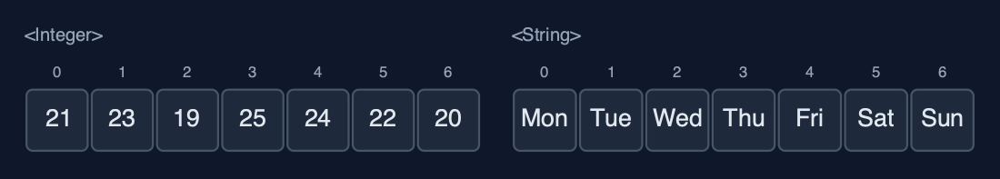
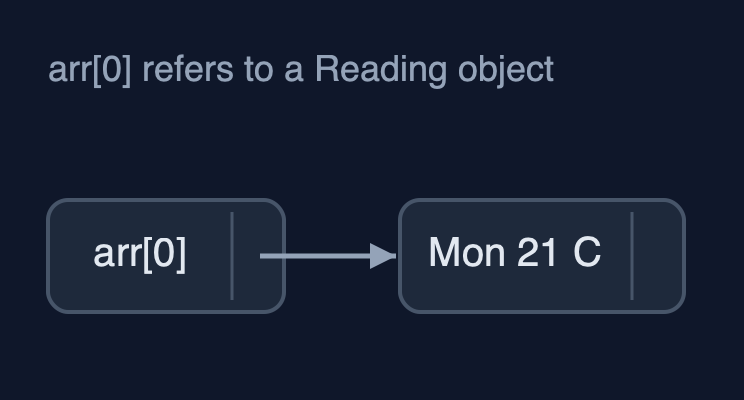
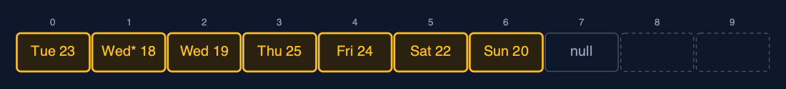
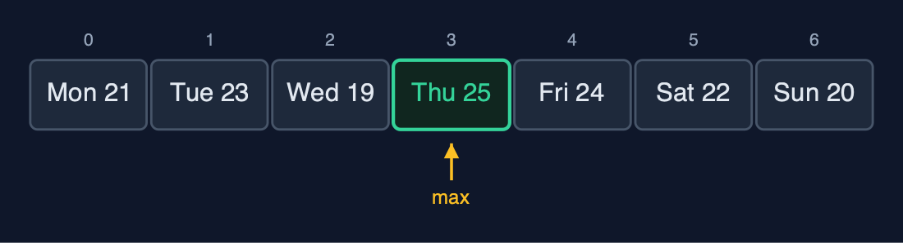

# Static Array (Generic), Explained

## In one sentence

A generic static array is the static array written once with a type parameter T, storing references and comparing them with equals and compareTo, so one class holds any comparable type with the same O(1) access and O(n) shifting.

## The picture


*GenericStaticArray<Reading> with n = 7: each place holds a reference to a Reading object*

## The everyday idea

Picture the same row of numbered lockers, but now every locker holds a **label with an address** on it rather than the thing itself: the thing is kept somewhere else, and the label tells you where. The lockers do not care what the things are, parcels, books, bicycles, so the same row works for anything. When the manager says "this row is for books only", nobody may put a bicycle's label in it. To ask "is this the same book?" you compare the books, not the labels: two labels can point at two copies of the same book.

## The 5 acts

### Act 1: One class, any element type

One class is used three times. `GenericStaticArray<Integer>` holds the temperatures, `GenericStaticArray<String>` holds the day names, and `GenericStaticArray<Reading>` holds a record of our own with a day and a temperature. Traversal prints all three with the same loop. The type argument is checked by the compiler: `temps.update(0, "hot")` is refused before the program ever runs, which an array of `Object` could not do.



**Three arrays, one class: T is Integer, String, and Reading** Here are the three arrays. The same class, the same code. Only the type in angle brackets changes. Integer, string, and reading.

What the demo printed:

```
GenericStaticArray<Integer>: [21, 23, 19, 25, 24, 22, 20]
GenericStaticArray<String>:  [Mon, Tue, Wed, Thu, Fri, Sat, Sun]
GenericStaticArray<Reading>: [Mon 21 C, Tue 23 C, Wed 19 C, Thu 25 C, Fri 24 C, Sat 22 C, Sun 20 C]
one class, three element types; temps.update(0, "hot") does not compile
```

### Act 2: Inside: an array of references

Java removes type parameters when it compiles, which is called type erasure, so `new T[10]` cannot be written: the program would not know what T is. The array is created as `new Comparable[10]` and cast to `T[]`, which is safe because only T is ever stored. Each place holds a **reference**, the address of an object stored elsewhere. So when `copyWithCapacity(31)` grows the array, it copies 7 references, not 7 objects: index 0 of the old and the new array point at the very same object.



**Each place holds a reference; the objects live elsewhere in memory** Here is the picture. The array holds references, drawn as arrows. The objects themselves are elsewhere. Following the arrow is one more step than reading an int.

What the demo printed:

```
new T[10] is not allowed: T is erased when the program runs
so arr = (T[]) new Comparable[10]: 10 references, n = 7
copyWithCapacity(31): 7 references copied; index 0 is the same object: true
```

### Act 3: Searching with equals and compareTo

With objects, `==` asks only whether two references point at the same object. A new string "Fri", made separately, is a different object from the one in the array, so `==` says false. Linear search therefore uses `equals`, which compares contents: it finds 24 at index 4 after 5 comparisons, and finds the new "Fri" at index 4. Binary search needs order, and `<` works only on numbers, so it uses `compareTo`, negative, zero or positive. On the sorted temperatures it finds 24 in 3 comparisons; on the sorted day names [Fri, Mon, Sat, Sun, Thu, Tue, Wed] it finds "Thu" in 3 comparisons too, because String's compareTo is alphabetical.


**Binary search on day names: Sun (go right), Tue (go left), Thu: 3 compareTo calls** Binary search on the sorted day names. The middle is Sunday. Thursday comes after it alphabetically, so go right. The middle of the right half is Tuesday. Thursday comes before it, so go left. And there is Thursday. Three comparisons.

What the demo printed:

```
linearSearch(24) = index 4: 5 comparisons with equals
linearSearch(new String("Fri")) = index 4: equals compares the text
days.get(4) == new String("Fri") is false: == compares references
sorted [19, 20, 21, 23, 24, 25, 26]: binarySearch(24) = index 4, 3 comparisons with compareTo
sorted [Fri, Mon, Sat, Sun, Thu, Tue, Wed]: binarySearch("Thu") = index 4, 3 comparisons
```

### Act 4: Insertion, deletion, overflow

Insertion and deletion are the same loops as in the int version, moving references instead of numbers. A corrected reading, "Wed* 18 C", goes in at index 2: five references shift right. Deleting index 0 removes "Mon 21 C": seven references shift left, and then the last place, no longer in use, is set to `null`. That line matters for objects: if the array kept the old reference, the garbage collector could never free the object. Three more readings fill the array to 10 of 10, and the next insertion is an overflow.



**deleteAt(0): seven references shift left, and the freed place becomes null** Here is the array after the deletion. Seven references, in amber, shifted one place to the left. The place after them, which used to hold a copy of the last reference, is now null.

What the demo printed:

```
insertAt(2, Wed* 18 C): 5 shifts, n = 8
deleteAt(0) removed Mon 21 C: 7 shifts; the freed place is set to null
[Tue 23 C, Wed* 18 C, Wed 19 C, Thu 25 C, Fri 24 C, Sat 22 C, Sun 20 C]
n = 10, insertAt(0, Thu 30 C): overflow: the array is full (10 of 10)
```

### Act 5: One algorithm, many orders

`findMax` is written once and asks each element for its order through `compareTo`. For readings, whose `compareTo` compares temperatures, it returns "Thu 25 C" after 6 comparisons. For day names, String's `compareTo` is alphabetical, so the same method returns "Wed". Reverse swaps references: 3 swaps for 7 readings. One operation from the int version is missing: `sum()`, because adding needs numbers and `T` can be any type. Java's own `ArrayList<E>` and `Arrays.binarySearch(T[], key)` are generic in exactly this way.



**findMax on readings compares temperatures: Thu 25 C is the largest** Here is find max on the readings. Six comparisons, each asking a reading to compare itself with the largest so far. Thursday, at twenty five degrees, wins.

What the demo printed:

```
readings, findMax by temperature: Thu 25 C, 6 comparisons
day names, findMax alphabetically: Wed
reverse: 3 swaps; [Sun 20 C, Sat 22 C, Fri 24 C, Thu 25 C, Wed 19 C, Tue 23 C, Mon 21 C]
no sum(): adding needs numbers, and T can be any type
already in Java: java.util.ArrayList<E> and Arrays.binarySearch(T[], key) are generic the same way
```

## The operations in code

### Creating the array

```java
/**
 * An empty array of the given capacity.
 *
 * @throws IllegalArgumentException if {@code capacity} is negative
 */
@SuppressWarnings("unchecked")
public GenericStaticArray(int capacity) {
    if (capacity < 0) {
        throw new IllegalArgumentException("capacity must not be negative: " + capacity);
    }
    // Java cannot create "new T[capacity]": T is erased when the program runs. Every T is a
    // Comparable, so an array of Comparable can hold them, and the cast is safe because only
    // T is ever stored.
    this.arr = (T[]) new Comparable[capacity];
}
```

`new T[capacity]` does not compile, because Java erases `T` when it compiles. Every `T` is a `Comparable`, so an array of `Comparable` can hold them, and the cast to `T[]` is safe because the class only ever stores `T`. This is the standard textbook way to build a generic array in Java.

### Linear search with equals

```java
/**
 * Linear search: the index of the first element equal to {@code key}, or -1. Uses
 * {@code equals}, which compares contents; {@code ==} would compare references. O(n), O(1) space.
 */
public int linearSearch(T key) {
    for (int i = 0; i < n; i++) {
        steps.compare();
        if (arr[i].equals(key)) {
            return i;
        }
    }
    return -1;
}
```

`arr[i].equals(key)` compares the contents of two objects. `arr[i] == key` would only be true for the very same object, so a search for `new String("Fri")` would fail although "Fri" is in the array.

### Binary search with compareTo

```java
/**
 * Binary search, for an array sorted in ascending order by {@code compareTo}: compare with the
 * middle element and discard the half that cannot hold {@code key}. O(log n), O(1) space.
 *
 * @return an index holding {@code key}, or -1
 */
public int binarySearch(T key) {
    int low = 0;
    int high = n - 1;
    while (low <= high) {
        int mid = low + (high - low) / 2;    // not (low + high) / 2, which can overflow
        steps.compare();
        int c = arr[mid].compareTo(key);     // negative: arr[mid] < key; zero: equal; positive: >
        if (c == 0) {
            return mid;
        } else if (c < 0) {
            low = mid + 1;
        } else {
            high = mid - 1;
        }
    }
    return -1;
}
```

`<` and `>` only work on numbers, so the generic version asks the element: `arr[mid].compareTo(key)` is negative, zero or positive. The halving, and the 20 comparisons for a million elements, are unchanged.

### Deletion

```java
/**
 * Deletion at position {@code pos} (0 &lt;= pos &lt; n): shifts {@code arr[pos+1..n-1]} one place
 * left, then clears the freed place. O(n - pos - 1) shifts.
 *
 * @return the deleted element
 * @throws IllegalStateException "underflow" when the array is empty
 */
public T deleteAt(int pos) {
    if (isEmpty()) {
        throw new IllegalStateException("underflow: the array is empty");
    }
    checkIndex(pos);
    T deleted = arr[pos];
    for (int i = pos; i < n - 1; i++) {
        arr[i] = arr[i + 1];
        steps.shift();
    }
    arr[n - 1] = null;    // no reference left behind, so the object can be garbage-collected
    n--;
    return deleted;
}
```

The same shifts as the int version, plus one line: the place that falls out of use is set to `null`. Otherwise the array would keep a reference to the deleted object and Java could never free it.

## The operations, and what they cost

| Operation | What it does | Time: best / average / worst | Extra space | Steps counted in the demo |
| --- | --- | --- | --- | --- |
| Traverse | Visit arr[0] to arr[n-1] once | O(n) / O(n) / O(n) | O(1) | 7 reads for the week |
| Access `get(i)` | Return the reference in arr[i] | O(1) / O(1) / O(1) | O(1) | 1 step |
| Update `update(i, x)` | Store a new reference in arr[i] | O(1) / O(1) / O(1) | O(1) | 1 step |
| Insert `insertAt(pos, x)` | Shift arr[pos..n-1] right, store x | O(1) at the end / O(n) / O(n) at the front | O(1) | 5 shifts to insert a reading at index 2 of 7 |
| Delete `deleteAt(pos)` | Shift arr[pos+1..n-1] left, set the freed place to null | O(1) at the end / O(n) / O(n) at the front | O(1) | 7 shifts to delete index 0 of 8 |
| Linear search | Compare with each element using equals | O(1) / O(n) / O(n) | O(1) | 5 comparisons to find 24 |
| Binary search (sorted) | compareTo with the middle, discard half, repeat | O(1) / O(log n) / O(log n) | O(1) | 3 comparisons for 24, and 3 for "Thu" |
| Find maximum | compareTo each element with the largest so far | O(n) / O(n) / O(n) | O(1) | 6 comparisons for 7 readings |
| Reverse | Swap the references in arr[i] and arr[n-1-i] moving inward | O(n) / O(n) / O(n) | O(1) | 3 swaps for 7 elements |
| Grow `copyWithCapacity(m)` | A new array; the references copied, not the objects | O(n) / O(n) / O(n) | O(n) | 7 references copied |

## Compared with related structures

The generic static array against the int-only static array and the generic dynamic array (n elements):

| Property | Generic static array | Static array of int | Generic dynamic array |
| --- | --- | --- | --- |
| Element types | any T that is Comparable | int only | any T |
| What each place stores | a reference to an object | the value itself | a reference to an object |
| Access element i | O(1), then follow the reference | O(1) | O(1) |
| Insert or delete at the front | O(n) shifts | O(n) shifts | O(n) shifts |
| Equality and order | equals, compareTo | ==, < | equals, compareTo |
| Size | fixed at creation | fixed at creation | grows by copying |
| Memory per element | a reference plus the object | 4 bytes | a reference plus the object, plus spare places |

## The verdict

Write data structures generically whenever they may hold more than one type; that is how every Java collection is written. Keep a primitive array such as `int[]` for large amounts of plain numbers, where references and separate objects would cost memory and time.

## How to recognise it in code you did not write

- A class header with angle brackets: `class GenericStaticArray<T extends Comparable<T>>`.
- `(T[]) new Comparable[capacity]` or `(T[]) new Object[capacity]` in a constructor.
- `equals` and `compareTo` where the int version had `==` and `<`.

## Where you have already met this

- `ArrayList<String>`, `HashMap<String, Integer>` and every other Java collection.
- `Comparable<T>`, implemented by `String`, `Integer`, `LocalDate` and many more.
- Templates in C++ and generics in C# and TypeScript.
