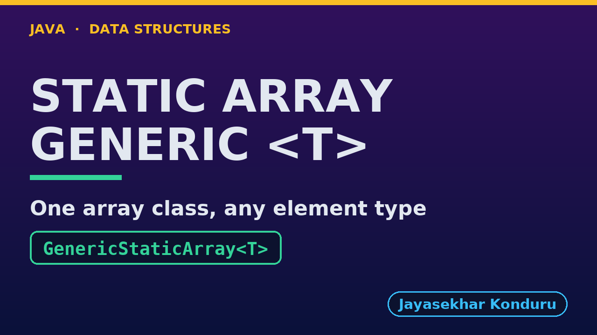

# YouTube — Static Array (Generic)

Everything needed to publish `video/static-array-generic-explained.mp4`. Copy the fields straight out of this file.

Chapter timings come from the video's `.srt`; they are regenerated whenever the video is rebuilt.

## Title

```
Generic Static Array in Java - Type Parameters, equals and compareTo
```

68 characters (YouTube shows about 60 before cutting a title off in search).

## Description

The first two lines are what a viewer sees above the fold, so they carry the hook rather than the boilerplate.

```
Generic Static Array in Java, explained with one week of temperatures stored three ways by the same class: as Integer temperatures, as String day names, and as Reading records of our own. We see why Java cannot create new T[10] and what the array really stores, references to objects, so copying the array copies references and not objects. We search with equals, which compares contents, and see == fail on two equal strings; we binary search numbers and day names with compareTo in 3 comparisons each. We insert and delete with the same shifts as the plain array, clearing the freed place so the object can be garbage-collected, and hit the same overflow. We finish with one findMax algorithm giving the hottest reading and the last day name alphabetically, because each type brings its own order. The int-only version is in the Static Array project.

CHAPTERS
00:00 Introduction
00:49 The Everyday Idea
01:23 The Words
01:52 Act One — One class, any element type
02:19 One class, any element type
02:33 Act Two — Inside: an array of references
03:04 Inside: an array of references
03:19 Act Three — Searching with equals and compareTo
03:54 Searching with equals and compareTo
04:16 Act Four — Insertion, deletion, overflow
04:47 Insertion, deletion, overflow
05:02 Act Five — One algorithm, many orders
05:31 One algorithm, many orders
05:46 Time and Space Complexity
06:16 Compared With Related Structures
06:49 Common Mistakes
07:16 Thanks for Watching

SOURCE CODE, WRITTEN NOTES AND AN INTERACTIVE ANIMATION
https://github.com/jk-boot-up/datastructures/tree/main/gradle-java/arrays-and-lists/static-array-generic

WHAT YOU NEED FIRST
Java basics: variables, loops, classes and methods. No data-structures knowledge is assumed; START-HERE.md in the repository explains memory, references and counting steps.
```

## Chapters

YouTube shows these as chapters because there are at least three and the first is at `00:00`.

```
00:00 Introduction
00:49 The Everyday Idea
01:23 The Words
01:52 Act One — One class, any element type
02:19 One class, any element type
02:33 Act Two — Inside: an array of references
03:04 Inside: an array of references
03:19 Act Three — Searching with equals and compareTo
03:54 Searching with equals and compareTo
04:16 Act Four — Insertion, deletion, overflow
04:47 Insertion, deletion, overflow
05:02 Act Five — One algorithm, many orders
05:31 One algorithm, many orders
05:46 Time and Space Complexity
06:16 Compared With Related Structures
06:49 Common Mistakes
07:16 Thanks for Watching
```

## Tags

```
java generics, generic array, static array, comparable, equals vs ==, binary search, data structures, java data structures, java, java 25, algorithms, computer science, programming tutorial, beginner, big o
```

206 characters, under YouTube's 500 limit.

## Thumbnail



Upload `docs/thumbnail.png` (1280×720) under **Details → Thumbnail → Upload file**. It is made for the small size YouTube shows in search: the name, one line of promise and one piece of code.

## Upload checklist

- [ ] Upload `video/static-array-generic-explained.mp4` (1080p, H.264, 30 fps, AAC 48 kHz)
- [ ] Set the video language to **English**, then add subtitles: *Upload file → With timing* → `video/static-array-generic-explained.srt`
- [ ] Upload `docs/thumbnail.png` as the thumbnail
- [ ] Paste the title, description and tags from above
- [ ] Add to the **Data Structures in Java** playlist
- [ ] Wait for 1080p processing before sharing the link

## Runtime

08:01.
