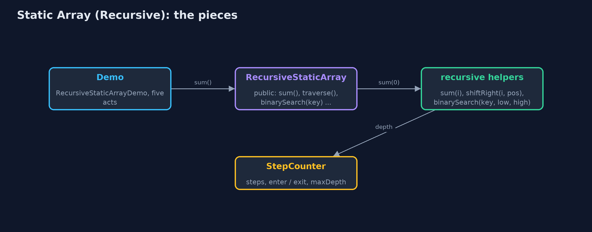
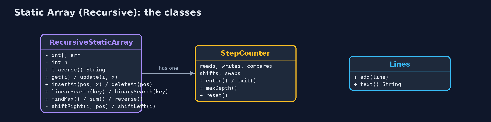
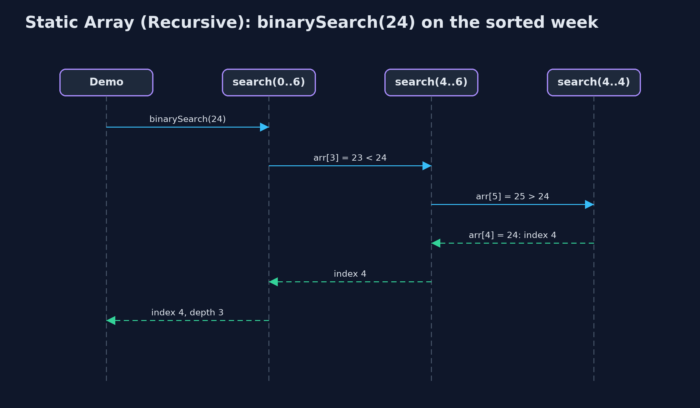

# Static Array (Recursive)

**A recursive operation solves the problem for one element and calls itself for the rest, stopping at a base case; it does the same work as the loop, but every call still waiting uses a frame on the call stack, so its extra space is the depth of the recursion: O(n) for traversal and search, O(log n) for binary search.**


*sum(0) waits for sum(1), which waits for sum(2) ... down to the base case sum(7) = 0*

A **static array** stores elements of one type in **consecutive memory locations**, with a fixed **capacity**, and keeps `n` elements in `arr[0..n-1]`. This project is the same array as the `static-array` project, but every operation that can be written **recursively** is: the method handles one element (or one half), then **calls itself** for the rest, and stops at a **base case** where there is nothing left to do. The answers are the same as the loops' answers, and the number of steps is the same too. What changes is memory: every call that is still waiting for the call below it keeps a **frame** on the **call stack**, so a recursive operation's extra space is its **recursion depth**: O(n) for traversal, search, sum, maximum and shifting, n / 2 for reversal, and only O(log n) for binary search. Access and update are one address calculation and stay non-recursive.

> New to data structures? Read [Start here](../../START-HERE.md) first: it explains memory, references and counting steps in ten minutes.

## The everyday idea

Picture a queue of seven people, and you want the total of the money in their pockets. You ask the first person. They do not count everyone; they ask the person behind them "what is the total from you to the end?", and wait. That person asks the next, and waits too. The last person has nobody behind, so they answer straight away with their own amount: that is the base case. Then the answers travel back up the queue, each person adding their own amount before passing it on. While the question travels down, everyone is standing there waiting: seven people waiting is seven frames on the call stack.

## The worked example: A week of daily temperatures, every operation written recursively

The same weather station as the `static-array` project stores one whole-number temperature a day in `int arr[10]`: Monday at index 0 through Sunday at index 6, so n = 7. The demo first traces `sum(0)` call by call to the base case, then runs every operation recursively and prints both what it counted (reads, comparisons, shifts, swaps) and how deep the recursion went. Finally it runs binary search and linear search on an array of a million elements, and linear search runs out of call stack.

## Why it exists

Many textbook algorithms are defined recursively: "the sum is the first element plus the sum of the rest", "binary search searches one half". Writing them that way makes the code match the definition, and it is the only practical way to write the tree, graph and divide-and-conquer algorithms later in the course. The array is the simplest place to learn how recursion runs: the base case, the recursive case, the call stack, the depth, and the cost in memory that a loop does not pay.

## New words

| Word | What it means here |
| --- | --- |
| **recursion** | A method solving a problem by calling itself on a smaller part of the same problem. |
| **base case** | The smallest input, answered directly without another call: `i == n`, no elements left. Without it the recursion never stops. |
| **recursive case** | The part that handles one element and calls the method again for the rest: `arr[i] + sum(i + 1)`. |
| **call stack** | The memory where Java keeps one frame for every method call that has not yet returned. |
| **stack frame** | One call's parameters and local variables, pushed when the call starts and popped when it returns. |
| **recursion depth** | The largest number of calls waiting on the stack at once. The extra space of a recursive operation is proportional to it. |
| **stack overflow** | Too many frames for the call stack: Java throws `StackOverflowError`. |
| **tail recursion** | The recursive call is the last thing the method does. Some languages then reuse the frame; Java does not. |

## What you will see, act by act

Run the demo and it tells the story in 5 acts, printing the real numbers that the tests check:

```bash
./gradlew run
```

| Act | What it shows |
| --- | --- |
| 1. Thinking recursively | sum(0) = 21 + sum(1), and so on down to the base case sum(7) = 0: the answer is 154, with 7 calls waiting at once. |
| 2. The call stack | Traversal goes 7 calls deep, one frame per element; findMax finds index 3 (25 C) at depth 6, comparing on the way back up. |
| 3. Searching recursively | Recursive linear search finds 24 at index 4 with 5 comparisons at depth 5; recursive binary search on the sorted week finds it with 3 comparisons at depth 3. |
| 4. Insertion, deletion and reversal, recursively | insertAt(2, 18) shifts 5 elements at depth 5; deleteAt(0) shifts 7 at depth 7; reverse swaps 3 pairs at depth 3. |
| 5. The limit of recursion | On 1,000,000 elements, recursive binary search goes only 20 calls deep; recursive linear search throws a real StackOverflowError. |

Each act is drawn step by step in [the explained walkthrough](docs/static-array-recursive-explained.md) and in [the animation](docs/animation.html).

## The operations, and what they cost

Time is given for the best, average and worst case in Big-O notation (START-HERE.md explains it by counting steps); the last column is what the demo actually counted, so every formula can be checked against a real number.

| Operation | What it does | Time: best / average / worst | Extra space (call stack) | Same operation as a loop | Steps counted in the demo |
| --- | --- | --- | --- | --- | --- |
| Traverse | Visit arr[i], then traverse from i + 1 | O(n) / O(n) / O(n) | O(n): depth n | O(1) | 7 reads, depth 7 |
| Access `get(i)` | Return arr[i], by address calculation (not recursive) | O(1) / O(1) / O(1) | O(1) | O(1) | 1 step |
| Update `update(i, x)` | Replace arr[i] (not recursive) | O(1) / O(1) / O(1) | O(1) | O(1) | 1 step |
| Insert `insertAt(pos, x)` | shiftRight from the last element down to pos, then store x | O(1) at the end / O(n) / O(n) at the front | O(n - pos) | O(1) | 5 shifts at depth 5 to insert at index 2 of 7 |
| Delete `deleteAt(pos)` | shiftLeft from pos up to the end | O(1) at the end / O(n) / O(n) at the front | O(n - pos) | O(1) | 7 shifts at depth 7 to delete index 0 of 8 |
| Linear search | Is the key at i? If not, search from i + 1 | O(1) / O(n) / O(n) | O(n) | O(1) | 5 comparisons at depth 5 to find 24 |
| Binary search (sorted) | Compare with the middle, search one half | O(1) / O(log n) / O(log n) | O(log n) | O(1) | 3 comparisons at depth 3; 20 at depth 20 on 1,000,000 |
| Find maximum | The larger of arr[i] and the maximum of the rest | O(n) / O(n) / O(n) | O(n) | O(1) | 6 comparisons at depth 6 |
| Sum | arr[i] plus the sum of the rest; 0 when none are left | O(n) / O(n) / O(n) | O(n) | O(1) | 154 at depth 7 |
| Reverse | Swap the two ends, reverse what is between them | O(n) / O(n) / O(n) | O(n / 2) = O(n) | O(1) | 3 swaps at depth 3 |

Extra space is the memory an operation needs besides the structure itself. A loop needs a fixed amount, O(1); a recursive operation needs one call-stack frame for every call still waiting, so its extra space is the depth of the recursion.

## The operations in code

### Sum: the simplest recursion

```java
/** The sum: arr[i] plus the sum of the rest. O(n) time and stack. */
public long sum() {
    return sum(0);
}

private long sum(int i) {
    if (i == n) {
        return 0;                  // base case: the sum of no elements is 0
    }
    steps.enter();
    steps.read();
    long result = arr[i] + sum(i + 1);
    steps.exit();
    return result;
}
```

The base case is `i == n`: the sum of no elements is 0. The recursive case adds `arr[i]` to the sum of the rest. The addition cannot happen until `sum(i + 1)` returns, so all seven calls wait on the stack together: depth 7, O(n) extra space, where the loop needed one variable.

### Traversal

```java
/** Traversal: element i, then the rest from i + 1. O(n) time, O(n) stack. */
public String traverse() {
    StringBuilder s = new StringBuilder("[");
    traverse(0, s);
    return s.append(']').toString();
}

private void traverse(int i, StringBuilder s) {
    if (i == n) {                  // base case: no elements left
        return;
    }
    steps.enter();
    steps.read();
    if (i > 0) {
        s.append(", ");
    }
    s.append(arr[i]);
    traverse(i + 1, s);            // recursive case: the rest of the array
    steps.exit();
}
```

The same shape as sum: visit element i, then traverse the rest. The recursive call is the last statement (tail recursion), but Java still keeps every frame.

### Insertion at a position

```java
/**
 * Insertion at {@code pos}: shift arr[pos..n-1] right recursively, then store. The recursion
 * starts at the last element, so each element is moved before its place is overwritten.
 * O(n - pos) time and stack.
 *
 * @throws IllegalStateException "overflow" when the array is full
 */
public void insertAt(int pos, int value) {
    if (isFull()) {
        throw new IllegalStateException("overflow: the array is full (" + arr.length + " of " + arr.length + ")");
    }
    if (pos < 0 || pos > n) {
        throw new IndexOutOfBoundsException("position " + pos + " outside 0.." + n);
    }
    shiftRight(n - 1, pos);
    arr[pos] = value;
    steps.write();
    n++;
}

private void shiftRight(int i, int pos) {
    if (i < pos) {                 // base case: every element from pos onwards has moved
        return;
    }
    steps.enter();
    arr[i + 1] = arr[i];
    steps.shift();
    shiftRight(i - 1, pos);
    steps.exit();
}
```

`shiftRight(i, pos)` moves `arr[i]` one place right and then shifts the elements before it; it starts at the last element, `n - 1`, so every element moves before its old place is overwritten, just as the loop runs from the end. The base case is `i < pos`: everything from `pos` onwards has moved. n - pos shifts, n - pos frames deep.

### Deletion at a position

```java
/**
 * Deletion at {@code pos}: shift arr[pos+1..n-1] left recursively. O(n - pos) time and stack.
 *
 * @return the deleted element
 * @throws IllegalStateException "underflow" when the array is empty
 */
public int deleteAt(int pos) {
    if (isEmpty()) {
        throw new IllegalStateException("underflow: the array is empty");
    }
    checkIndex(pos);
    int deleted = arr[pos];
    shiftLeft(pos);
    n--;
    return deleted;
}

private void shiftLeft(int i) {
    if (i >= n - 1) {              // base case: reached the last element
        return;
    }
    steps.enter();
    arr[i] = arr[i + 1];
    steps.shift();
    shiftLeft(i + 1);
    steps.exit();
}
```

The mirror image: `shiftLeft(i)` moves `arr[i + 1]` into `arr[i]` and recurses on `i + 1`, stopping at the last element.

### Linear search

```java
/** Linear search: is the key at i? If not, search from i + 1. O(n) time, O(n) stack. */
public int linearSearch(int key) {
    return linearSearch(key, 0);
}

private int linearSearch(int key, int i) {
    if (i == n) {
        return -1;                 // base case: searched everything
    }
    steps.enter();
    steps.compare();
    int result = arr[i] == key ? i : linearSearch(key, i + 1);
    steps.exit();
    return result;
}
```

Two base cases: `i == n` (searched everything, return -1), and a match (return i). Otherwise search from i + 1. Finding 24 at index 4 takes 5 calls; searching a million elements needs a million frames, and overflows.

### Binary search

```java
/** Binary search on a sorted array: search only the half that can hold the key. O(log n) time and stack. */
public int binarySearch(int key) {
    return binarySearch(key, 0, n - 1);
}

private int binarySearch(int key, int low, int high) {
    if (low > high) {
        return -1;                 // base case: the range is empty
    }
    steps.enter();
    int mid = low + (high - low) / 2;
    steps.compare();
    int result;
    if (arr[mid] == key) {
        result = mid;
    } else if (arr[mid] < key) {
        result = binarySearch(key, mid + 1, high);
    } else {
        result = binarySearch(key, low, mid - 1);
    }
    steps.exit();
    return result;
}
```

The base case is an empty range, `low > high`. Each call compares with the middle and calls itself on one half only, so the depth is at most about log2(n) + 1: 20 for a million elements. This is the recursion that is always safe to use.

### Find maximum

```java
/** The index of the largest element: the larger of arr[i] and the largest of the rest. O(n) time and stack. */
public int findMax() {
    return n == 0 ? -1 : findMax(0);
}

private int findMax(int i) {
    if (i == n - 1) {
        return i;                  // base case: one element is its own maximum
    }
    steps.enter();
    int restMax = findMax(i + 1);
    steps.compare();
    int result = arr[i] >= arr[restMax] ? i : restMax;
    steps.exit();
    return result;
}
```

The base case is the last element, which is its own maximum. Every other call first finds the maximum of the rest, then compares it with its own element on the way back up, so the comparisons happen as the calls return.

### Reversal

```java
/** Reverses in place: swap the two ends, then reverse what is between them. O(n) time, O(n / 2) stack. */
public void reverse() {
    reverse(0, n - 1);
}

private void reverse(int i, int j) {
    if (i >= j) {
        return;                    // base case: zero or one element in the middle
    }
    steps.enter();
    int t = arr[i];
    arr[i] = arr[j];
    arr[j] = t;
    steps.swap();
    reverse(i + 1, j - 1);
    steps.exit();
}
```

Swap the two ends, then reverse the part between them. The base case is `i >= j`: zero or one element left in the middle. n / 2 swaps, n / 2 frames.

## Compared with related structures

The recursive array against the same array written with loops (the `static-array` project), and against the related structures (n elements):

| Operation | Recursive static array | Iterative static array | Singly linked list |
| --- | --- | --- | --- |
| Access element i | O(1) time, O(1) space | O(1) time, O(1) space | O(n) time |
| Traverse, sum, maximum | O(n) time, O(n) stack | O(n) time, O(1) space | O(n) time |
| Linear search | O(n) time, O(n) stack | O(n) time, O(1) space | O(n) time |
| Binary search (sorted) | O(log n) time, O(log n) stack | O(log n) time, O(1) space | not possible: no middle to jump to |
| Insert or delete at the front | O(n) shifts, O(n) stack | O(n) shifts, O(1) space | O(1) |
| A million elements | linear recursion: StackOverflowError | fine | fine with loops |
| Code | matches the textbook definition | slightly longer, no stack cost |  |

## The code

```
src/main/java/com/jk/explore/staticarrayrecursive/
├── Lines.java                     The demo's printed lines, kept in one {@code StringBuilder} so the tests can check them
├── RecursiveStaticArray.java      A static (fixed-capacity) array of integers whose operations are written recursively
├── RecursiveStaticArrayDemo.java  Tells the story of the recursive static array in five acts, printing the real counts and the real depth of every recursion
└── StepCounter.java               Counts what an array operation costs, so the demo prints real numbers instead of claims: element reads and writes, comparisons, shifts (moving an element to the next position), swaps, copies into a new array, and the deepest recursion reached (the most call-stack frames alive at once, which is the extra space a recursive version uses)
```

## Test

```bash
./gradlew test
```

28 tests in `DemoRunsTest`, `RecursiveStaticArrayTest`. Every number the demo prints is asserted, and nothing depends on the clock, so every run gives the same result.

## Common mistakes

| The mistake | What goes wrong | The fix |
| --- | --- | --- |
| No base case, or one that is never reached | The method calls itself for ever and Java throws `StackOverflowError`. | Write the base case first, and check that every recursive call moves towards it (`i + 1`, a smaller half). |
| Making no progress: `sum(i)` calling `sum(i)` | Same as no base case: infinite recursion. | Each call must work on a smaller problem than the one it was given. |
| Base case `i == n - 1` in sum, with n = 0 | An empty array starts at i = 0, which never equals -1, and reads past the end. | Use `i == n`, which also handles the empty array. |
| Shifting from pos upwards on insertion | Each element overwrites the next before it has moved, copying one value into every place. | Start the recursion at the last element and move down to pos. |
| Linear recursion on large data | One frame per element: a million elements overflows the call stack. | Use recursion where the depth is O(log n), and loops for linear passes over big arrays. |

## Try it yourself

1. **Easy.** Write a recursive `int countAbove(int limit, int i)` that returns how many elements from index i onwards are greater than `limit`. What are its base case, its time and its extra space?
2. **Medium.** Write a recursive `boolean isSorted(int i)` that returns true when `arr[i..n-1]` is in ascending order. How deep does it go on the week, and how deep on [5, 3, 8, 9]?
3. **Harder.** Rewrite recursive `binarySearch(key, low, high)` as a loop. Why can every tail-recursive method be rewritten like this, and what does it save?

The answers are in [docs/exercises.md](docs/exercises.md), below the questions, so they are not given away.

## When to use it

- The problem is naturally defined in terms of a smaller copy of itself, such as binary search on one half.
- The recursion depth is small: O(log n), as in binary search, is always safe.
- Learning: tracing a recursion on an array is the best preparation for trees and divide-and-conquer.

## When not to

- The recursion depth grows with n, as in linear search or traversal, and n can be large: Java has no tail-call elimination, so a million elements overflow the call stack. Use the loops of the `static-array` project.
- Performance matters: each call costs a frame, a jump and a return, which a loop does not.

## Where you have already met this

- The definition of factorial: n! = n x (n - 1)!, with 0! = 1 as the base case.
- Any `StackOverflowError` from a method that called itself with no base case.
- Merge sort and quicksort, which recurse on halves of an array.

## Technologies and versions

| Technology | Version | Used for |
| --- | --- | --- |
| Java | 25 | the code (toolchain set in `build.gradle`; Gradle fetches JDK 25 if it is missing) |
| Gradle | 9.8.0 (wrapper) | build and run, nothing to install |
| JUnit | 6.1.3 | the tests |
| videokit | course tool | the narrated video and animation: Piper `en_US-amy-medium`, speed 0.8, longer pauses (the `amy-slow` voice) |

## Learning material

| Document | What it is for |
| --- | --- |
| [Start here](../../START-HERE.md) | the ideas every project relies on |
| [Problem statement](docs/problem-statement.md) | the situation and what the project must show |
| [Prerequisites](docs/prerequisites.md) | what you need to know first |
| [Static Array (Recursive), explained](docs/static-array-recursive-explained.md) | every act, picture by picture |
| [Animated walkthrough](docs/animation.html) | the structure changing step by step, narrated |
| [Cheat sheet](docs/cheat-sheet.md) | the whole structure on one page |
| [Exercises and answers](docs/exercises.md) | practice, easy to harder |
| [Session guide](docs/session.md) | a one-hour lesson |
| [Specification](docs/spec.md) | what this project must be true of |

### How the pieces fit

The demo calls the public operations of `RecursiveStaticArray`; each starts a private recursive method that works on `int[] arr` and reports steps and depth to `StepCounter`.



### The classes

`RecursiveStaticArray` is the data structure; `StepCounter` counts steps and measures recursion depth; `Lines` collects the demo's output.



### How the data moves

Base case first; otherwise one element's work and a call on the rest, then the addition as the call returns.


### Who calls whom, in order

Three calls, each on half the range; the answer returns through every frame.



### Video

`video/static-array-recursive-explained.mp4` (with `.m4a` audio and `.srt` subtitles) is built by `video/build_video.sh`. Rendered media is not committed.

## Where this sits

Part of the [data structures course](../../index.md), in *arrays-and-lists*.
