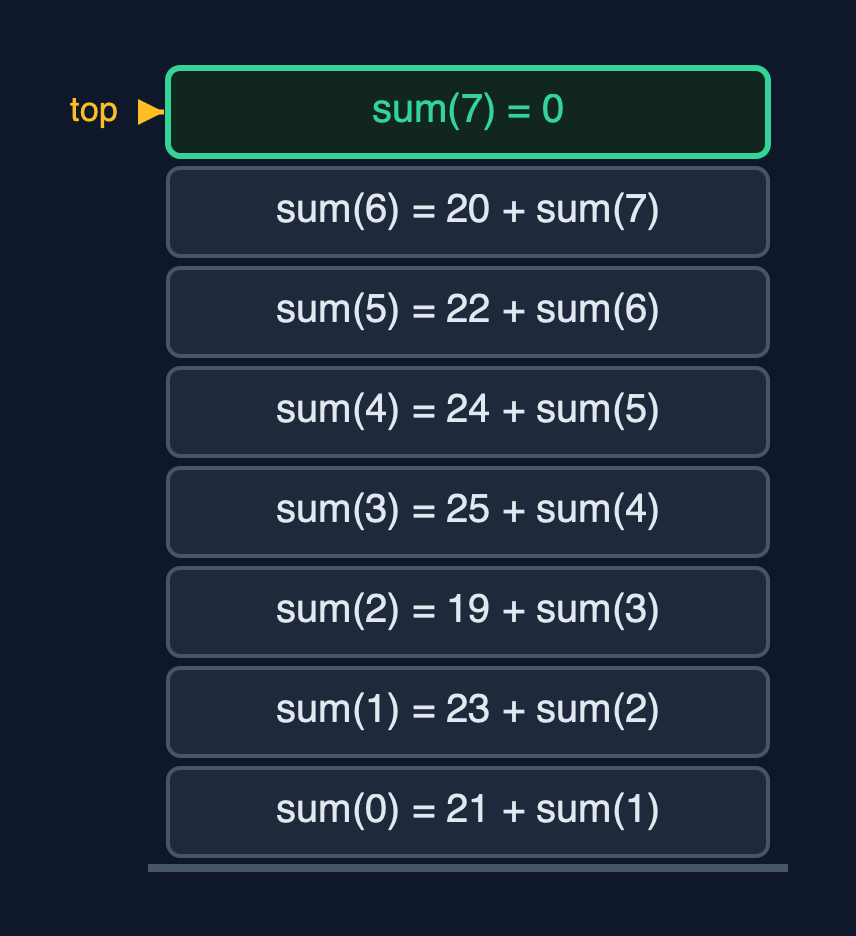

# Static Array (Recursive) — Cheat Sheet

**A recursive operation solves the problem for one element and calls itself for the rest, stopping at a base case; it does the same work as the loop, but every call still waiting uses a frame on the call stack, so its extra space is the depth of the recursion: O(n) for traversal and search, O(log n) for binary search.**

| | |
| --- | --- |
| **What it is** | A recursive array operation handles one element, or one half, and calls itself for the rest until a base case; it does the same work as the loop but keeps one stack frame per waiting call, so its extra space is the recursion depth: O(n) for linear passes and O(log n) for binary search. |
| **Everyday picture** | A queue of people each asking the one behind |
| **Use it when** | The problem is naturally defined in terms of a smaller copy of itself, such as binary search on one half; The recursion depth is small: O(log n), as in binary search, is always safe; Learning: tracing a recursion on an array is the best preparation for trees and divide-and-conquer |
| **Avoid it when** | The recursion depth grows with n, as in linear search or traversal, and n can be large: Java has no tail-call elimination, so a million elements overflow the call stack. Use the loops of the `static-array` project; Performance matters: each call costs a frame, a jump and a return, which a loop does not |
| **Already in Java** | Nothing: Java's arrays and `java.util.Arrays` are all iterative; recursion is how the textbooks teach the operations |

## Costs

| Operation | What it does | Time: best / average / worst | Extra space (call stack) | Same operation as a loop | Steps counted in the demo |
| --- | --- | --- | --- | --- | --- |
| Traverse | Visit arr[i], then traverse from i + 1 | O(n) / O(n) / O(n) | O(n): depth n | O(1) | 7 reads, depth 7 |
| Access `get(i)` | Return arr[i], by address calculation (not recursive) | O(1) / O(1) / O(1) | O(1) | O(1) | 1 step |
| Update `update(i, x)` | Replace arr[i] (not recursive) | O(1) / O(1) / O(1) | O(1) | O(1) | 1 step |
| Insert `insertAt(pos, x)` | shiftRight from the last element down to pos, then store x | O(1) at the end / O(n) / O(n) at the front | O(n - pos) | O(1) | 5 shifts at depth 5 to insert at index 2 of 7 |
| Delete `deleteAt(pos)` | shiftLeft from pos up to the end | O(1) at the end / O(n) / O(n) at the front | O(n - pos) | O(1) | 7 shifts at depth 7 to delete index 0 of 8 |
| Linear search | Is the key at i? If not, search from i + 1 | O(1) / O(n) / O(n) | O(n) | O(1) | 5 comparisons at depth 5 to find 24 |
| Binary search (sorted) | Compare with the middle, search one half | O(1) / O(log n) / O(log n) | O(log n) | O(1) | 3 comparisons at depth 3; 20 at depth 20 on 1,000,000 |
| Find maximum | The larger of arr[i] and the maximum of the rest | O(n) / O(n) / O(n) | O(n) | O(1) | 6 comparisons at depth 6 |
| Sum | arr[i] plus the sum of the rest; 0 when none are left | O(n) / O(n) / O(n) | O(n) | O(1) | 154 at depth 7 |
| Reverse | Swap the two ends, reverse what is between them | O(n) / O(n) / O(n) | O(n / 2) = O(n) | O(1) | 3 swaps at depth 3 |

## Compared with related structures

The recursive array against the same array written with loops (the `static-array` project), and against the related structures (n elements):

| Operation | Recursive static array | Iterative static array | Singly linked list |
| --- | --- | --- | --- |
| Access element i | O(1) time, O(1) space | O(1) time, O(1) space | O(n) time |
| Traverse, sum, maximum | O(n) time, O(n) stack | O(n) time, O(1) space | O(n) time |
| Linear search | O(n) time, O(n) stack | O(n) time, O(1) space | O(n) time |
| Binary search (sorted) | O(log n) time, O(log n) stack | O(log n) time, O(1) space | not possible: no middle to jump to |
| Insert or delete at the front | O(n) shifts, O(n) stack | O(n) shifts, O(1) space | O(1) |
| A million elements | linear recursion: StackOverflowError | fine | fine with loops |
| Code | matches the textbook definition | slightly longer, no stack cost |  |

## Watch out for

- **No base case, or one that is never reached**: Write the base case first, and check that every recursive call moves towards it (`i + 1`, a smaller half).
- **Making no progress: `sum(i)` calling `sum(i)`**: Each call must work on a smaller problem than the one it was given.
- **Base case `i == n - 1` in sum, with n = 0**: Use `i == n`, which also handles the empty array.
- **Shifting from pos upwards on insertion**: Start the recursion at the last element and move down to pos.
- **Linear recursion on large data**: Use recursion where the depth is O(log n), and loops for linear passes over big arrays.
