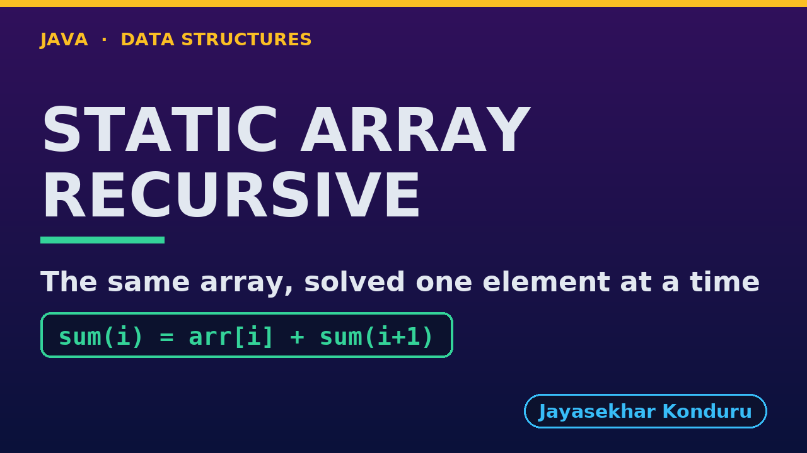

# YouTube — Static Array (Recursive)

Everything needed to publish `video/static-array-recursive-explained.mp4`. Copy the fields straight out of this file.

Chapter timings come from the video's `.srt`; they are regenerated whenever the video is rebuilt.

## Title

```
Static Array in Java, Recursively - Base Case, Call Stack and Complexity
```

72 characters (YouTube shows about 60 before cutting a title off in search).

## Description

The first two lines are what a viewer sees above the fold, so they carry the hook rather than the boilerplate.

```
Static Array in Java, written recursively, explained with a week of daily temperatures stored in int arr[10] with n = 7 elements. We trace sum(0) = 21 + sum(1) all the way down to the base case and see seven calls waiting on the call stack at once. We then write every textbook operation recursively, counting both the steps and the recursion depth: traversal and sum at depth 7, finding the maximum in 6 comparisons, linear search for 24 in 5 comparisons at depth 5, binary search in 3 comparisons at depth 3, insertion and deletion shifting 5 and 7 elements recursively, and reversal in 3 swaps. We finish at the limit of recursion: binary search on a million elements goes only 20 calls deep, while linear search on a million elements throws a real StackOverflowError. The same operations written with loops are in the Static Array project.

CHAPTERS
00:00 Introduction
00:52 The Everyday Idea
01:32 The Words
02:04 Act One — Thinking recursively
02:37 Thinking recursively
03:15 Act Two — The call stack
03:46 The call stack
04:04 Act Three — Searching recursively
04:33 Searching recursively
04:59 Act Four — Insertion, deletion and reversal, recursively
05:32 Insertion, deletion and reversal, recursively
06:10 Act Five — The limit of recursion
06:43 The limit of recursion
07:02 Time and Space Complexity
07:37 Recursive or Iterative?
08:11 Common Mistakes
08:38 Thanks for Watching

SOURCE CODE, WRITTEN NOTES AND AN INTERACTIVE ANIMATION
https://github.com/jk-boot-up/datastructures/tree/main/gradle-java/arrays-and-lists/static-array-recursive

WHAT YOU NEED FIRST
Java basics: variables, loops, classes and methods. No data-structures knowledge is assumed; START-HERE.md in the repository explains memory, references and counting steps.
```

## Chapters

YouTube shows these as chapters because there are at least three and the first is at `00:00`.

```
00:00 Introduction
00:52 The Everyday Idea
01:32 The Words
02:04 Act One — Thinking recursively
02:37 Thinking recursively
03:15 Act Two — The call stack
03:46 The call stack
04:04 Act Three — Searching recursively
04:33 Searching recursively
04:59 Act Four — Insertion, deletion and reversal, recursively
05:32 Insertion, deletion and reversal, recursively
06:10 Act Five — The limit of recursion
06:43 The limit of recursion
07:02 Time and Space Complexity
07:37 Recursive or Iterative?
08:11 Common Mistakes
08:38 Thanks for Watching
```

## Tags

```
recursion, static array, recursive binary search, call stack, stack overflow, space complexity, data structures, java data structures, java, java 25, algorithms, computer science, programming tutorial, beginner, big o
```

217 characters, under YouTube's 500 limit.

## Thumbnail



Upload `docs/thumbnail.png` (1280×720) under **Details → Thumbnail → Upload file**. It is made for the small size YouTube shows in search: the name, one line of promise and one piece of code.

## Upload checklist

- [ ] Upload `video/static-array-recursive-explained.mp4` (1080p, H.264, 30 fps, AAC 48 kHz)
- [ ] Set the video language to **English**, then add subtitles: *Upload file → With timing* → `video/static-array-recursive-explained.srt`
- [ ] Upload `docs/thumbnail.png` as the thumbnail
- [ ] Paste the title, description and tags from above
- [ ] Add to the **Data Structures in Java** playlist
- [ ] Wait for 1080p processing before sharing the link

## Runtime

09:27.
