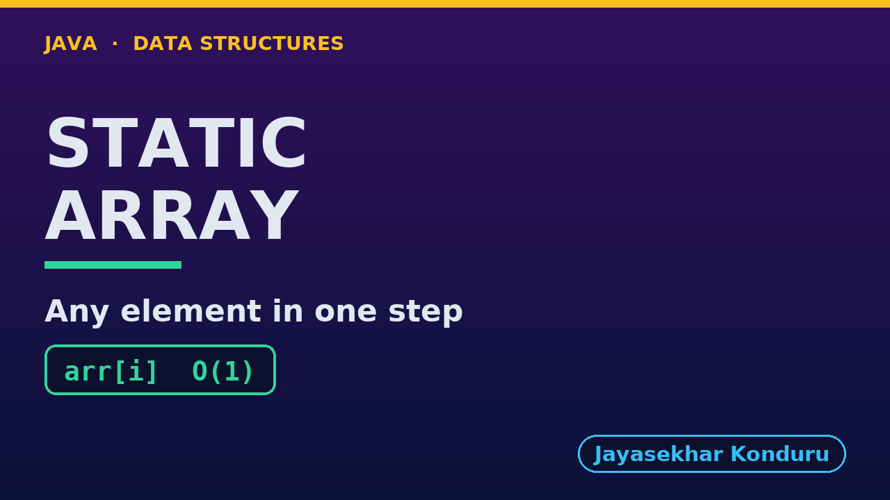

# YouTube — Static Array

Everything needed to publish `video/static-array-explained.mp4`. Copy the fields straight out of this file.

Chapter timings come from the video's `.srt`; they are regenerated whenever the video is rebuilt.

## Title

```
Static Array in Java - Operations and Complexity
```

48 characters (YouTube shows about 60 before cutting a title off in search).

## Description

The first two lines are what a viewer sees above the fold, so they carry the hook rather than the boilerplate.

```
Static Array in Java, explained with a week of daily temperatures stored in int arr[10] with n = 7 elements. We start with seven separate variables and see why every question needs code written out by hand, then store the week in one array and compute the address of arr[3] with base + i x size. We count the real cost of each textbook operation: access and update in one step, linear search in n comparisons, binary search on a sorted array in 3, insertion and deletion shifting 5 and 7 elements, and an overflow when the array is full. We finish with binary search on a million elements in 20 comparisons and the bill: a capacity that never changes. Every operation here is iterative, using O(1) extra space.

CHAPTERS
00:00 Introduction
00:55 The Everyday Idea
01:27 The Words
01:58 Act One — Seven separate variables
02:23 Seven separate variables
02:37 Act Two — One array: int arr[10], n = 7
03:04 One array: int arr[10], n = 7
03:45 Act Three — Access, update, search
04:15 Access, update, search
04:56 Act Four — Insertion, deletion, overflow
05:25 Insertion, deletion, overflow
06:00 Act Five — The bill
06:28 The bill
06:47 Time and Space Complexity
07:20 Compared With Related Structures
07:49 Common Mistakes
08:18 Thanks for Watching

SOURCE CODE, WRITTEN NOTES AND AN INTERACTIVE ANIMATION
https://github.com/jk-boot-up/datastructures/tree/main/gradle-java/arrays-and-lists/static-array

WHAT YOU NEED FIRST
Java basics: variables, loops, classes and methods. No data-structures knowledge is assumed; START-HERE.md in the repository explains memory, references and counting steps.
```

## Chapters

YouTube shows these as chapters because there are at least three and the first is at `00:00`.

```
00:00 Introduction
00:55 The Everyday Idea
01:27 The Words
01:58 Act One — Seven separate variables
02:23 Seven separate variables
02:37 Act Two — One array: int arr[10], n = 7
03:04 One array: int arr[10], n = 7
03:45 Act Three — Access, update, search
04:15 Access, update, search
04:56 Act Four — Insertion, deletion, overflow
05:25 Insertion, deletion, overflow
06:00 Act Five — The bill
06:28 The bill
06:47 Time and Space Complexity
07:20 Compared With Related Structures
07:49 Common Mistakes
08:18 Thanks for Watching
```

## Tags

```
static array, array operations, linear search, binary search, array insertion deletion, time complexity, data structures, java data structures, java, java 25, algorithms, computer science, programming tutorial, beginner, big o
```

226 characters, under YouTube's 500 limit.

## Thumbnail



Upload `docs/thumbnail.png` (1280×720) under **Details → Thumbnail → Upload file**. It is made for the small size YouTube shows in search: the name, one line of promise and one piece of code.

## Upload checklist

- [ ] Upload `video/static-array-explained.mp4` (1080p, H.264, 30 fps, AAC 48 kHz)
- [ ] Set the video language to **English**, then add subtitles: *Upload file → With timing* → `video/static-array-explained.srt`
- [ ] Upload `docs/thumbnail.png` as the thumbnail
- [ ] Paste the title, description and tags from above
- [ ] Add to the **Data Structures in Java** playlist
- [ ] Wait for 1080p processing before sharing the link

## Runtime

09:05.
